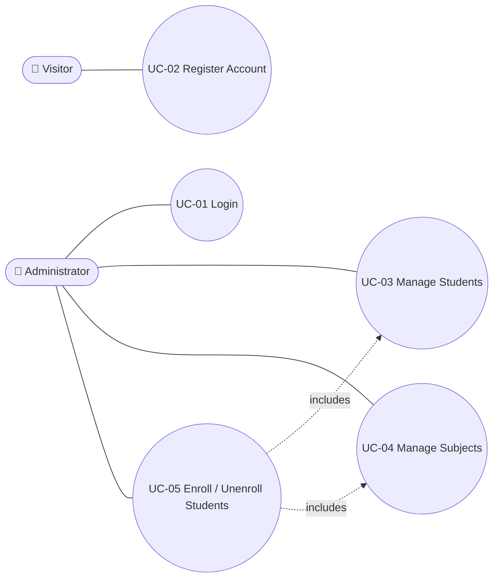
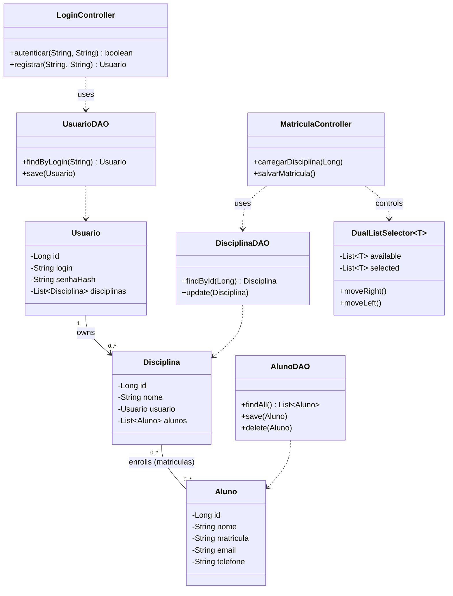
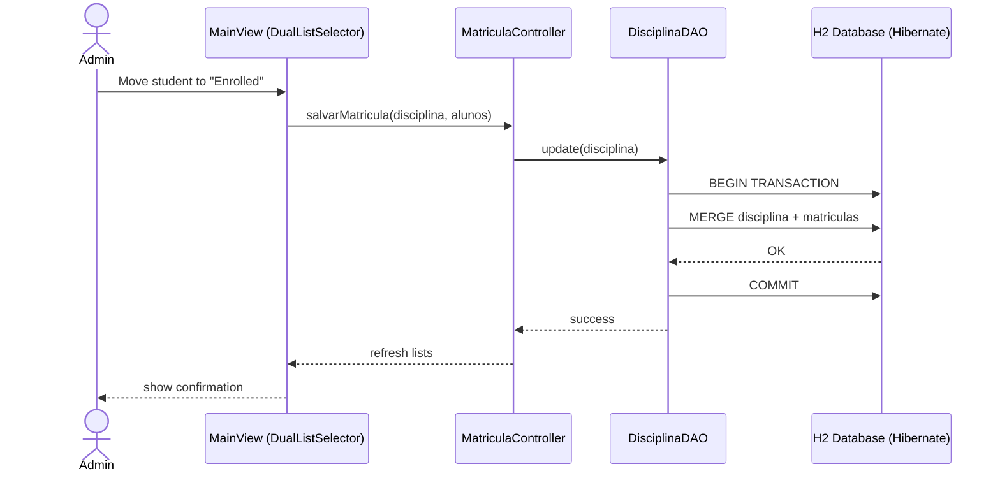
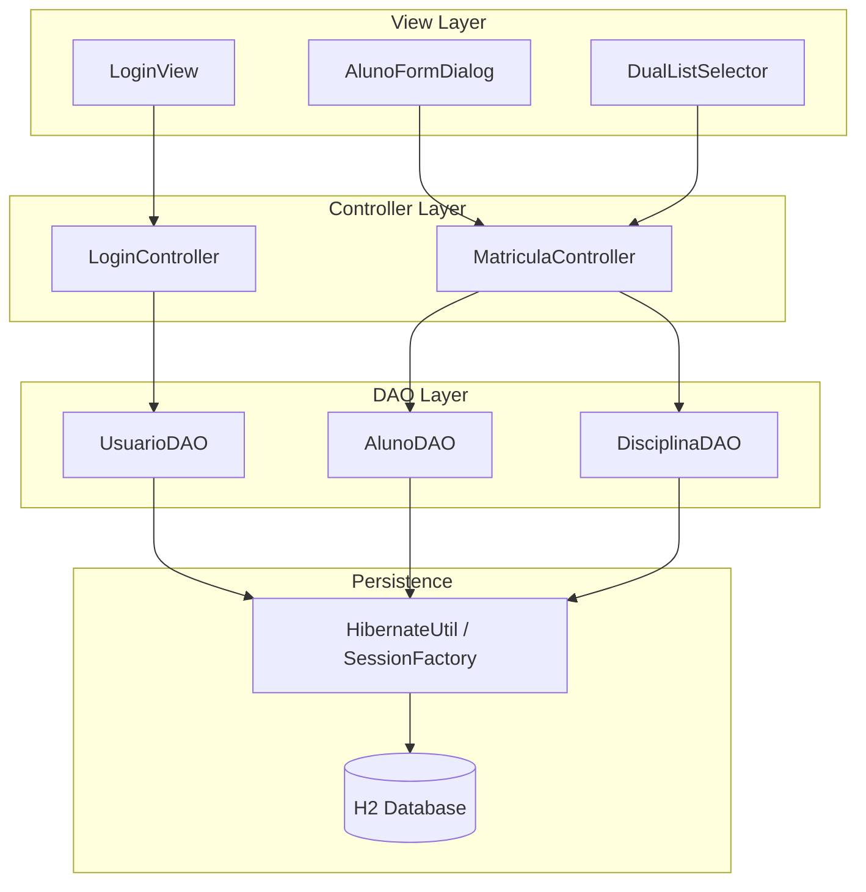
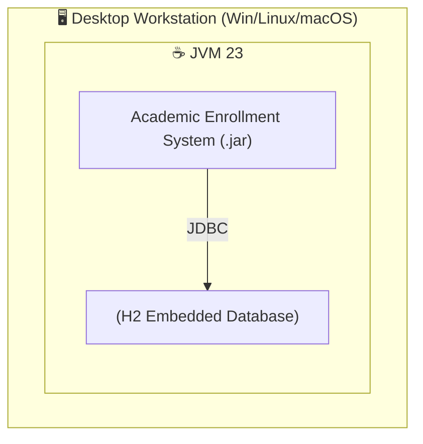
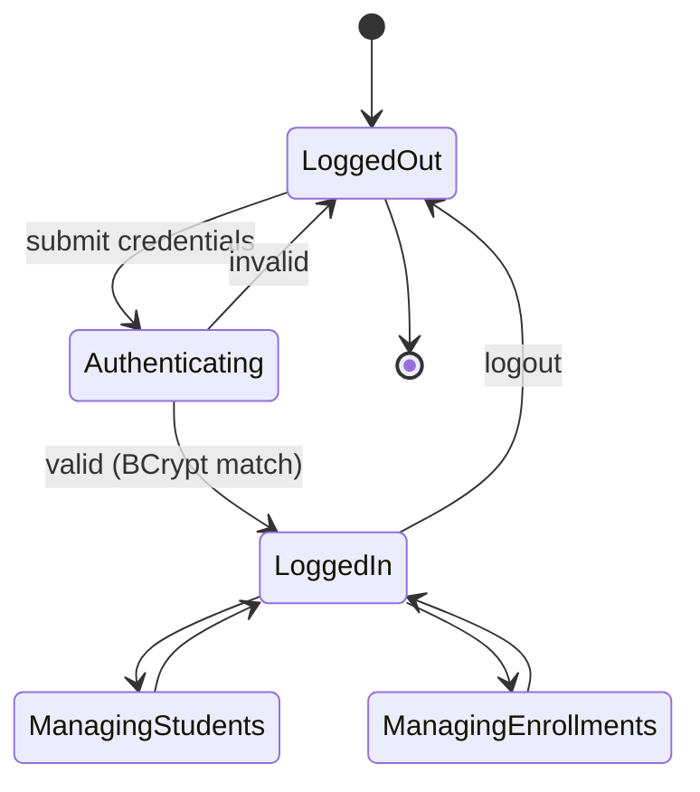
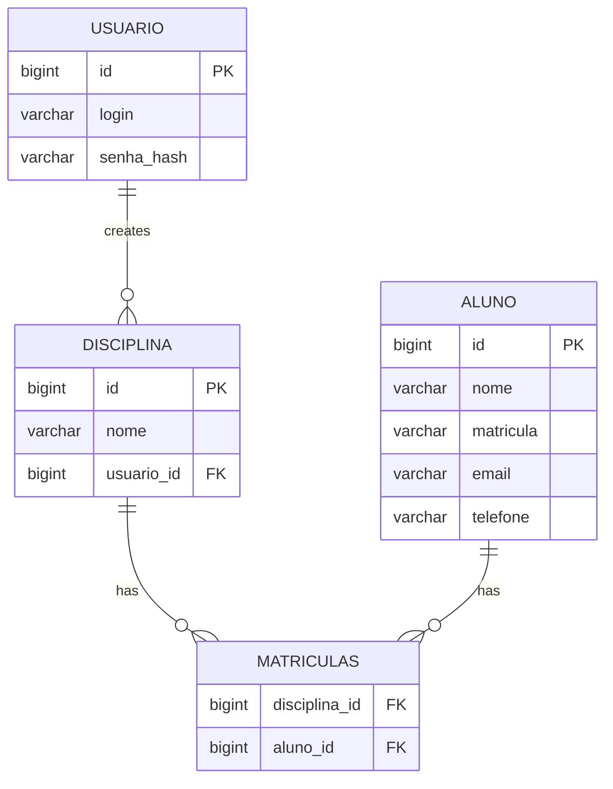
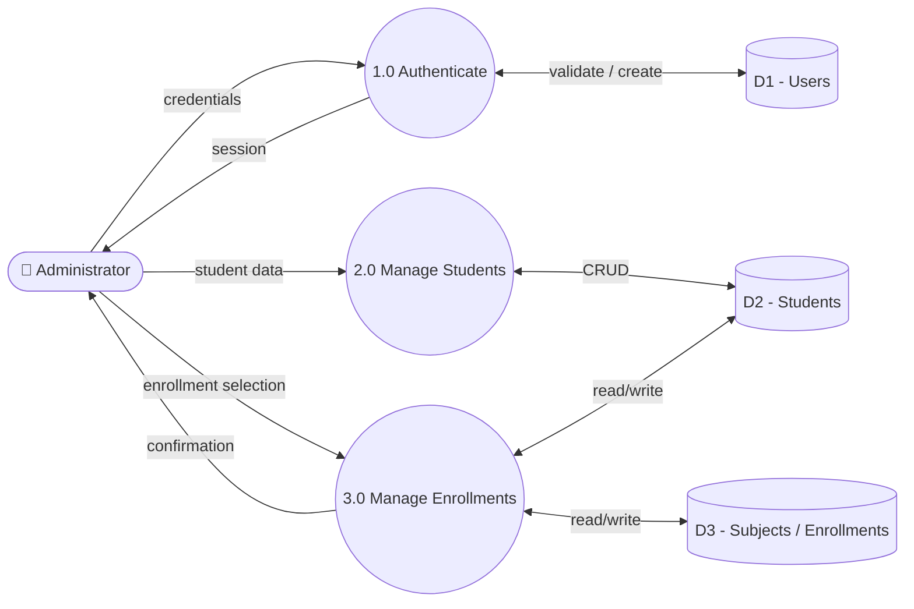
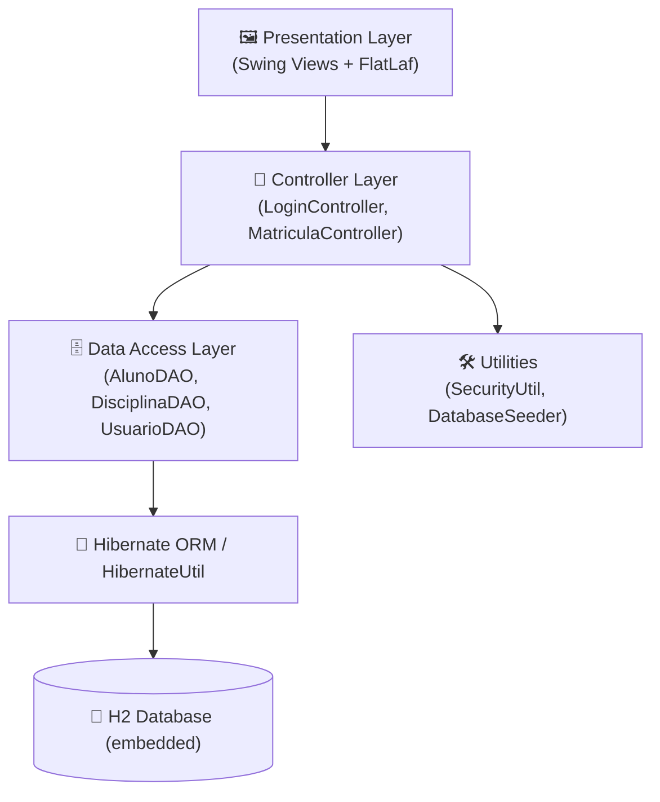
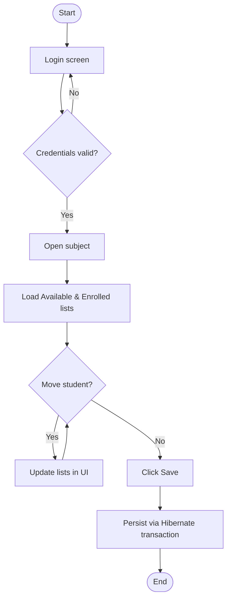

<div align="center">
  <br />
  

  <h1>🎓 Academic Enrollment System</h1>

  <strong style="font-size: 1.2em;">
    Dual List Selection Component with Hibernate Persistence
  </strong>

  <br /><br />

  <p style="max-width: 700px;">
    A robust desktop solution built in <strong>Java Swing</strong> under the <strong>MVC</strong> architecture. The project focuses on a reusable visual component for item selection and data persistence using <strong>Hibernate ORM</strong>.
  </p>

  <p>
    
    
    
    
  </p>

  <p>
    🌐 <strong>Choose Language / Selecione o idioma / Elija el idioma</strong><br/><br/>
    <a href="README.md"></a>
    <a href="README_PT.md"></a>
    <a href="README_ES.md"></a>
  </p>
</div>

---

## 📖 About the Project

The **Academic Enrollment System** is a desktop application built to demonstrate advanced skills in Object-Oriented Programming and the **MVC** architecture. Its core feature is a reusable "Dual List Selector" component used to enroll students into subjects, backed by **Hibernate** persistence and an embedded **H2** database.

## 📑 Table of Contents

- 📋 Requirements (Functional, Non-Functional, Business Rules, Domain, Data, Interface)
- 🎭 Use Cases
- 🔗 Requirements Traceability Matrix
- 📄 Software Requirements Specification (SRS)
- 📊 UML & Structural Diagrams (Use Case, Class, Sequence, Component, Deployment, State Machine)
- 🗄️ Data Model & Data Dictionary (Conceptual / Logical / Physical / ER Diagram)
- 🔀 Data Flow Diagram (DFD)
- 🏗️ Architecture Diagram & Flowchart
- 👤 Persona & User Journey Map
- 🖼️ Wireframes & Mockups
- 🚀 Installation & Execution
- 👨‍💻 Author

---

<details>
<summary>

## 📋 1. Requirements

</summary>

### ✅ Functional Requirements (FR)

| ID | Module | Description | Priority |
|---|---|---|---|
| FR-001 | Authentication | The system must allow login and registration of administrator accounts. | Essential |
| FR-002 | Student Management | The system must allow creating, editing and deleting students (CRUD). | Essential |
| FR-003 | Enrollment | The user must be able to move students between "Available" and "Enrolled" lists. | Essential |
| FR-004 | Enrollment | On "Save", the association between student and subject must be persisted. | Essential |
| FR-005 | Interface | The list must display an avatar icon next to the student's name. | Medium |
| FR-006 | Subject Management | The system must allow an authenticated user to create subjects owned by them. | High |
| FR-007 | Data Seeding | On first run, the system must seed the database with sample students and a default admin user. | Medium |

### ⚡ Non-Functional Requirements (NFR)

| ID | Attribute | Description |
|---|---|---|
| NFR-001 | Usability | The UI must use the FlatLaf theme for a modern, responsive look. |
| NFR-002 | Portability | The database must be embedded H2, requiring no external installation. |
| NFR-003 | Maintainability | Code must strictly follow MVC and use Generics in the visual component. |
| NFR-004 | Security | Passwords must never be stored in plain text (BCrypt hashing). |
| NFR-005 | Reliability | Write operations must be atomic, using Hibernate transactions with rollback on failure. |
| NFR-006 | Performance | The student list must render smoothly with 1,000+ records via a custom `ListCellRenderer`. |

### 📜 Business Rules (BR)

| ID | Actor | Rule | Rationale |
|---|---|---|---|
| BR-001 | System | An enrollment links a student to a subject via a many-to-many join table. | Allows a student to be enrolled in multiple subjects. |
| BR-002 | System | On first run, if no users exist, an `admin` / `1234` user is auto-created. | Guarantees immediate access without manual setup. |
| BR-003 | User | The student's "Matrícula" (registration number) must be unique. | Ensures academic record uniqueness. |
| BR-004 | System | New user passwords must be hashed with BCrypt before persistence. | Baseline security against data leaks. |
| BR-005 | User | Deleting a student is permanent and removes all of its enrollments. | Hard delete as required by the exercise scope. |
| BR-006 | System | A subject (Disciplina) always belongs to the user (Usuario) who created it. | Establishes ownership boundary for multi-admin scenarios. |

### 🌐 Domain Requirements

- The system models a simplified academic domain: **Users (administrators)**, **Subjects**, **Students**, and **Enrollments**.
- An "Enrollment" is not a first-class entity in the UI — it is represented by the membership of a `Student` in a `Subject`'s collection.
- Domain vocabulary is in Portuguese in the codebase (`Aluno`, `Disciplina`, `Usuario`, `Matricula`) reflecting the academic institution's native language.

### 🗃️ Data Requirements

- Student records require: full name, unique registration number, email, and phone.
- User records require: unique login and a hashed password (never plain text).
- Subject records require: a name and an owning user.
- The enrollment relation requires only the pair (subject ID, student ID).

### 🖥️ Interface Requirements

- The login screen must validate credentials and display visual feedback for errors.
- The main screen must present two synchronized lists ("Available" / "Enrolled") with move buttons.
- Forms (Add/Edit Student) must validate mandatory fields before enabling "Save".
- The UI must use a consistent flat, modern Look & Feel (FlatLaf) across all windows.

</details>

---

<details>
<summary>

## 🎭 2. Use Cases

</summary>

| ID | Use Case | Primary Actor | Description |
|---|---|---|---|
| UC-01 | Login | Administrator | Authenticate with login and password to access the system. |
| UC-02 | Register Account | Visitor | Create a new administrator account with a hashed password. |
| UC-03 | Manage Students (CRUD) | Administrator | Create, edit, view and delete student records. |
| UC-04 | Manage Subjects | Administrator | Create subjects owned by the logged-in user. |
| UC-05 | Enroll / Unenroll Students | Administrator | Move students between "Available" and "Enrolled" lists and persist the result. |

### Use Case Diagram



</details>

---

<details>
<summary>

## 🔗 3. Requirements Traceability Matrix

</summary>

| Requirement | Use Case | Diagram(s) | Component |
|---|---|---|---|
| FR-001 / BR-002 | UC-01 Login | Sequence, State Machine | `LoginController`, `UsuarioDAO` |
| FR-001 / BR-004 | UC-02 Register Account | Class, State Machine | `LoginController`, `SecurityUtil` |
| FR-002 / BR-003 / BR-005 | UC-03 Manage Students | Class, ER Diagram | `AlunoFormDialog`, `AlunoDAO` |
| FR-006 / BR-006 | UC-04 Manage Subjects | Class, ER Diagram | `MatriculaController`, `DisciplinaDAO` |
| FR-003 / FR-004 / BR-001 | UC-05 Enroll / Unenroll | Sequence, Component, Flowchart | `DualListSelector`, `MatriculaController`, `DisciplinaDAO` |
| FR-005 | UC-03 | Wireframe / Mockup | `DualListSelector` (custom renderer) |
| NFR-002 / NFR-004 / NFR-005 | UC-01..05 | Deployment, Architecture | `HibernateUtil`, `SecurityUtil` |

</details>

---

<details>
<summary>

## 📄 4. Software Requirements Specification (SRS)

</summary>

### 4.1 Purpose

This document specifies the functional and non-functional behavior of the Academic Enrollment System, a desktop application for managing students, subjects and enrollments.

### 4.2 Scope

The system covers: administrator authentication, student CRUD, subject creation, and enrollment management via a dual-list interface. It does not cover grading, attendance, or multi-institution support.

### 4.3 Overall Description

- **Product perspective:** standalone Java Swing desktop app with an embedded H2 database — no external server required.
- **User classes:** a single role, *Administrator* (created via registration, seeded by default as `admin` / `1234`).
- **Operating environment:** Windows, Linux or macOS with Java 23+ installed.
- **Constraints:** strict MVC separation; generic, reusable UI component (`DualListSelector<T>`).

### 4.4 Specific Requirements

See [§1 Requirements](#-1-requirements) for the full FR / NFR / BR list, and [§2 Use Cases](#-2-use-cases) for behavioral specifications.

### 4.5 External Interface Requirements

- **UI:** Swing + FlatLaf, described in [§9 Wireframes & Mockups](#-9-wireframes--mockups).
- **Data:** embedded H2 database via Hibernate, described in [§6 Data Model](#-6-data-model--data-dictionary).
- **Hardware:** none beyond a standard desktop/laptop capable of running a JVM.

</details>

---

<details>
<summary>

## 📊 5. UML & Structural Diagrams

</summary>

### Class Diagram



### Sequence Diagram — Enroll Student



### Component Diagram



### Deployment Diagram



### State Machine — User Session



> 📦 *Note: in the interest of conciseness, Object, Communication, Activity, Package, Composite Structure, Interaction Overview and Timing diagrams are consolidated into the diagrams above — the system's small scope (3 entities, 2 controllers, 1 generic UI component) is fully covered by these six views.*

</details>

---

<details>
<summary>

## 🗄️ 6. Data Model & Data Dictionary

</summary>

### Conceptual Model

Three core concepts: **User** (administrator), **Subject** (owned by a User), and **Student** (enrolled in zero or more Subjects). The relationship between Subject and Student is many-to-many ("Enrollment").

### Logical Model

- `Usuario (1) ──< (N) Disciplina`
- `Disciplina (N) ──< matriculas >── (N) Aluno`

### Physical Model — ER Diagram



### Data Dictionary

**`alunos`**

| Field | Type | Constraints | Description |
|---|---|---|---|
| id | BIGINT | PK, auto-increment | Unique student identifier |
| nome | VARCHAR | NOT NULL | Full name |
| matricula | VARCHAR | NOT NULL, UNIQUE | Registration number |
| email | VARCHAR | nullable | Contact email |
| telefone | VARCHAR | nullable | Contact phone |

**`usuarios`**

| Field | Type | Constraints | Description |
|---|---|---|---|
| id | BIGINT | PK, auto-increment | Unique user identifier |
| login | VARCHAR | NOT NULL, UNIQUE | Username |
| senha_hash | VARCHAR | NOT NULL | BCrypt password hash |

**`disciplinas`**

| Field | Type | Constraints | Description |
|---|---|---|---|
| id | BIGINT | PK, auto-increment | Unique subject identifier |
| nome | VARCHAR | NOT NULL | Subject name |
| usuario_id | BIGINT | FK → usuarios.id | Owning administrator |

**`matriculas`** (join table)

| Field | Type | Constraints | Description |
|---|---|---|---|
| disciplina_id | BIGINT | FK → disciplinas.id | Enrolled subject |
| aluno_id | BIGINT | FK → alunos.id | Enrolled student |

</details>

---

<details>
<summary>

## 🔀 7. Data Flow Diagram (DFD)

</summary>



> *Data lineage: student and enrollment data originates from manual admin input or the `DatabaseSeeder` (first run), flows through the DAO layer, and is persisted to the H2 file/in-memory store — no external systems are involved.*

</details>

---

<details>
<summary>

## 🏗️ 8. Architecture Diagram & Flowchart

</summary>

### Architecture (Layered MVC)



### Flowchart — Enrollment Process



</details>

---

<details>
<summary>

## 👤 9. Persona & User Journey Map

</summary>

### Persona

| Attribute | Description |
|---|---|
| **Name** | Carla Mendes |
| **Role** | Academic Coordinator |
| **Age** | 41 |
| **Tech-savviness** | Intermediate — comfortable with desktop apps, not a developer |
| **Goals** | Quickly enroll/unenroll students each semester without errors |
| **Frustrations** | Slow, cluttered legacy systems; fear of losing unsaved changes |
| **Quote** | *"I just need to move students between lists and know it saved."* |

### User Journey Map

| Stage | Action | Touchpoint | Emotion | Pain Point | Opportunity |
|---|---|---|---|---|---|
| 1. Access | Opens app, logs in | LoginView | Neutral | Forgets password | Clear error feedback (FR-001) |
| 2. Orientation | Selects a subject | MainView | Curious | Too many subjects listed | Search/filter (future) |
| 3. Action | Drags/moves students between lists | DualListSelector | Focused | Unsure which side is "enrolled" | Clear labels + icons (FR-005) |
| 4. Confirmation | Clicks "Save" | MainView | Relieved | No feedback after save | Toast/confirmation dialog |
| 5. Review | Reopens subject to verify | MainView | Confident | — | Data persisted correctly (FR-004) |

</details>

---

<details>
<summary>

## 🖼️ 10. Wireframes & Mockups

</summary>

### Login Screen (Wireframe)

```
┌──────────────────────────────────────┐
│              🎓 LOGIN                 │
│                                        │
│   Username  [______________]         │
│   Password  [______________]         │
│                                        │
│         [   ENTER   ]  [ REGISTER ]   │
│                                        │
│   ⚠ Invalid credentials (on error)    │
└──────────────────────────────────────┘
```

### Main Screen — Dual List (Mockup)

```
┌────────────────────────────────────────────────────────────────┐
│  Subject: [ Calculus I        ▼ ]                [ Save 💾 ]    │
├─────────────────────────┬───────────┬──────────────────────────┤
│  AVAILABLE STUDENTS      │           │   ENROLLED STUDENTS      │
│  ────────────────────    │   ➡ Add   │   ────────────────────   │
│  👤 2024001 - Ana Silva   │           │   👤 2024010 - João Lima  │
│  👤 2024002 - Bruno Costa │   ⬅ Remove│   👤 2024011 - Maria Reis │
│  👤 2024003 - Carla Souza │           │   👤 2024012 - Pedro Alve │
│  ...                      │           │   ...                    │
├─────────────────────────┴───────────┴──────────────────────────┤
│ [ + New Student ]  [ ✎ Edit ]  [ 🗑 Delete ]                     │
└────────────────────────────────────────────────────────────────┘
```

</details>

---

## 🚀 Installation & Execution

### Prerequisites

* **Java JDK 23**
* **Maven** 3.8+
* **Git** (optional)
* Recommended IDE: **IntelliJ IDEA**

### Steps

1. Clone the repository:
   ```bash
   git clone https://github.com/VictorHJesusSantiago/DualListHibernate.git
   ```
2. Open the project in your IDE and let Maven download dependencies from `pom.xml`.
3. Set the Project SDK to **Java 23**.
4. Run `src/main/java/br/com/projeto/MainApp.java`.

### 🔑 Default Access

On first run, the system seeds:

* **User:** `admin`
* **Password:** `1234`

---

## 👨‍💻 Author

<table>
  <tr>
    <td width="100" align="center">
      
    </td>
    <td>
      <strong>Victor Henrique Jesus Santiago</strong><br>
      Full Stack Developer<br><br>
      📧 <a href="mailto:victorhenriquedejesussantiago@gmail.com">victorhenriquedejesussantiago@gmail.com</a><br>
      👔 <a href="https://www.linkedin.com/in/victor-henrique-de-jesus-santiago/">LinkedIn/victorhjsantiago</a><br>
      🐙 <a href="https://github.com/VictorHJesusSantiago">GitHub/VictorHJesusSantiago</a>
    </td>
  </tr>
</table>
