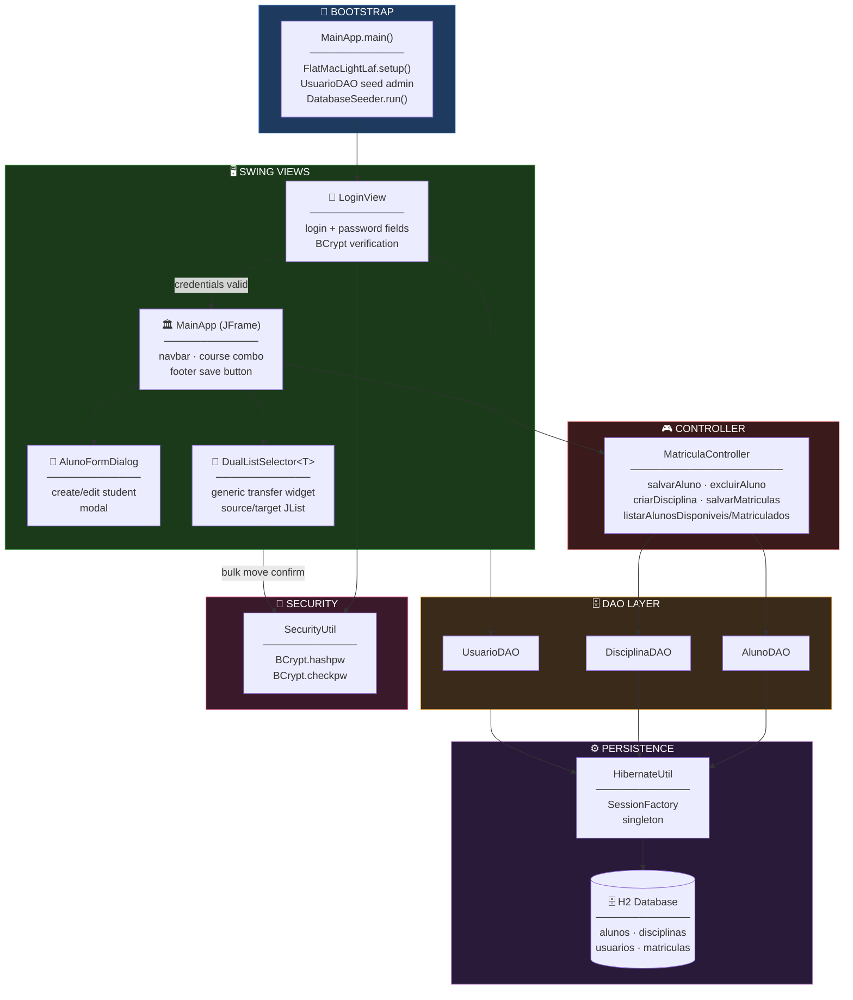
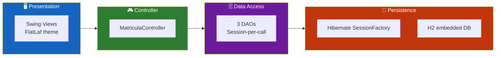
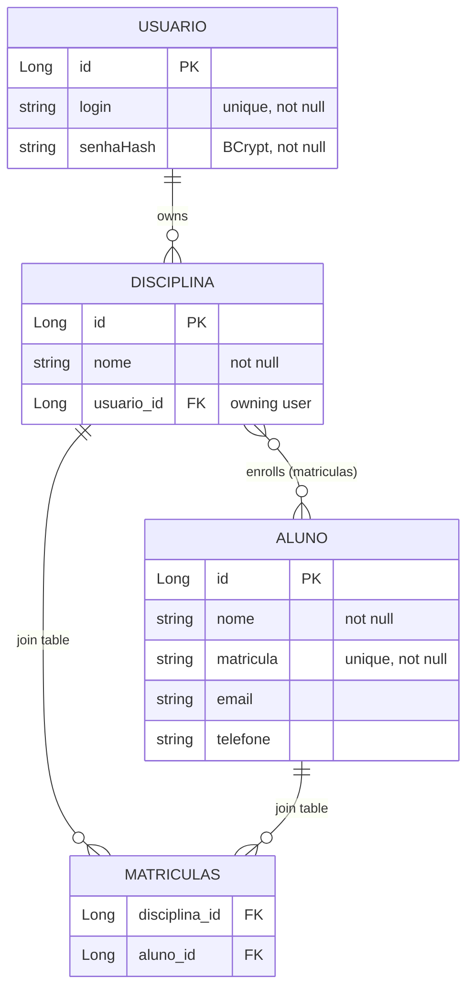
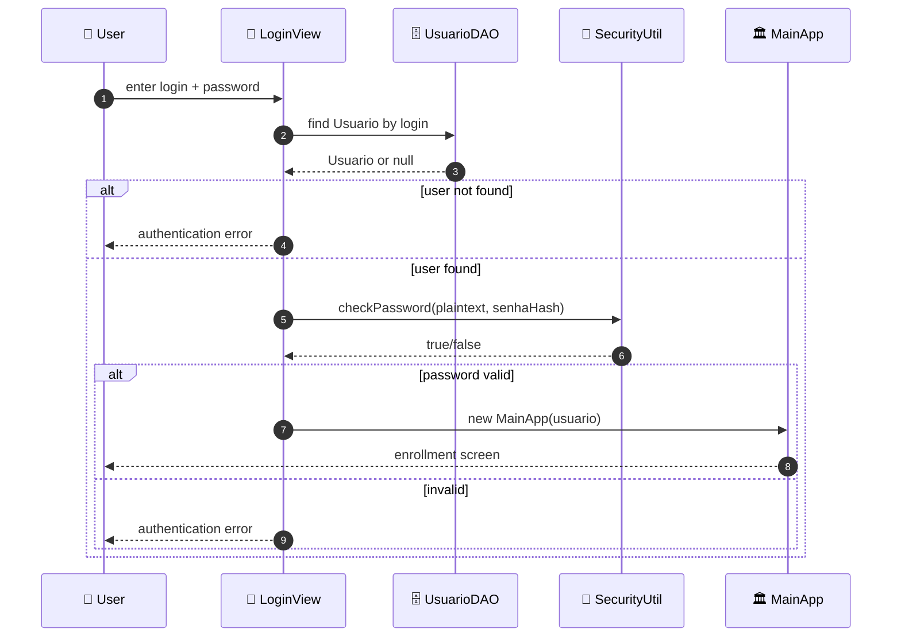
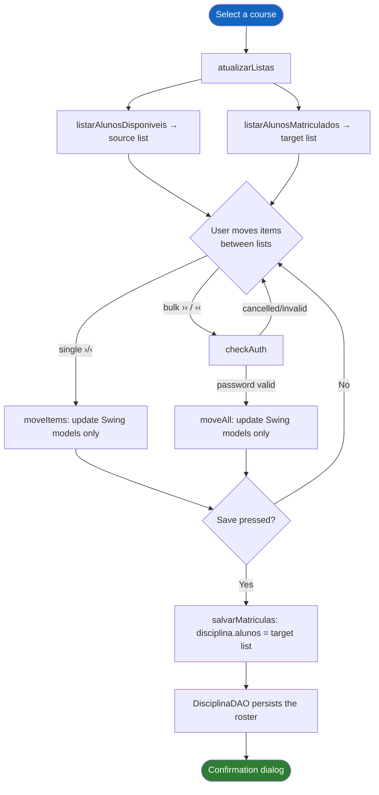
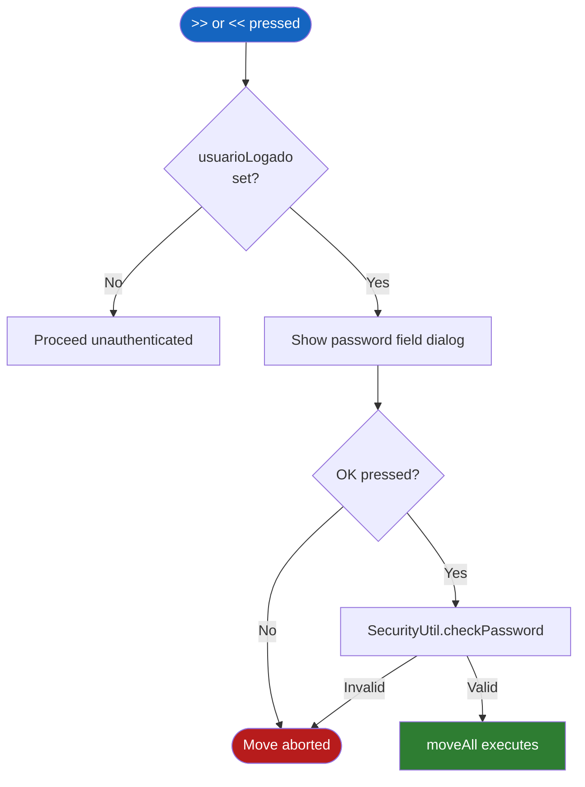

<div align="center">

**🌐 Choose Language / Selecione o Idioma / Elija el Idioma**

[](README.md)&nbsp;&nbsp;&nbsp;[](README_PT.md)&nbsp;&nbsp;&nbsp;[](README_ES.md)

</div>

---

<div align="center">

```
██████╗ ██╗   ██╗ █████╗ ██╗     ██╗     ██╗███████╗████████╗
██╔══██╗██║   ██║██╔══██╗██║     ██║     ██║██╔════╝╚══██╔══╝
██║  ██║██║   ██║███████║██║     ██║     ██║███████╗   ██║
██║  ██║██║   ██║██╔══██║██║     ██║     ██║╚════██║   ██║
██████╔╝╚██████╔╝██║  ██║███████╗███████╗██║███████║   ██║
╚═════╝  ╚═════╝ ╚═╝  ╚═╝╚══════╝╚══════╝╚═╝╚══════╝   ╚═╝
     Swing + Hibernate Enrollment Manager with a Dual-List UI
```

---

[-ED8B00?style=for-the-badge&logo=openjdk&logoColor=white)](https://openjdk.org/)
[](https://hibernate.org/)
[](https://www.h2database.com/)
[]()
[](https://www.formdev.com/flatlaf/)
[]()
[](https://maven.apache.org/)

<br/>

> **A desktop enrollment manager where moving a student between two lists**
> *is* the act of enrolling or withdrawing them, backed by Hibernate ORM over an embedded H2 database.

<br/>


</div>

---

## 📑 Table of Contents

<details>
<summary>▶️ <strong>Click to expand / collapse this section</strong></summary>

<table>
<tr>
<td valign="top" width="50%">

**🏗️ System**
- [Overview](#-overview)
- [System Architecture](#-system-architecture)
- [Technology Stack](#-technology-stack)
- [Design Patterns](#-design-patterns-applied)
- [Project Structure](#-project-structure)

**📦 Modules**
- [MainApp — Shell](#-mainapp--application-shell)
- [LoginView — Authentication](#-loginview--authentication-screen)
- [DualListSelector — Generic UI](#-duallistselector--generic-dual-list-widget)
- [MatriculaController — Orchestration](#-matriculacontroller--enrollment-orchestration)
- [DAO Layer](#-dao-layer--alunodao-disciplinadao-usuariodao)
- [SecurityUtil — Hashing](#-securityutil--password-hashing)
- [HibernateUtil / DatabaseSeeder](#-hibernateutil--databaseseeder)

</td>
<td valign="top" width="50%">

**💼 Business**
- [Business Rules](#-business-rules)
- [Functional Requirements](#-functional-requirements)
- [Non-Functional Requirements](#-non-functional-requirements)

**📐 Design**
- [Data Model](#-data-model)
- [System Flows](#-system-flows)
- [Login Flow](#login-flow)
- [Enrollment Flow](#enrollment-flow)
- [Bulk Move Authorization Flow](#bulk-move-authorization-flow)

**🔐 Security & Ops**
- [Security](#-security)
- [Installation & Execution](#-installation--execution)
- [Automated Tests](#-automated-tests)
- [Metrics & Monitoring](#-metrics--monitoring)
- [Known Limitations](#-known-limitations)

</td>
</tr>
</table>

---

</details>

## 🌟 Overview

<details>
<summary>▶️ <strong>Click to expand / collapse this section</strong></summary>

**DualListHibernate** is a Java Swing desktop application that manages student enrollment in courses ("disciplinas") through a **dual-list transfer widget**: available students sit in a left-hand list, enrolled students sit in a right-hand list, and single or bulk arrow buttons move entries between them. Saving simply persists whatever ended up on the right side as the course's enrolled roster — the UI state *is* the domain state until the save button commits it.

Persistence runs through **Hibernate ORM 6** against an embedded **H2** database, with three JPA entities — `Usuario`, `Disciplina`, `Aluno` — connected by a one-to-many (user owns courses) and a many-to-many (course enrolls students) relationship. A lightweight DAO layer wraps Hibernate `Session` boilerplate, and a `MatriculaController` sits between the Swing views and the DAOs, keeping persistence concerns out of the UI code.

Access is gated by a login screen backed by **BCrypt** password hashing, and destructive bulk operations (moving *all* students at once) require re-entering the logged-in admin's password before they proceed.

### 🎯 System Objectives

| Objective | Description |
|-----------|-------------|
| 🔄 **Dual-list enrollment** | Represent "enrolled" vs. "available" as two lists connected by transfer arrows |
| 🎓 **Course management** | Let an authenticated user create courses and scope enrollment to them |
| 👤 **Student CRUD** | Create, edit and delete student records through a modal form dialog |
| 🔐 **Authenticated access** | Require login before any enrollment screen is reachable |
| 🛡️ **Bulk-action confirmation** | Require a password re-entry before moving an entire list at once |
| 🗄️ **ORM-backed persistence** | Model the domain as JPA entities mapped by Hibernate onto H2 tables |
| 🌱 **Deterministic startup data** | Seed an admin user and demo data automatically on first run |
| 🎨 **Modern desktop look** | Render with FlatLaf's Mac Light theme instead of default Swing chrome |

---

</details>

## 🏗️ System Architecture

<details>
<summary>▶️ <strong>Click to expand / collapse this section</strong></summary>

### Module Diagram


```mermaid
flowchart TB
    subgraph BOOT["🚀  BOOTSTRAP"]
        MAIN["MainApp.main()\n─────────────\nFlatMacLightLaf.setup()\nUsuarioDAO seed admin\nDatabaseSeeder.run()"]
    end

    subgraph UI["🖥️  SWING VIEWS"]
        direction LR
        LOGIN["🔐 LoginView\n─────────────\nlogin + password fields\nBCrypt verification"]
        APP["🏛️ MainApp (JFrame)\n─────────────\nnavbar · course combo\nfooter save button"]
        FORM["📝 AlunoFormDialog\n─────────────\ncreate/edit student\nmodal"]
        DLS["🔀 DualListSelector&lt;T&gt;\n─────────────\ngeneric transfer widget\nsource/target JList"]
    end

    subgraph CTRL["🎮  CONTROLLER"]
        MC["MatriculaController\n─────────────────────\nsalvarAluno · excluirAluno\ncriarDisciplina · salvarMatriculas\nlistarAlunosDisponiveis/Matriculados"]
    end

    subgraph DAO["🗄️  DAO LAYER"]
        direction LR
        ADAO["AlunoDAO"]
        DDAO["DisciplinaDAO"]
        UDAO["UsuarioDAO"]
    end

    subgraph ORM["⚙️  PERSISTENCE"]
        HU["HibernateUtil\n─────────────\nSessionFactory\nsingleton"]
        DB[("🗄️ H2 Database\n─────────────\nalunos · disciplinas\nusuarios · matriculas")]
    end

    subgraph SEC["🔐  SECURITY"]
        SU["SecurityUtil\n─────────────\nBCrypt.hashpw\nBCrypt.checkpw"]
    end

    MAIN --> LOGIN
    LOGIN -->|"credentials valid"| APP
    LOGIN --> SU
    APP --> DLS
    APP --> FORM
    APP --> MC
    DLS -->|"bulk move confirm"| SU
    MC --> ADAO & DDAO
    LOGIN --> UDAO
    ADAO & DDAO & UDAO --> HU --> DB

    style BOOT fill:#1e3a5f,color:#fff,stroke:#4a90d9
    style UI fill:#1a3a1a,color:#fff,stroke:#4caf50
    style CTRL fill:#3a1a1a,color:#fff,stroke:#e57373
    style DAO fill:#3a2a1a,color:#fff,stroke:#ffb74d
    style ORM fill:#2a1a3a,color:#fff,stroke:#ce93d8
    style SEC fill:#3a1a2a,color:#fff,stroke:#f06292
```

### Architecture Layers


```mermaid
flowchart LR
    subgraph L1["🖥️ Presentation"]
        A1["Swing Views\nFlatLaf theme"]
    end
    subgraph L2["🎮 Controller"]
        B1["MatriculaController"]
    end
    subgraph L3["🗄️ Data Access"]
        C1["3 DAOs\nSession-per-call"]
    end
    subgraph L4["💾 Persistence"]
        D1["Hibernate SessionFactory"]
        D2["H2 embedded DB"]
    end

    L1 --> L2 --> L3 --> L4

    style L1 fill:#1565C0,color:#fff
    style L2 fill:#2E7D32,color:#fff
    style L3 fill:#6A1B9A,color:#fff
    style L4 fill:#BF360C,color:#fff
```

---

</details>

## 🛠️ Technology Stack

<details>
<summary>▶️ <strong>Click to expand / collapse this section</strong></summary>

<table>
<thead>
<tr>
<th>Layer</th>
<th>Technology</th>
<th>Version</th>
<th>Purpose</th>
</tr>
</thead>
<tbody>
<tr>
<td><strong>🧠 Language</strong></td>
<td>Java</td>
<td>23 (preview features enabled)</td>
<td>Entire application, compiled with <code>--enable-preview</code></td>
</tr>
<tr>
<td rowspan="2"><strong>🗄️ Persistence</strong></td>
<td>Hibernate ORM</td>
<td>6.4.1.Final</td>
<td>JPA implementation, entity mapping, session management</td>
</tr>
<tr>
<td>H2 Database</td>
<td>2.2.224</td>
<td>Embedded, file/memory-backed relational store</td>
</tr>
<tr>
<td rowspan="2"><strong>🎨 UI</strong></td>
<td>Java Swing</td>
<td>JDK-bundled</td>
<td>Windows, dialogs, lists, layout managers</td>
</tr>
<tr>
<td>FlatLaf</td>
<td>3.2.5</td>
<td>Modern Look &amp; Feel (Mac Light), rounded components via <code>FlatClientProperties.STYLE</code></td>
</tr>
<tr>
<td><strong>🔐 Security</strong></td>
<td>jBCrypt</td>
<td>0.4</td>
<td>Password hashing (<code>gensalt(12)</code>) and verification</td>
</tr>
<tr>
<td rowspan="2"><strong>🔧 Build</strong></td>
<td>Maven</td>
<td>—</td>
<td><code>pom.xml</code>, single-module project</td>
</tr>
<tr>
<td>maven-compiler-plugin</td>
<td>3.11.0</td>
<td>Compiles with <code>source</code>/<code>target</code> 23 and preview flag</td>
</tr>
</tbody>
</table>

---

</details>

## 🎨 Design Patterns Applied

<details>
<summary>▶️ <strong>Click to expand / collapse this section</strong></summary>

| Pattern | Where | Rationale |
|---------|-------|-----------|
| 🧭 **MVC-ish layering** | Views (`MainApp`, `LoginView`, `AlunoFormDialog`) → Controller (`MatriculaController`) → DAO → Hibernate | UI never touches Hibernate directly; every persistence call is mediated |
| 🔀 **Generic Widget** | `DualListSelector<T>` | The transfer-list mechanic is written once and reused for any list-of-`T`, not hardcoded to `Aluno` |
| 🏭 **DAO Pattern** | `AlunoDAO`, `DisciplinaDAO`, `UsuarioDAO` | Each entity gets a small, focused persistence gateway |
| 🔂 **Singleton** | `HibernateUtil` — one `SessionFactory` for the process lifetime | Avoids the cost of rebuilding Hibernate's metadata model per call |
| 🧱 **Custom Cell Renderer** | `ModernStudentRenderer` inside `DualListSelector` | Decouples "how a student looks in a list" from the list widget itself |
| 🚦 **Guard Confirmation** | `checkAuth()` before `moveAll()` | Bulk, high-blast-radius actions require an explicit re-authentication step |
| 🌱 **Seed on Boot** | `UsuarioDAO.criarUsuarioAdminSeNaoExistir()` + `DatabaseSeeder.run()` | The app is runnable from a clean database with zero manual setup |
| 🎨 **Client-Property Styling** | `FlatClientProperties.STYLE` strings throughout the views | Per-component visual tweaks (arc, border, hover) without subclassing Swing components |

---

</details>

## 📁 Project Structure

<details>
<summary>▶️ <strong>Click to expand / collapse this section</strong></summary>

```
DualListHibernate/
│
├── 📄 pom.xml                            # Maven build: Hibernate, H2, FlatLaf, jBCrypt
│
└── 📂 src/main/
    ├── 📂 java/br/com/projeto/
    │   ├── 📄 MainApp.java                       # ★ Application shell — navbar, course combo, save
    │   │
    │   ├── 📂 controller/
    │   │   └── 📄 MatriculaController.java        # ★ Enrollment orchestration, UI-facing API
    │   │
    │   ├── 📂 dao/
    │   │   ├── 📄 AlunoDAO.java                   # Student persistence gateway
    │   │   ├── 📄 DisciplinaDAO.java               # Course persistence gateway
    │   │   └── 📄 UsuarioDAO.java                  # User persistence gateway + admin seeding
    │   │
    │   ├── 📂 model/
    │   │   ├── 📄 Aluno.java                       # @Entity — student
    │   │   ├── 📄 Disciplina.java                  # @Entity — course, owns @ManyToMany alunos
    │   │   └── 📄 Usuario.java                     # @Entity — user, owns @OneToMany disciplinas
    │   │
    │   ├── 📂 util/
    │   │   ├── 📄 DatabaseSeeder.java              # Demo-data bootstrap
    │   │   ├── 📄 HibernateUtil.java               # SessionFactory singleton
    │   │   └── 📄 SecurityUtil.java                # BCrypt hash/verify
    │   │
    │   └── 📂 view/
    │       ├── 📄 LoginView.java                   # Authentication screen
    │       ├── 📄 DualListSelector.java            # ★ Generic dual-list transfer widget
    │       └── 📄 AlunoFormDialog.java             # Create/edit student modal
    │
    └── 📂 resources/
        └── 📄 hibernate.cfg.xml                    # Hibernate/H2 connection + dialect config
│
├── 📄 README.md                          # 🇺🇸 English (primary)
├── 📄 README_PT.md                       # 🇧🇷 Português
└── 📄 README_ES.md                       # 🇪🇸 Español
```

---

</details>

## 📦 System Modules

<details>
<summary>▶️ <strong>Click to expand / collapse this section</strong></summary>

### 🏛️ MainApp — Application Shell

The main `JFrame`, built entirely in code (no `.form`/XML layout). Holds a top navbar (title, course selector, new-course button, student action buttons, logout), a center `DualListSelector`, and a footer save button.

| Region | Contents |
|--------|----------|
| Navbar left | Title, "Disciplina:" combo box, `+` new-course button |
| Navbar right | Novo Aluno, Editar, Excluir, Sair |
| Center | `DualListSelector<Aluno>` bound to the selected course |
| Footer | "Salvar Alterações de Matrícula" — commits the target list as the roster |

`atualizarListas()` re-queries available and enrolled students from `MatriculaController` every time the course combo changes.

---

### 🔐 LoginView — Authentication Screen

The application's entry point (launched from `main()` after bootstrap). Collects a login and password, looks up the `Usuario` via `UsuarioDAO`, and verifies the password with `SecurityUtil.checkPassword` against the stored BCrypt hash. On success it opens `MainApp` with the authenticated `Usuario`; on failure it stays on screen.

---

### 🔀 DualListSelector — Generic Dual-List Widget

The centerpiece UI component, parameterized as `DualListSelector<T>` so the transfer mechanic is reusable beyond students.

| Element | Role |
|---------|------|
| `sourceModel` / `targetModel` | Two `DefaultListModel<T>` backing the "available" and "enrolled" `JList`s |
| `>` / `<` | Move the current selection one item at a time |
| `>>` / `<<` | Move every item at once — gated by `checkAuth()` |
| `ModernStudentRenderer` | Custom cell renderer drawing an initials avatar, name and "matrícula • email" subtitle |
| `checkAuth()` | Prompts for the logged-in admin's password before a bulk move proceeds |

`setSourceItems`/`setTargetItems` and `getSourceItems`/`getTargetItems` are the widget's public contract — `MainApp` reads and writes through these, never touching the Swing models directly.

---

### 🎮 MatriculaController — Enrollment Orchestration

The single point of contact between the Swing views and the DAO layer.

| Method | Responsibility |
|--------|-----------------|
| `salvarAluno(Aluno)` | Create or update a student via `AlunoDAO` |
| `excluirAluno(Aluno)` | Remove the student from every course's roster, then delete the record |
| `criarDisciplina(nome, usuario)` | Create a new course owned by the given user |
| `salvarMatriculas(disciplina, alunos)` | Overwrite a course's enrolled list with the given students |
| `listarDisciplinas(usuario)` | Courses owned by the current user |
| `listarAlunosDisponiveis(disciplina)` | All students not already in the course's roster |
| `listarAlunosMatriculados(disciplina)` | The course's current roster |

---

### 🗄️ DAO Layer — AlunoDAO, DisciplinaDAO, UsuarioDAO

Each DAO opens a Hibernate `Session` from `HibernateUtil`'s shared `SessionFactory`, wraps a transaction, and closes the session — one session per call, no long-lived session held across the UI's lifetime. `DisciplinaDAO.listarPorUsuario` and `AlunoDAO.listarTodos` back the combo box and the source list respectively.

---

### 🔐 SecurityUtil — Password Hashing

Two static methods wrapping jBCrypt.

| Method | Behaviour |
|--------|-----------|
| `hashPassword(plaintext)` | `BCrypt.hashpw(plaintext, BCrypt.gensalt(12))` — cost factor 12 |
| `checkPassword(plaintext, hash)` | Rejects immediately if `hash` is null or not `$2a$`-prefixed, else `BCrypt.checkpw` |

---

### ⚙️ HibernateUtil / DatabaseSeeder

`HibernateUtil` builds and caches a single `SessionFactory` from `hibernate.cfg.xml`. `DatabaseSeeder.run()` and `UsuarioDAO.criarUsuarioAdminSeNaoExistir()` run at startup so the app is immediately usable against a fresh H2 file with no manual data entry.

---

</details>

## 💼 Business Rules

<details>
<summary>▶️ <strong>Click to expand / collapse this section</strong></summary>

### 🎓 Enrollment Rules

| # | Rule | Enforcement |
|---|------|-------------|
| BR-01 | A student is "enrolled" in a course if and only if they appear in that course's target list at save time | `salvarMatriculas` overwrites `disciplina.alunos` wholesale |
| BR-02 | The available list for a course excludes every already-enrolled student | `listarAlunosDisponiveis` filters by enrolled ID set |
| BR-03 | Moving a single student requires only a selection, not authentication | `>` / `<` call `moveItems` directly |
| BR-04 | Moving an entire list requires the logged-in admin's password | `>>` / `<<` call `checkAuth()` before `moveAll()` |
| BR-05 | Enrollment changes are not persisted until "Salvar Alterações de Matrícula" is pressed | The dual-list state is purely client-side until the footer button fires |

### 👤 Student Rules

| # | Rule | Enforcement |
|---|------|-------------|
| BR-06 | `matricula` (student registration number) must be unique | `@Column(unique = true)` on `Aluno.matricula` |
| BR-07 | `nome` and `matricula` are mandatory | `@Column(nullable = false)` |
| BR-08 | Deleting a student removes them from every course they were enrolled in first | `excluirAluno` iterates all courses before the DAO delete |

### 🎓 Course Rules

| # | Rule | Enforcement |
|---|------|-------------|
| BR-09 | Every course belongs to exactly one owning user | `@ManyToOne` `Disciplina.usuario`, non-nullable |
| BR-10 | A user only sees and manages their own courses | `listarDisciplinas(usuario)` scopes the query |
| BR-11 | A new course starts with an empty roster | `Disciplina.alunos` defaults to an empty `ArrayList` |

### 🔐 Authentication Rules

| # | Rule | Enforcement |
|---|------|-------------|
| BR-12 | `login` must be unique | `@Column(unique = true)` on `Usuario.login` |
| BR-13 | Passwords are never stored in plaintext | Only `senhaHash` is persisted, produced by `SecurityUtil.hashPassword` |
| BR-14 | An admin account is guaranteed to exist on first run | `criarUsuarioAdminSeNaoExistir()` at startup |

---

</details>

## ✅ Functional Requirements

<details>
<summary>▶️ <strong>Click to expand / collapse this section</strong></summary>

| ID | Requirement | Priority | Status |
|----|-------------|----------|--------|
| **RF-01** | The system shall require login before showing the enrollment screen | 🔴 High | ✅ Implemented |
| **RF-02** | The system shall list students not yet enrolled in the selected course | 🔴 High | ✅ Implemented |
| **RF-03** | The system shall list students already enrolled in the selected course | 🔴 High | ✅ Implemented |
| **RF-04** | The system shall move a single selected student between the two lists | 🔴 High | ✅ Implemented |
| **RF-05** | The system shall move every student in a list at once | 🟡 Medium | ✅ Implemented |
| **RF-06** | The system shall require a password re-entry before a bulk move | 🔴 High | ✅ Implemented |
| **RF-07** | The system shall persist enrollment only when the save button is pressed | 🔴 High | ✅ Implemented |
| **RF-08** | The system shall allow creating a new course inline | 🟡 Medium | ✅ Implemented |
| **RF-09** | The system shall allow creating a new student via a modal form | 🔴 High | ✅ Implemented |
| **RF-10** | The system shall allow editing an existing student's data | 🔴 High | ✅ Implemented |
| **RF-11** | The system shall allow deleting a student after confirmation | 🔴 High | ✅ Implemented |
| **RF-12** | The system shall remove a deleted student from all course rosters | 🔴 High | ✅ Implemented |
| **RF-13** | The system shall seed an admin user automatically on first run | 🟡 Medium | ✅ Implemented |
| **RF-14** | The system shall seed demo data automatically on first run | 🟢 Low | ✅ Implemented |
| **RF-15** | The system shall warn when an action requires a selection that is missing | 🟡 Medium | ✅ Implemented |
| **RF-16** | The system shall log out and return to the login screen | 🟡 Medium | ✅ Implemented |

---

</details>

## ⚡ Non-Functional Requirements

<details>
<summary>▶️ <strong>Click to expand / collapse this section</strong></summary>

| ID | Category | Requirement | Target |
|----|----------|-------------|--------|
| **RNF-01** | ⚡ Performance | Course switch to list refresh | < 300 ms on local H2 |
| **RNF-02** | 🗄️ Persistence | Enrollment write is atomic per course | Single `salvarOuAtualizar` transaction |
| **RNF-03** | 🔐 Security | Passwords stored only as BCrypt hashes | Cost factor 12 |
| **RNF-04** | 🎨 Usability | UI follows a modern flat visual language | FlatLaf Mac Light + custom `STYLE` props |
| **RNF-05** | 🧱 Maintainability | UI code never calls Hibernate directly | All access mediated by DAOs |
| **RNF-06** | 🔁 Reusability | The transfer-list mechanic is not student-specific | `DualListSelector<T>` is generic |
| **RNF-07** | 🌱 Zero-setup | The app boots against an empty database without manual steps | Auto-seed admin + demo data |
| **RNF-08** | 🖥️ Portability | Runs on any JDK 23 host without an external database server | Embedded H2 |

---

</details>

## 🗄️ Data Model

<details>
<summary>▶️ <strong>Click to expand / collapse this section</strong></summary>

### Entity-Relationship Diagram


```mermaid
erDiagram
    USUARIO ||--o{ DISCIPLINA : "owns"
    DISCIPLINA }o--o{ ALUNO : "enrolls (matriculas)"

    USUARIO {
        Long id PK
        string login "unique, not null"
        string senhaHash "BCrypt, not null"
    }

    DISCIPLINA {
        Long id PK
        string nome "not null"
        Long usuario_id FK "owning user"
    }

    ALUNO {
        Long id PK
        string nome "not null"
        string matricula "unique, not null"
        string email
        string telefone
    }

    MATRICULAS {
        Long disciplina_id FK
        Long aluno_id FK
    }

    DISCIPLINA ||--o{ MATRICULAS : "join table"
    ALUNO ||--o{ MATRICULAS : "join table"
```

### Table Specification

| Table | Backing entity | Key relationship |
|-------|-----------------|-------------------|
| `usuarios` | `Usuario` | `@OneToMany(mappedBy="usuario", cascade=ALL, fetch=EAGER)` → `disciplinas` |
| `disciplinas` | `Disciplina` | `@ManyToOne` → `usuario`; `@ManyToMany(fetch=EAGER)` via `matriculas` → `alunos` |
| `alunos` | `Aluno` | Referenced by `matriculas`; identity via `id`, business key via `matricula` |
| `matriculas` | join table | `disciplina_id` + `aluno_id`, declared via `@JoinTable` on `Disciplina.alunos` |

> [!NOTE]
> `Disciplina.alunos` and `Usuario.disciplinas` are both `EAGER`-fetched, which keeps the dual-list refresh logic simple at the cost of loading full graphs on every course/user query — acceptable at this application's scale.

---

</details>

## 🔄 System Flows

<details>
<summary>▶️ <strong>Click to expand / collapse this section</strong></summary>

### Login Flow


```mermaid
sequenceDiagram
    autonumber
    participant U as 👤 User
    participant LV as 🔐 LoginView
    participant DAO as 🗄️ UsuarioDAO
    participant SEC as 🔐 SecurityUtil
    participant APP as 🏛️ MainApp

    U->>LV: enter login + password
    LV->>DAO: find Usuario by login
    DAO-->>LV: Usuario or null
    alt user not found
        LV-->>U: authentication error
    else user found
        LV->>SEC: checkPassword(plaintext, senhaHash)
        SEC-->>LV: true/false
        alt password valid
            LV->>APP: new MainApp(usuario)
            APP-->>U: enrollment screen
        else invalid
            LV-->>U: authentication error
        end
    end
```

### Enrollment Flow


```mermaid
flowchart TD
    A([Select a course]) --> B[atualizarListas]
    B --> C[listarAlunosDisponiveis → source list]
    B --> D[listarAlunosMatriculados → target list]
    C & D --> E{User moves items<br/>between lists}
    E -->|single ›/‹| F[moveItems: update Swing models only]
    E -->|bulk ›› / ‹‹| G[checkAuth]
    G -->|password valid| H[moveAll: update Swing models only]
    G -->|cancelled/invalid| E
    F & H --> I{Save pressed?}
    I -- No --> E
    I -- Yes --> J[salvarMatriculas: disciplina.alunos = target list]
    J --> K[DisciplinaDAO persists the roster]
    K --> L([Confirmation dialog])

    style A fill:#1565C0,color:#fff
    style L fill:#2E7D32,color:#fff
```

### Bulk Move Authorization Flow


```mermaid
flowchart TD
    S([">> or << pressed"]) --> N{usuarioLogado<br/>set?}
    N -- No --> ALLOW[Proceed unauthenticated]
    N -- Yes --> PROMPT[Show password field dialog]
    PROMPT --> OK{OK pressed?}
    OK -- No --> DENY([Move aborted])
    OK -- Yes --> CHK[SecurityUtil.checkPassword]
    CHK -- Valid --> MOVE[moveAll executes]
    CHK -- Invalid --> DENY

    style S fill:#1565C0,color:#fff
    style MOVE fill:#2E7D32,color:#fff
    style DENY fill:#B71C1C,color:#fff
```

---

</details>

## 🔐 Security

<details>
<summary>▶️ <strong>Click to expand / collapse this section</strong></summary>

### Implemented Controls

| Control | Implementation | Effect |
|---------|---------------|--------|
| 🔐 **Hashed passwords** | `BCrypt.hashpw` with cost factor 12 | Plaintext passwords never touch the database |
| ✅ **Constant-time-ish verification** | `BCrypt.checkpw` | Standard BCrypt comparison, resistant to naive timing shortcuts |
| 🧪 **Hash format validation** | `checkPassword` rejects non-`$2a$` hashes before comparing | Malformed or legacy hashes fail closed instead of throwing |
| 🛡️ **Step-up authentication for bulk actions** | `checkAuth()` re-prompts for the password before `moveAll()` | A momentarily unlocked session cannot silently mass-enroll or mass-withdraw |
| 🔒 **No plaintext password field echo** | `JPasswordField` masks input in the bulk-action prompt | Shoulder-surfing resistance during the re-auth prompt |

### Known Security Limitations

> [!WARNING]
> This is an educational desktop app; the following would need attention before any production use.

| Limitation | Risk | Mitigation path |
|------------|------|-----------------|
| 🗄️ **Embedded, unencrypted H2 file** | Anyone with filesystem access can read the database directly | Enable H2 file encryption or move to a properly access-controlled server database |
| 🔓 **No session/account lockout** | Unlimited login attempts against `LoginView` | Add attempt throttling or lockout after repeated failures |
| 🧾 **No password complexity policy** | `hashPassword` accepts any string | Enforce minimum length/complexity before hashing |
| 🪪 **Single shared admin credential model** | The seeded admin is the de facto root account | Introduce per-user roles/permissions if multi-tenant use is intended |
| 🧬 **Preview Java features enabled** | `--enable-preview` ties builds to a specific JDK feature set | Pin the exact JDK build used for compilation and distribution |

---

</details>

## 🚀 Installation & Execution

<details>
<summary>▶️ <strong>Click to expand / collapse this section</strong></summary>

### Prerequisites

```bash
java -version     # JDK 23 required (preview features)
mvn -version       # Apache Maven
```

### Build

```bash
mvn clean compile
mvn package          # produces target/DualListHibernate-1.0-SNAPSHOT.jar
```

### Execution

```bash
mvn exec:java -Dexec.mainClass="br.com.projeto.MainApp"

# Or directly, with preview features enabled:
java --enable-preview -cp target/classes:$(mvn dependency:build-classpath -q -Dmdep.outputFile=/dev/stdout) br.com.projeto.MainApp
```

On first launch, the app auto-creates the admin user and seeds demo courses/students — no manual database setup is required.

---

</details>

## 🧪 Automated Tests

<details>
<summary>▶️ <strong>Click to expand / collapse this section</strong></summary>

> [!IMPORTANT]
> No test sources exist in this repository (`src/test` is absent). The table below is a checklist for manual verification and a starting point for a future JUnit suite.

### Manual Acceptance Checklist

| # | Scenario | Expected result |
|---|----------|-----------------|
| 1 | Launch on an empty database | Admin user and demo data are seeded automatically |
| 2 | Log in with valid credentials | `MainApp` opens with the courses owned by that user |
| 3 | Log in with invalid credentials | Access denied, stays on `LoginView` |
| 4 | Move one student with `>` | Student appears only in the enrolled list, not yet persisted |
| 5 | Move all students with `>>` | Password prompt appears before the move executes |
| 6 | Cancel the bulk-move password prompt | No students move |
| 7 | Save enrollment | `disciplina.alunos` in H2 matches the target list exactly |
| 8 | Delete a student enrolled in 2 courses | Student disappears from both courses' rosters and from the database |
| 9 | Create a duplicate `matricula` | Persistence fails due to the unique constraint |

---

</details>

## 📊 Metrics & Monitoring

<details>
<summary>▶️ <strong>Click to expand / collapse this section</strong></summary>

| Metric | Value |
|--------|-------|
| JPA entities | 3 (`Usuario`, `Disciplina`, `Aluno`) |
| DAO classes | 3 |
| Swing views | 3 (`LoginView`, `MainApp`, `AlunoFormDialog`) |
| Generic widgets | 1 (`DualListSelector<T>`) |
| Direct dependencies | 4 (Hibernate, H2, FlatLaf, jBCrypt) |
| BCrypt cost factor | 12 |
| Java preview level | 23 |

---

</details>

## ⚠️ Known Limitations

<details>
<summary>▶️ <strong>Click to expand / collapse this section</strong></summary>

> [!IMPORTANT]
> Developed as an educational demonstration of Hibernate ORM mapping and a reusable Swing dual-list transfer widget.

| Category | Issue | Status |
|----------|-------|--------|
| 🧪 **No automated tests** | `src/test` is absent | ⚠️ Open — add JUnit coverage for `MatriculaController` and DAO round-trips |
| ↩️ **No undo before save** | Once "Salvar" is pressed, the previous roster is gone | ⚠️ Open — snapshot the prior roster for a rollback option |
| 🔓 **No account lockout** | Unlimited login attempts | ⚠️ Open — add throttling |
| 🗄️ **Unencrypted H2 file** | Filesystem access equals data access | ⚠️ Open — enable H2 encryption for anything beyond local demo use |
| 🧬 **Java 23 preview dependency** | Ties the build to a specific JDK feature set | ➕ Intentional for this demo's scope, but worth revisiting for longevity |

</details>

---

<div align="center">

---

### 🎓 DualListHibernate

*Two lists, one roster: enrollment as a drag between columns*

[](https://openjdk.org/)
[](https://hibernate.org/)
[]()

<br/>

```
"Enrollment isn't a checkbox here — it's which column the name is sitting in."
```

</div>
