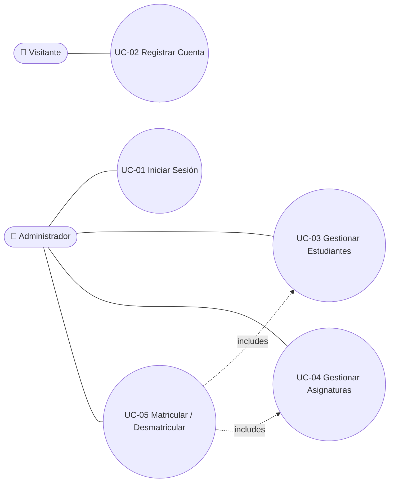
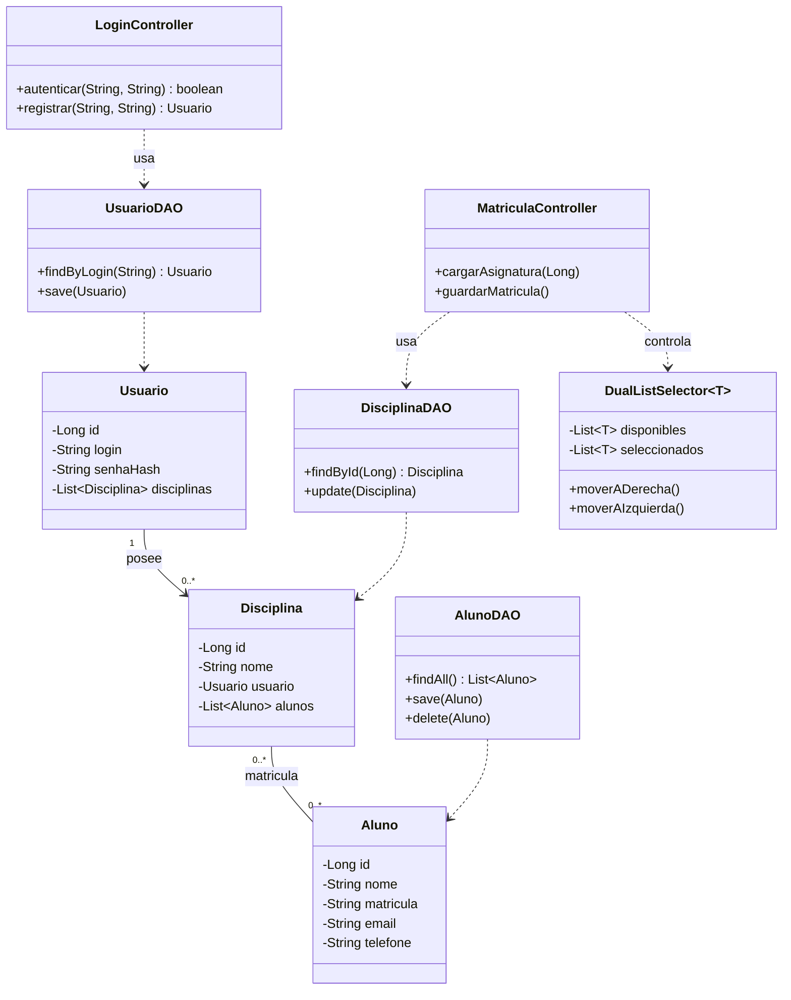
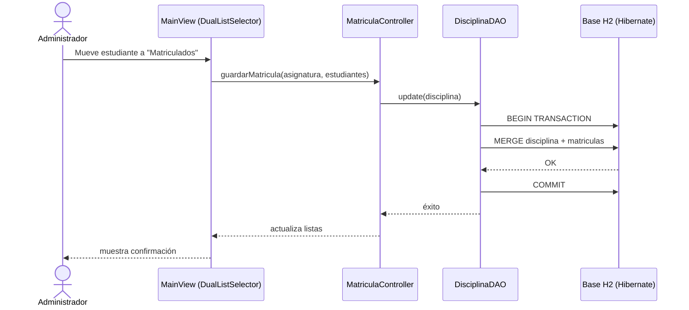
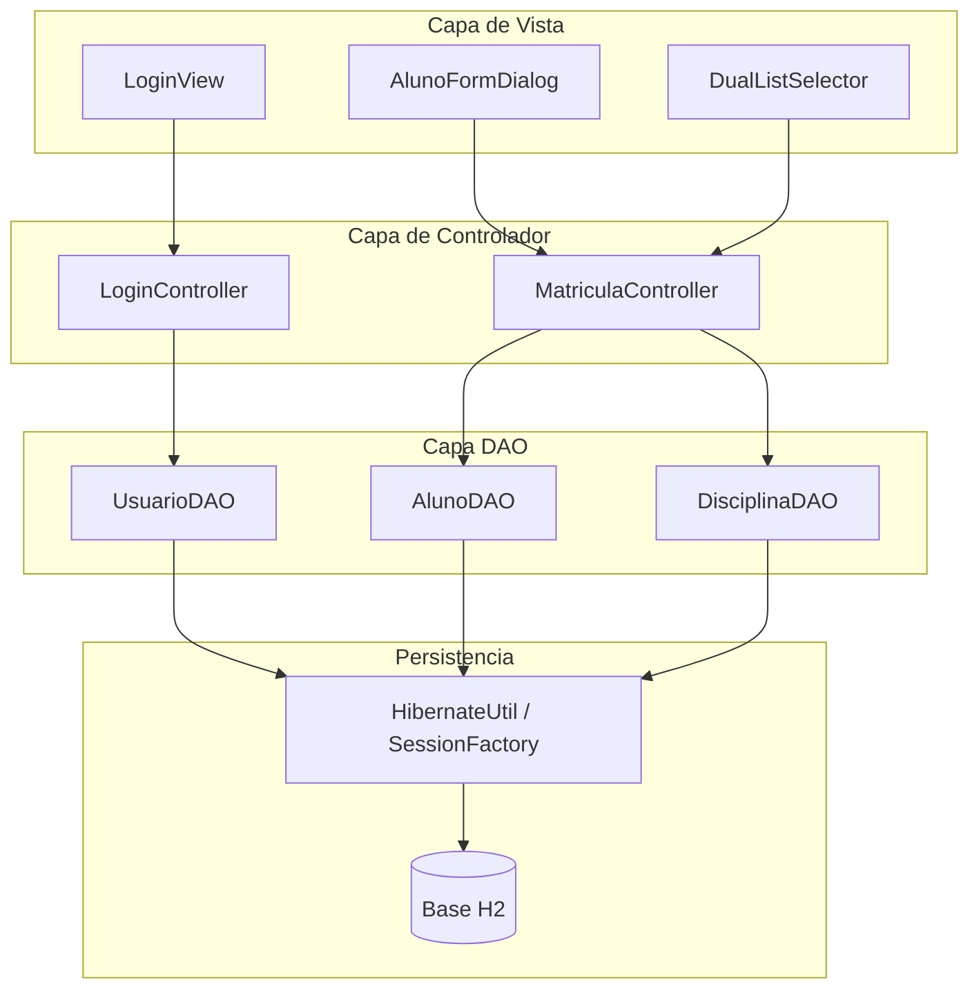
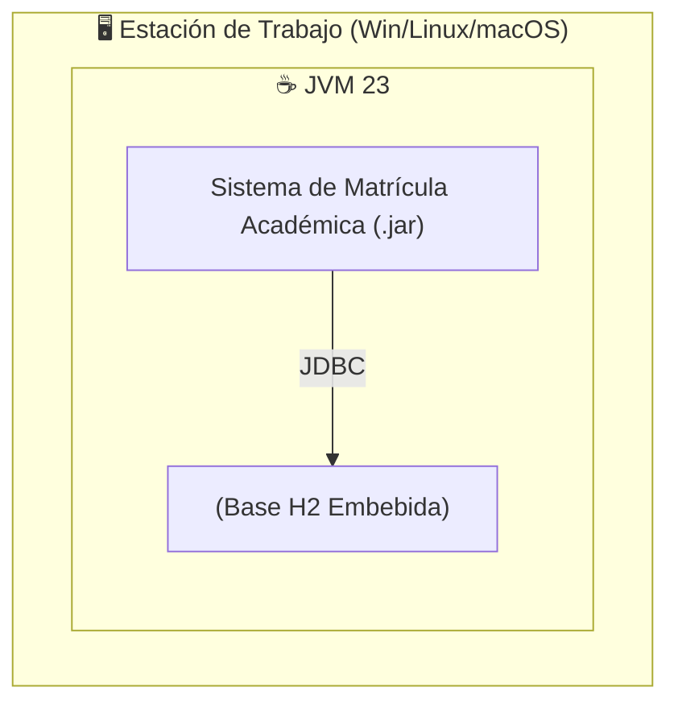
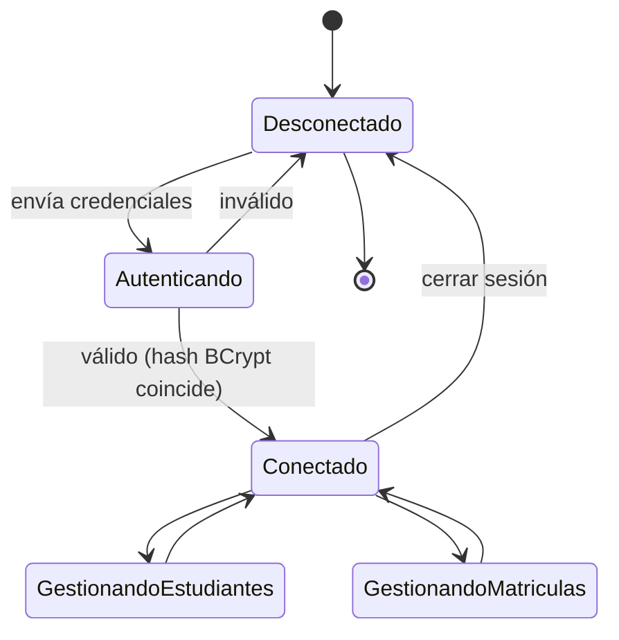
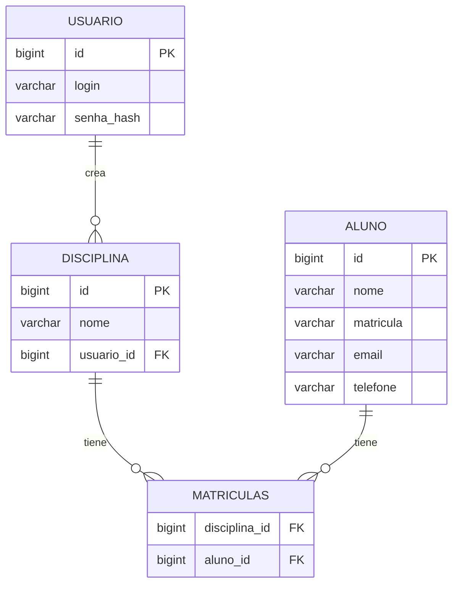
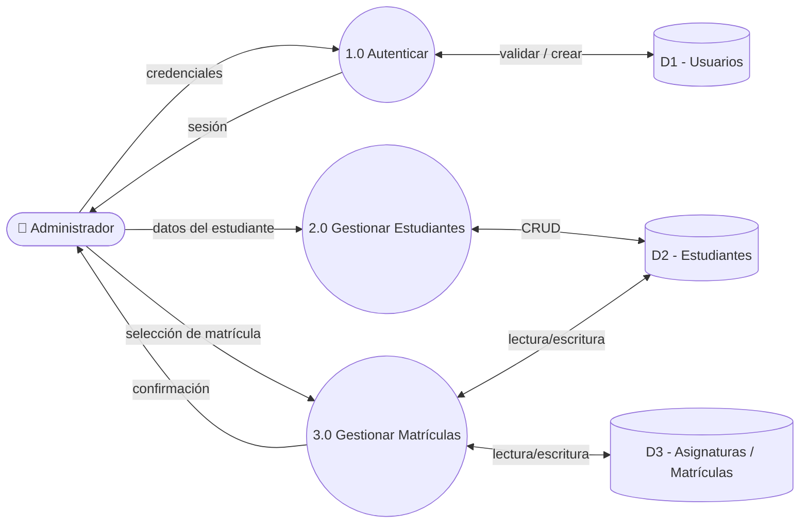
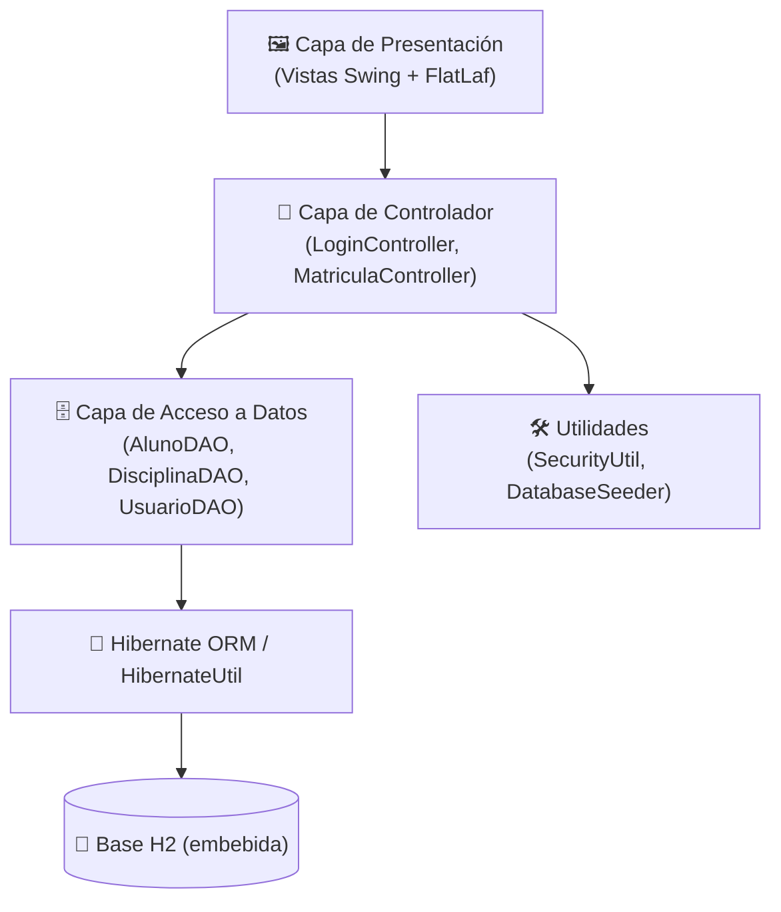
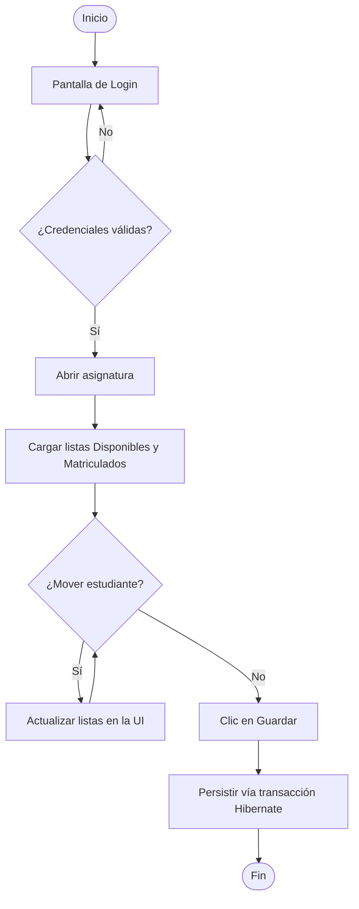

<div align="center">
  <br />
  

  <h1>🎓 Sistema de Matrícula Académica</h1>

  <strong style="font-size: 1.2em;">
    Componente de Selección de Lista Doble (Dual List) con Persistencia Hibernate
  </strong>

  <br /><br />

  <p style="max-width: 700px;">
    Una solución de escritorio robusta desarrollada en <strong>Java Swing</strong> bajo la arquitectura <strong>MVC</strong>. El proyecto se centra en un componente visual reutilizable para la selección de elementos y en la persistencia de datos mediante <strong>Hibernate ORM</strong>.
  </p>

  <p>
    
    
    
    
  </p>

  <p>
    🌐 <strong>Choose Language / Selecione o idioma / Elija el idioma</strong><br/><br/>
    <a href="README.md"></a>
    <a href="README_PT.md"></a>
    <a href="README_ES.md"></a>
  </p>
</div>

---

## 📖 Sobre el Proyecto

El **Sistema de Matrícula Académica** es una aplicación de escritorio creada para demostrar competencias avanzadas en Programación Orientada a Objetos y arquitectura **MVC**. Su funcionalidad central es un componente reutilizable "Dual List Selector" usado para matricular estudiantes en asignaturas, con persistencia mediante **Hibernate** y base de datos embebida **H2**.

## 📑 Índice

- 📋 Requisitos (Funcionales, No Funcionales, Reglas de Negocio, Dominio, Datos, Interfaz)
- 🎭 Casos de Uso
- 🔗 Matriz de Trazabilidad de Requisitos
- 📄 Documento de Especificación de Requisitos de Software (SRS)
- 📊 Diagramas UML y Estructurales (Casos de Uso, Clases, Secuencia, Componentes, Despliegue, Máquina de Estados)
- 🗄️ Modelo de Datos y Diccionario de Datos (Conceptual / Lógico / Físico / DER)
- 🔀 Diagrama de Flujo de Datos (DFD)
- 🏗️ Diagrama de Arquitectura y Diagrama de Flujo
- 👤 Persona y Mapa de Viaje del Usuario
- 🖼️ Wireframes y Mockups
- 🚀 Instalación y Ejecución
- 👨‍💻 Autor

---

<details>
<summary>

## 📋 1. Requisitos

</summary>

### ✅ Requisitos Funcionales (RF)

| ID | Módulo | Descripción | Prioridad |
|---|---|---|---|
| RF-001 | Autenticación | El sistema debe permitir el inicio de sesión y registro de cuentas de administrador. | Esencial |
| RF-002 | Gestión de Estudiantes | El sistema debe permitir crear, editar y eliminar estudiantes (CRUD). | Esencial |
| RF-003 | Matrícula | El usuario debe poder mover estudiantes entre las listas "Disponibles" y "Matriculados". | Esencial |
| RF-004 | Matrícula | Al hacer clic en "Guardar", la asociación entre estudiante y asignatura debe persistirse. | Esencial |
| RF-005 | Interfaz | La lista debe mostrar un ícono (avatar) junto al nombre del estudiante. | Media |
| RF-006 | Gestión de Asignaturas | El sistema debe permitir que el usuario autenticado cree asignaturas de su propiedad. | Alta |
| RF-007 | Carga Inicial de Datos | En la primera ejecución, el sistema debe poblar la base de datos con estudiantes de ejemplo y un usuario admin por defecto. | Media |

### ⚡ Requisitos No Funcionales (RNF)

| ID | Atributo | Descripción |
|---|---|---|
| RNF-001 | Usabilidad | La interfaz debe usar el tema FlatLaf para una apariencia moderna y responsiva. |
| RNF-002 | Portabilidad | La base de datos debe ser H2 embebida, sin necesidad de instalación externa. |
| RNF-003 | Mantenibilidad | El código debe seguir estrictamente el patrón MVC y usar Generics en el componente visual. |
| RNF-004 | Seguridad | Las contraseñas nunca deben almacenarse en texto plano (hash BCrypt). |
| RNF-005 | Confiabilidad | Las operaciones de escritura deben ser atómicas, con transacciones Hibernate y rollback ante fallos. |
| RNF-006 | Rendimiento | La lista de estudiantes debe renderizarse con fluidez con más de 1.000 registros mediante un `ListCellRenderer` personalizado. |

### 📜 Reglas de Negocio (RN)

| ID | Actor | Regla | Justificación |
|---|---|---|---|
| RN-001 | Sistema | Una matrícula asocia un estudiante con una asignatura mediante una tabla de relación N:N. | Permite que un estudiante esté en múltiples asignaturas. |
| RN-002 | Sistema | En la primera ejecución, si no existen usuarios, se crea automáticamente `admin` / `1234`. | Garantiza acceso inmediato sin configuración manual. |
| RN-003 | Usuario | El campo "Matrícula" del estudiante debe ser único. | Garantiza la unicidad del registro académico. |
| RN-004 | Sistema | Las contraseñas de nuevos usuarios deben cifrarse con BCrypt antes de persistirse. | Seguridad básica contra filtración de datos. |
| RN-005 | Usuario | La eliminación de un estudiante es permanente y elimina sus matrículas. | Eliminación definitiva según el alcance del ejercicio. |
| RN-006 | Sistema | Una asignatura siempre pertenece al usuario (Usuario) que la creó. | Define el límite de propiedad en escenarios multiusuario. |

### 🌐 Requisitos de Dominio

- El sistema modela un dominio académico simplificado: **Usuarios (administradores)**, **Asignaturas**, **Estudiantes** y **Matrículas**.
- Una "Matrícula" no es una entidad de primera clase en la UI — se representa mediante la pertenencia de un `Aluno` (Estudiante) a la colección de una `Disciplina` (Asignatura).
- El vocabulario del dominio está en portugués en el código (`Aluno`, `Disciplina`, `Usuario`, `Matricula`), reflejando el idioma nativo de la institución.

### 🗃️ Requisitos de Datos

- El registro de estudiante requiere: nombre completo, número de matrícula único, correo electrónico y teléfono.
- El registro de usuario requiere: nombre de usuario único y contraseña en hash (nunca texto plano).
- El registro de asignatura requiere: nombre y usuario propietario.
- La relación de matrícula requiere solo el par (ID de asignatura, ID de estudiante).

### 🖥️ Requisitos de Interfaz

- La pantalla de inicio de sesión debe validar credenciales y mostrar retroalimentación visual de error.
- La pantalla principal debe presentar dos listas sincronizadas ("Disponibles" / "Matriculados") con botones de movimiento.
- Los formularios (Agregar/Editar Estudiante) deben validar campos obligatorios antes de habilitar "Guardar".
- La interfaz debe usar un Look & Feel moderno y consistente (FlatLaf) en todas las ventanas.

</details>

---

<details>
<summary>

## 🎭 2. Casos de Uso

</summary>

| ID | Caso de Uso | Actor Principal | Descripción |
|---|---|---|---|
| UC-01 | Iniciar Sesión | Administrador | Autenticarse con usuario y contraseña para acceder al sistema. |
| UC-02 | Registrar Cuenta | Visitante | Crear una nueva cuenta de administrador con contraseña en hash. |
| UC-03 | Gestionar Estudiantes (CRUD) | Administrador | Crear, editar, visualizar y eliminar registros de estudiantes. |
| UC-04 | Gestionar Asignaturas | Administrador | Crear asignaturas de propiedad del usuario conectado. |
| UC-05 | Matricular / Desmatricular Estudiantes | Administrador | Mover estudiantes entre las listas "Disponibles" y "Matriculados" y persistir el resultado. |

### Diagrama de Casos de Uso



</details>

---

<details>
<summary>

## 🔗 3. Matriz de Trazabilidad de Requisitos

</summary>

| Requisito | Caso de Uso | Diagrama(s) | Componente |
|---|---|---|---|
| RF-001 / RN-002 | UC-01 Iniciar Sesión | Secuencia, Máquina de Estados | `LoginController`, `UsuarioDAO` |
| RF-001 / RN-004 | UC-02 Registrar Cuenta | Clases, Máquina de Estados | `LoginController`, `SecurityUtil` |
| RF-002 / RN-003 / RN-005 | UC-03 Gestionar Estudiantes | Clases, DER | `AlunoFormDialog`, `AlunoDAO` |
| RF-006 / RN-006 | UC-04 Gestionar Asignaturas | Clases, DER | `MatriculaController`, `DisciplinaDAO` |
| RF-003 / RF-004 / RN-001 | UC-05 Matricular / Desmatricular | Secuencia, Componentes, Diagrama de Flujo | `DualListSelector`, `MatriculaController`, `DisciplinaDAO` |
| RF-005 | UC-03 | Wireframe / Mockup | `DualListSelector` (renderer personalizado) |
| RNF-002 / RNF-004 / RNF-005 | UC-01..05 | Despliegue, Arquitectura | `HibernateUtil`, `SecurityUtil` |

</details>

---

<details>
<summary>

## 📄 4. Documento de Especificación de Requisitos de Software (SRS)

</summary>

### 4.1 Propósito

Este documento especifica el comportamiento funcional y no funcional del Sistema de Matrícula Académica, una aplicación de escritorio para la gestión de estudiantes, asignaturas y matrículas.

### 4.2 Alcance

El sistema cubre: autenticación de administradores, CRUD de estudiantes, creación de asignaturas y gestión de matrículas mediante una interfaz de lista doble. No cubre calificaciones, asistencia ni soporte multi-institución.

### 4.3 Descripción General

- **Perspectiva del producto:** aplicación de escritorio Java Swing independiente con base de datos H2 embebida — sin servidor externo.
- **Clases de usuario:** un único rol, *Administrador* (creado mediante registro, o inicializado como `admin` / `1234`).
- **Entorno operativo:** Windows, Linux o macOS con Java 23+ instalado.
- **Restricciones:** separación MVC estricta; componente de UI genérico y reutilizable (`DualListSelector<T>`).

### 4.4 Requisitos Específicos

Vea [§1 Requisitos](#-1-requisitos) para la lista completa de RF / RNF / RN, y [§2 Casos de Uso](#-2-casos-de-uso) para las especificaciones de comportamiento.

### 4.5 Requisitos de Interfaz Externa

- **UI:** Swing + FlatLaf, descrita en [§9 Wireframes y Mockups](#-9-wireframes-y-mockups).
- **Datos:** base de datos H2 embebida vía Hibernate, descrita en [§6 Modelo de Datos](#-6-modelo-de-datos-y-diccionario-de-datos).
- **Hardware:** ninguno especial, más allá de un equipo de escritorio/portátil capaz de ejecutar una JVM.

</details>

---

<details>
<summary>

## 📊 5. Diagramas UML y Estructurales

</summary>

### Diagrama de Clases



### Diagrama de Secuencia — Matricular Estudiante



### Diagrama de Componentes



### Diagrama de Despliegue



### Máquina de Estados — Sesión del Usuario



> 📦 *Nota: por concisión, los diagramas de Objetos, Comunicación, Actividades, Paquetes, Estructura Compuesta, Visión General de Interacción y Tiempo se consolidan en los diagramas anteriores — el alcance reducido del sistema (3 entidades, 2 controladores, 1 componente de UI genérico) queda totalmente cubierto por estas seis vistas.*

</details>

---

<details>
<summary>

## 🗄️ 6. Modelo de Datos y Diccionario de Datos

</summary>

### Modelo Conceptual

Tres conceptos centrales: **Usuario** (administrador), **Asignatura** (propiedad de un Usuario) y **Estudiante** (matriculado en cero o más Asignaturas). La relación entre Asignatura y Estudiante es muchos-a-muchos ("Matrícula").

### Modelo Lógico

- `Usuario (1) ──< (N) Disciplina`
- `Disciplina (N) ──< matriculas >── (N) Aluno`

### Modelo Físico — DER



### Diccionario de Datos

**`alunos`**

| Campo | Tipo | Restricciones | Descripción |
|---|---|---|---|
| id | BIGINT | PK, autoincremental | Identificador único del estudiante |
| nome | VARCHAR | NOT NULL | Nombre completo |
| matricula | VARCHAR | NOT NULL, UNIQUE | Número de matrícula |
| email | VARCHAR | opcional | Correo de contacto |
| telefone | VARCHAR | opcional | Teléfono de contacto |

**`usuarios`**

| Campo | Tipo | Restricciones | Descripción |
|---|---|---|---|
| id | BIGINT | PK, autoincremental | Identificador único del usuario |
| login | VARCHAR | NOT NULL, UNIQUE | Nombre de usuario |
| senha_hash | VARCHAR | NOT NULL | Hash BCrypt de la contraseña |

**`disciplinas`**

| Campo | Tipo | Restricciones | Descripción |
|---|---|---|---|
| id | BIGINT | PK, autoincremental | Identificador único de la asignatura |
| nome | VARCHAR | NOT NULL | Nombre de la asignatura |
| usuario_id | BIGINT | FK → usuarios.id | Administrador propietario |

**`matriculas`** (tabla de unión)

| Campo | Tipo | Restricciones | Descripción |
|---|---|---|---|
| disciplina_id | BIGINT | FK → disciplinas.id | Asignatura matriculada |
| aluno_id | BIGINT | FK → alunos.id | Estudiante matriculado |

</details>

---

<details>
<summary>

## 🔀 7. Diagrama de Flujo de Datos (DFD)

</summary>



> *Linaje de datos: los datos de estudiantes y matrículas se originan en la entrada manual del administrador o en el `DatabaseSeeder` (primera ejecución), fluyen a través de la capa DAO y se persisten en el almacenamiento H2 (archivo/memoria) — no participan sistemas externos.*

</details>

---

<details>
<summary>

## 🏗️ 8. Diagrama de Arquitectura y Diagrama de Flujo

</summary>

### Arquitectura (MVC por Capas)



### Diagrama de Flujo — Proceso de Matrícula



</details>

---

<details>
<summary>

## 👤 9. Persona y Mapa de Viaje del Usuario

</summary>

### Persona

| Atributo | Descripción |
|---|---|
| **Nombre** | Carla Mendes |
| **Rol** | Coordinadora Académica |
| **Edad** | 41 |
| **Nivel tecnológico** | Intermedio — cómoda con apps de escritorio, no es desarrolladora |
| **Objetivos** | Matricular/desmatricular estudiantes rápidamente cada semestre, sin errores |
| **Frustraciones** | Sistemas heredados lentos y desordenados; miedo a perder cambios no guardados |
| **Frase** | *"Solo necesito mover estudiantes entre las listas y saber que se guardó."* |

### Mapa de Viaje del Usuario

| Etapa | Acción | Punto de Contacto | Emoción | Punto de Dolor | Oportunidad |
|---|---|---|---|---|---|
| 1. Acceso | Abre la app e inicia sesión | LoginView | Neutral | Olvida la contraseña | Retroalimentación de error clara (RF-001) |
| 2. Orientación | Selecciona una asignatura | MainView | Curiosa | Demasiadas asignaturas listadas | Búsqueda/filtro (futuro) |
| 3. Acción | Mueve estudiantes entre las listas | DualListSelector | Concentrada | Duda sobre qué lado es "matriculado" | Etiquetas e iconos claros (RF-005) |
| 4. Confirmación | Hace clic en "Guardar" | MainView | Aliviada | Sin retroalimentación tras guardar | Diálogo/aviso de confirmación |
| 5. Revisión | Reabre la asignatura para verificar | MainView | Confiada | — | Datos persistidos correctamente (RF-004) |

</details>

---

<details>
<summary>

## 🖼️ 10. Wireframes y Mockups

</summary>

### Pantalla de Inicio de Sesión (Wireframe)

```
┌──────────────────────────────────────┐
│            🎓 INICIAR SESIÓN          │
│                                        │
│   Usuario    [______________]        │
│   Contraseña [______________]        │
│                                        │
│       [  ENTRAR  ]  [ REGISTRARSE ]   │
│                                        │
│   ⚠ Credenciales inválidas (en error) │
└──────────────────────────────────────┘
```

### Pantalla Principal — Lista Doble (Mockup)

```
┌────────────────────────────────────────────────────────────────┐
│  Asignatura: [ Cálculo I       ▼ ]               [ Guardar 💾 ] │
├─────────────────────────┬───────────┬──────────────────────────┤
│  ESTUDIANTES DISPONIBLES │           │  ESTUDIANTES MATRICULADOS│
│  ────────────────────    │  ➡ Add    │   ────────────────────   │
│  👤 2024001 - Ana Silva   │           │   👤 2024010 - João Lima  │
│  👤 2024002 - Bruno Costa │  ⬅ Remove │   👤 2024011 - Maria Reis │
│  👤 2024003 - Carla Souza │           │   👤 2024012 - Pedro Alve │
│  ...                      │           │   ...                    │
├─────────────────────────┴───────────┴──────────────────────────┤
│ [ + Nuevo Estudiante ]  [ ✎ Editar ]  [ 🗑 Eliminar ]            │
└────────────────────────────────────────────────────────────────┘
```

</details>

---

## 🚀 Instalación y Ejecución

### Requisitos Previos

* **Java JDK 23**
* **Maven** 3.8+
* **Git** (opcional)
* IDE recomendado: **IntelliJ IDEA**

### Pasos

1. Clone el repositorio:
   ```bash
   git clone https://github.com/VictorHJesusSantiago/DualListHibernate.git
   ```
2. Abra el proyecto en su IDE y deje que Maven descargue las dependencias desde `pom.xml`.
3. Configure el Project SDK a **Java 23**.
4. Ejecute `src/main/java/br/com/projeto/MainApp.java`.

### 🔑 Acceso por Defecto

En la primera ejecución, el sistema crea:

* **Usuario:** `admin`
* **Contraseña:** `1234`

---

## 👨‍💻 Autor

<table>
  <tr>
    <td width="100" align="center">
      
    </td>
    <td>
      <strong>Victor Henrique Jesus Santiago</strong><br>
      Desarrollador Full Stack<br><br>
      📧 <a href="mailto:victorhenriquedejesussantiago@gmail.com">victorhenriquedejesussantiago@gmail.com</a><br>
      👔 <a href="https://www.linkedin.com/in/victor-henrique-de-jesus-santiago/">LinkedIn/victorhjsantiago</a><br>
      🐙 <a href="https://github.com/VictorHJesusSantiago">GitHub/VictorHJesusSantiago</a>
    </td>
  </tr>
</table>
