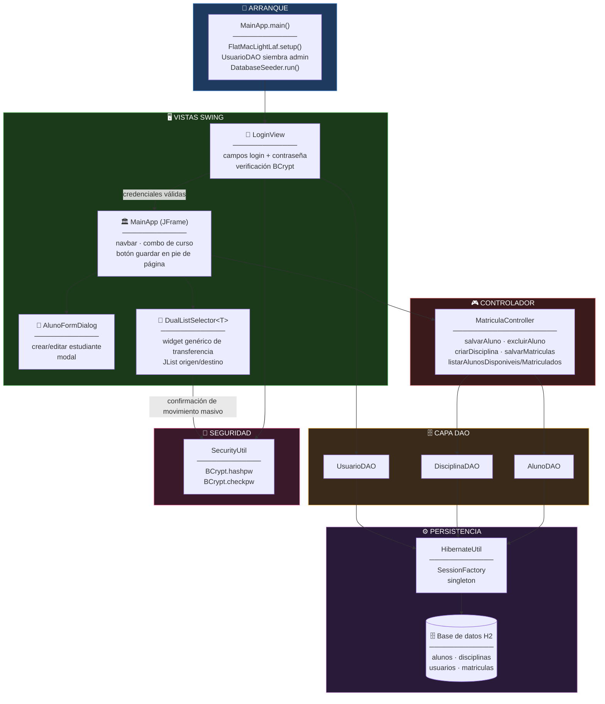
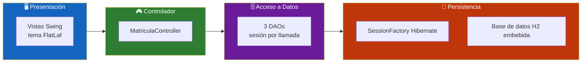
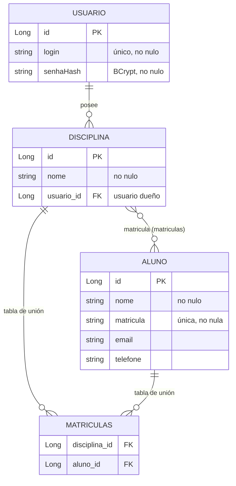
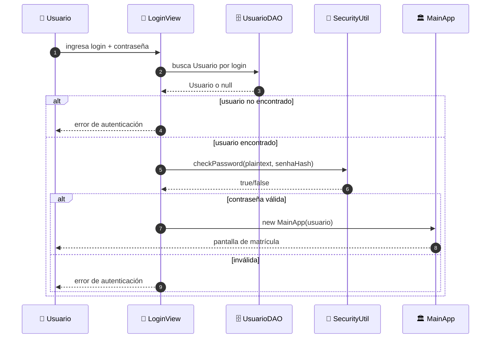
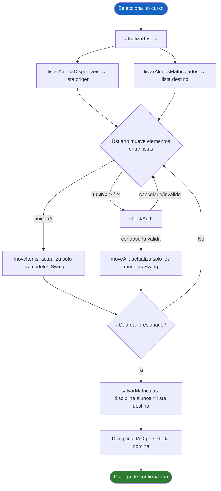
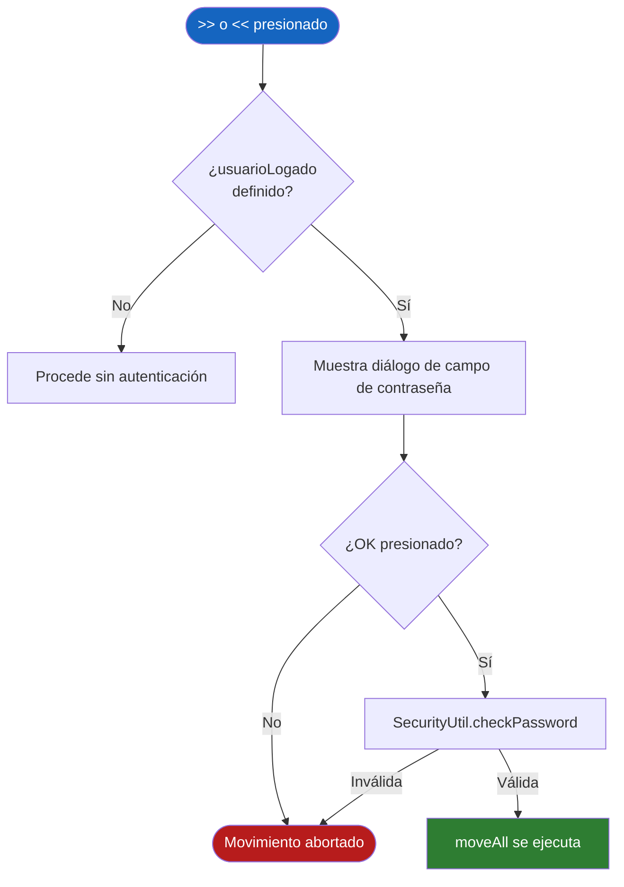

<div align="center">

**🌐 Choose Language / Selecione o Idioma / Elija el Idioma**

[](README.md)&nbsp;&nbsp;&nbsp;[](README_PT.md)&nbsp;&nbsp;&nbsp;[](README_ES.md)

</div>

---

<div align="center">

```
██████╗ ██╗   ██╗ █████╗ ██╗     ██╗     ██╗███████╗████████╗
██╔══██╗██║   ██║██╔══██╗██║     ██║     ██║██╔════╝╚══██╔══╝
██║  ██║██║   ██║███████║██║     ██║     ██║███████╗   ██║
██║  ██║██║   ██║██╔══██║██║     ██║     ██║╚════██║   ██║
██████╔╝╚██████╔╝██║  ██║███████╗███████╗██║███████║   ██║
╚═════╝  ╚═════╝ ╚═╝  ╚═╝╚══════╝╚══════╝╚═╝╚══════╝   ╚═╝
   Gestor de Matrículas en Swing + Hibernate con UI de Lista Doble
```

---

[-ED8B00?style=for-the-badge&logo=openjdk&logoColor=white)](https://openjdk.org/)
[](https://hibernate.org/)
[](https://www.h2database.com/)
[]()
[](https://www.formdev.com/flatlaf/)
[]()
[](https://maven.apache.org/)

<br/>

> **Un gestor de matrículas de escritorio donde mover a un estudiante entre dos listas**
> *es* el propio acto de matricularlo o darlo de baja, respaldado por Hibernate ORM sobre una base de datos H2 embebida.

<br/>


</div>

---

## 📑 Tabla de Contenidos

<details>
<summary>▶️ <strong>Haga clic para expandir / contraer esta sección</strong></summary>

<table>
<tr>
<td valign="top" width="50%">

**🏗️ Sistema**
- [Visión General](#-visión-general)
- [Arquitectura del Sistema](#️-arquitectura-del-sistema)
- [Stack Tecnológico](#️-stack-tecnológico)
- [Patrones de Diseño](#-patrones-de-diseño-aplicados)
- [Estructura del Proyecto](#-estructura-del-proyecto)

**📦 Módulos**
- [MainApp — Shell](#️-mainapp--shell-de-la-aplicación)
- [LoginView — Autenticación](#-loginview--pantalla-de-autenticación)
- [DualListSelector — UI Genérica](#-duallistselector--widget-genérico-de-lista-doble)
- [MatriculaController — Orquestación](#-matriculacontroller--orquestación-de-matrículas)
- [Capa DAO](#️-capa-dao--alunodao-disciplinadao-usuariodao)
- [SecurityUtil — Hashing](#-securityutil--hash-de-contraseña)
- [HibernateUtil / DatabaseSeeder](#️-hibernateutil--databaseseeder)

</td>
<td valign="top" width="50%">

**💼 Negocio**
- [Reglas de Negocio](#-reglas-de-negocio)
- [Requisitos Funcionales](#-requisitos-funcionales)
- [Requisitos No Funcionales](#-requisitos-no-funcionales)

**📐 Diseño**
- [Modelo de Datos](#️-modelo-de-datos)
- [Flujos del Sistema](#-flujos-del-sistema)
- [Flujo de Inicio de Sesión](#flujo-de-inicio-de-sesión)
- [Flujo de Matrícula](#flujo-de-matrícula)
- [Flujo de Autorización de Movimiento Masivo](#flujo-de-autorización-de-movimiento-masivo)

**🔐 Seguridad & Operación**
- [Seguridad](#-seguridad)
- [Instalación & Ejecución](#-instalación--ejecución)
- [Pruebas Automatizadas](#-pruebas-automatizadas)
- [Métricas & Monitoreo](#-métricas--monitoreo)
- [Limitaciones Conocidas](#️-limitaciones-conocidas)

</td>
</tr>
</table>

---

</details>

## 🌟 Visión General

<details>
<summary>▶️ <strong>Haga clic para expandir / contraer esta sección</strong></summary>

**DualListHibernate** es una aplicación de escritorio en Java Swing que gestiona la matrícula de estudiantes en cursos ("disciplinas") mediante un **widget de transferencia de lista doble**: los estudiantes disponibles se ubican en una lista a la izquierda, los matriculados en una lista a la derecha, y botones de flecha individuales o masivos mueven los elementos entre ellas. Guardar simplemente persiste lo que quedó del lado derecho como la nómina matriculada del curso — el estado de la UI *es* el estado del dominio hasta que el botón de guardar lo confirma.

La persistencia corre a través de **Hibernate ORM 6** contra una base de datos **H2** embebida, con tres entidades JPA — `Usuario`, `Disciplina`, `Aluno` — conectadas por una relación uno-a-muchos (el usuario es dueño de los cursos) y muchos-a-muchos (el curso matricula estudiantes). Una capa DAO ligera envuelve el boilerplate de `Session` de Hibernate, y un `MatriculaController` se sitúa entre las vistas Swing y los DAOs, manteniendo las preocupaciones de persistencia fuera del código de UI.

El acceso está protegido por una pantalla de inicio de sesión respaldada por hash de contraseña con **BCrypt**, y las operaciones destructivas masivas (mover *todos* los estudiantes de una vez) requieren reingresar la contraseña del administrador conectado antes de proceder.

### 🎯 Objetivos del Sistema

| Objetivo | Descripción |
|----------|-------------|
| 🔄 **Matrícula en lista doble** | Representar "matriculado" vs. "disponible" como dos listas conectadas por flechas de transferencia |
| 🎓 **Gestión de cursos** | Permitir que un usuario autenticado cree cursos y acote la matrícula a ellos |
| 👤 **CRUD de estudiantes** | Crear, editar y eliminar registros de estudiantes mediante un diálogo modal |
| 🔐 **Acceso autenticado** | Exigir inicio de sesión antes de que cualquier pantalla de matrícula sea alcanzable |
| 🛡️ **Confirmación de acción masiva** | Exigir reingreso de contraseña antes de mover una lista completa de una vez |
| 🗄️ **Persistencia respaldada por ORM** | Modelar el dominio como entidades JPA mapeadas por Hibernate en tablas H2 |
| 🌱 **Datos iniciales determinísticos** | Sembrar un usuario administrador y datos de demostración automáticamente en la primera ejecución |
| 🎨 **Apariencia de escritorio moderna** | Renderizar con el tema Mac Light de FlatLaf en lugar del aspecto predeterminado de Swing |

---

</details>

## 🏗️ Arquitectura del Sistema

<details>
<summary>▶️ <strong>Haga clic para expandir / contraer esta sección</strong></summary>

### Diagrama de Módulos


```mermaid
flowchart TB
    subgraph BOOT["🚀  ARRANQUE"]
        MAIN["MainApp.main()\n─────────────\nFlatMacLightLaf.setup()\nUsuarioDAO siembra admin\nDatabaseSeeder.run()"]
    end

    subgraph UI["🖥️  VISTAS SWING"]
        direction LR
        LOGIN["🔐 LoginView\n─────────────\ncampos login + contraseña\nverificación BCrypt"]
        APP["🏛️ MainApp (JFrame)\n─────────────\nnavbar · combo de curso\nbotón guardar en pie de página"]
        FORM["📝 AlunoFormDialog\n─────────────\ncrear/editar estudiante\nmodal"]
        DLS["🔀 DualListSelector&lt;T&gt;\n─────────────\nwidget genérico de transferencia\nJList origen/destino"]
    end

    subgraph CTRL["🎮  CONTROLADOR"]
        MC["MatriculaController\n─────────────────────\nsalvarAluno · excluirAluno\ncriarDisciplina · salvarMatriculas\nlistarAlunosDisponiveis/Matriculados"]
    end

    subgraph DAO["🗄️  CAPA DAO"]
        direction LR
        ADAO["AlunoDAO"]
        DDAO["DisciplinaDAO"]
        UDAO["UsuarioDAO"]
    end

    subgraph ORM["⚙️  PERSISTENCIA"]
        HU["HibernateUtil\n─────────────\nSessionFactory\nsingleton"]
        DB[("🗄️ Base de datos H2\n─────────────\nalunos · disciplinas\nusuarios · matriculas")]
    end

    subgraph SEC["🔐  SEGURIDAD"]
        SU["SecurityUtil\n─────────────\nBCrypt.hashpw\nBCrypt.checkpw"]
    end

    MAIN --> LOGIN
    LOGIN -->|"credenciales válidas"| APP
    LOGIN --> SU
    APP --> DLS
    APP --> FORM
    APP --> MC
    DLS -->|"confirmación de movimiento masivo"| SU
    MC --> ADAO & DDAO
    LOGIN --> UDAO
    ADAO & DDAO & UDAO --> HU --> DB

    style BOOT fill:#1e3a5f,color:#fff,stroke:#4a90d9
    style UI fill:#1a3a1a,color:#fff,stroke:#4caf50
    style CTRL fill:#3a1a1a,color:#fff,stroke:#e57373
    style DAO fill:#3a2a1a,color:#fff,stroke:#ffb74d
    style ORM fill:#2a1a3a,color:#fff,stroke:#ce93d8
    style SEC fill:#3a1a2a,color:#fff,stroke:#f06292
```

### Capas de la Arquitectura


```mermaid
flowchart LR
    subgraph L1["🖥️ Presentación"]
        A1["Vistas Swing\ntema FlatLaf"]
    end
    subgraph L2["🎮 Controlador"]
        B1["MatriculaController"]
    end
    subgraph L3["🗄️ Acceso a Datos"]
        C1["3 DAOs\nsesión por llamada"]
    end
    subgraph L4["💾 Persistencia"]
        D1["SessionFactory Hibernate"]
        D2["Base de datos H2 embebida"]
    end

    L1 --> L2 --> L3 --> L4

    style L1 fill:#1565C0,color:#fff
    style L2 fill:#2E7D32,color:#fff
    style L3 fill:#6A1B9A,color:#fff
    style L4 fill:#BF360C,color:#fff
```

---

</details>

## 🛠️ Stack Tecnológico

<details>
<summary>▶️ <strong>Haga clic para expandir / contraer esta sección</strong></summary>

<table>
<thead>
<tr>
<th>Capa</th>
<th>Tecnología</th>
<th>Versión</th>
<th>Finalidad</th>
</tr>
</thead>
<tbody>
<tr>
<td><strong>🧠 Lenguaje</strong></td>
<td>Java</td>
<td>23 (características preview habilitadas)</td>
<td>Aplicación completa, compilada con <code>--enable-preview</code></td>
</tr>
<tr>
<td rowspan="2"><strong>🗄️ Persistencia</strong></td>
<td>Hibernate ORM</td>
<td>6.4.1.Final</td>
<td>Implementación JPA, mapeo de entidades, gestión de sesiones</td>
</tr>
<tr>
<td>Base de datos H2</td>
<td>2.2.224</td>
<td>Almacén relacional embebido, respaldado por archivo/memoria</td>
</tr>
<tr>
<td rowspan="2"><strong>🎨 UI</strong></td>
<td>Java Swing</td>
<td>incluido en el JDK</td>
<td>Ventanas, diálogos, listas, gestores de layout</td>
</tr>
<tr>
<td>FlatLaf</td>
<td>3.2.5</td>
<td>Look &amp; Feel moderno (Mac Light), componentes redondeados vía <code>FlatClientProperties.STYLE</code></td>
</tr>
<tr>
<td><strong>🔐 Seguridad</strong></td>
<td>jBCrypt</td>
<td>0.4</td>
<td>Hash de contraseña (<code>gensalt(12)</code>) y verificación</td>
</tr>
<tr>
<td rowspan="2"><strong>🔧 Build</strong></td>
<td>Maven</td>
<td>—</td>
<td><code>pom.xml</code>, proyecto de un solo módulo</td>
</tr>
<tr>
<td>maven-compiler-plugin</td>
<td>3.11.0</td>
<td>Compila con <code>source</code>/<code>target</code> 23 y la bandera de preview</td>
</tr>
</tbody>
</table>

---

</details>

## 🎨 Patrones de Diseño Aplicados

<details>
<summary>▶️ <strong>Haga clic para expandir / contraer esta sección</strong></summary>

| Patrón | Dónde | Justificación |
|--------|-------|----------------|
| 🧭 **Capas estilo MVC** | Vistas (`MainApp`, `LoginView`, `AlunoFormDialog`) → Controlador (`MatriculaController`) → DAO → Hibernate | La UI nunca toca Hibernate directamente; toda llamada de persistencia es mediada |
| 🔀 **Widget Genérico** | `DualListSelector<T>` | La mecánica de lista de transferencia se escribe una vez y se reutiliza para cualquier lista de `T`, sin fijarse a `Aluno` |
| 🏭 **Patrón DAO** | `AlunoDAO`, `DisciplinaDAO`, `UsuarioDAO` | Cada entidad recibe una puerta de enlace de persistencia pequeña y enfocada |
| 🔂 **Singleton** | `HibernateUtil` — una `SessionFactory` para todo el ciclo de vida del proceso | Evita el costo de reconstruir el modelo de metadatos de Hibernate en cada llamada |
| 🧱 **Renderizador de Celda Personalizado** | `ModernStudentRenderer` dentro de `DualListSelector` | Desacopla "cómo se ve un estudiante en una lista" del propio widget de lista |
| 🚦 **Confirmación de Guarda** | `checkAuth()` antes de `moveAll()` | Las acciones masivas de alto impacto requieren un paso explícito de reautenticación |
| 🌱 **Siembra al Arrancar** | `UsuarioDAO.criarUsuarioAdminSeNaoExistir()` + `DatabaseSeeder.run()` | La aplicación es ejecutable desde una base de datos limpia sin configuración manual |
| 🎨 **Estilizado por Client-Property** | Cadenas `FlatClientProperties.STYLE` en toda la vista | Ajustes visuales por componente (arco, borde, hover) sin crear subclases de componentes Swing |

---

</details>

## 📁 Estructura del Proyecto

<details>
<summary>▶️ <strong>Haga clic para expandir / contraer esta sección</strong></summary>

```
DualListHibernate/
│
├── 📄 pom.xml                            # Build Maven: Hibernate, H2, FlatLaf, jBCrypt
│
└── 📂 src/main/
    ├── 📂 java/br/com/projeto/
    │   ├── 📄 MainApp.java                       # ★ Shell de la aplicación — navbar, combo de curso, guardar
    │   │
    │   ├── 📂 controller/
    │   │   └── 📄 MatriculaController.java        # ★ Orquestación de matrículas — API orientada a la UI
    │   │
    │   ├── 📂 dao/
    │   │   ├── 📄 AlunoDAO.java                   # Puerta de enlace de persistencia del estudiante
    │   │   ├── 📄 DisciplinaDAO.java               # Puerta de enlace de persistencia del curso
    │   │   └── 📄 UsuarioDAO.java                  # Puerta de enlace de persistencia del usuario + siembra de admin
    │   │
    │   ├── 📂 model/
    │   │   ├── 📄 Aluno.java                       # @Entity — estudiante
    │   │   ├── 📄 Disciplina.java                  # @Entity — curso, dueño de @ManyToMany alunos
    │   │   └── 📄 Usuario.java                     # @Entity — usuario, dueño de @OneToMany disciplinas
    │   │
    │   ├── 📂 util/
    │   │   ├── 📄 DatabaseSeeder.java              # Bootstrap de datos de demostración
    │   │   ├── 📄 HibernateUtil.java               # Singleton de SessionFactory
    │   │   └── 📄 SecurityUtil.java                # Hash/verificación BCrypt
    │   │
    │   └── 📂 view/
    │       ├── 📄 LoginView.java                   # Pantalla de autenticación
    │       ├── 📄 DualListSelector.java            # ★ Widget genérico de transferencia de lista doble
    │       └── 📄 AlunoFormDialog.java             # Modal de creación/edición de estudiante
    │
    └── 📂 resources/
        └── 📄 hibernate.cfg.xml                    # Configuración de conexión/dialecto Hibernate/H2
│
├── 📄 README.md                          # 🇺🇸 Inglés (principal)
├── 📄 README_PT.md                       # 🇧🇷 Portugués
└── 📄 README_ES.md                       # 🇪🇸 Español (este archivo)
```

---

</details>

## 📦 Módulos del Sistema

<details>
<summary>▶️ <strong>Haga clic para expandir / contraer esta sección</strong></summary>

### 🏛️ MainApp — Shell de la Aplicación

El `JFrame` principal, construido enteramente en código (sin layout `.form`/XML). Contiene una barra de navegación superior (título, selector de curso, botón de nuevo curso, botones de acción de estudiante, cierre de sesión), un `DualListSelector` central, y un botón de guardar en el pie de página.

| Región | Contenido |
|--------|-----------|
| Navbar izquierda | Título, combo box "Disciplina:", botón `+` de nuevo curso |
| Navbar derecha | Novo Aluno, Editar, Excluir, Sair |
| Centro | `DualListSelector<Aluno>` vinculado al curso seleccionado |
| Pie de página | "Salvar Alterações de Matrícula" — confirma la lista de destino como la nómina |

`atualizarListas()` vuelve a consultar los estudiantes disponibles y matriculados vía `MatriculaController` cada vez que cambia el combo de curso.

---

### 🔐 LoginView — Pantalla de Autenticación

El punto de entrada de la aplicación (lanzado desde `main()` tras el arranque). Recoge un login y contraseña, busca el `Usuario` vía `UsuarioDAO`, y verifica la contraseña con `SecurityUtil.checkPassword` contra el hash BCrypt almacenado. En caso de éxito, abre `MainApp` con el `Usuario` autenticado; en caso de fallo, permanece en pantalla.

---

### 🔀 DualListSelector — Widget Genérico de Lista Doble

El componente central de la UI, parametrizado como `DualListSelector<T>` para que la mecánica de transferencia sea reutilizable más allá de los estudiantes.

| Elemento | Rol |
|----------|-----|
| `sourceModel` / `targetModel` | Dos `DefaultListModel<T>` que respaldan las `JList` de "disponible" y "matriculado" |
| `>` / `<` | Mueve la selección actual un elemento a la vez |
| `>>` / `<<` | Mueve todos los elementos a la vez — protegido por `checkAuth()` |
| `ModernStudentRenderer` | Renderizador de celda personalizado que dibuja un avatar de iniciales, nombre y subtítulo "matrícula • email" |
| `checkAuth()` | Solicita la contraseña del administrador conectado antes de que un movimiento masivo proceda |

`setSourceItems`/`setTargetItems` y `getSourceItems`/`getTargetItems` son el contrato público del widget — `MainApp` lee y escribe a través de ellos, sin tocar nunca directamente los modelos Swing.

---

### 🎮 MatriculaController — Orquestación de Matrículas

El único punto de contacto entre las vistas Swing y la capa DAO.

| Método | Responsabilidad |
|--------|-------------------|
| `salvarAluno(Aluno)` | Crea o actualiza un estudiante vía `AlunoDAO` |
| `excluirAluno(Aluno)` | Elimina al estudiante de la nómina de todos los cursos, luego elimina el registro |
| `criarDisciplina(nome, usuario)` | Crea un nuevo curso perteneciente al usuario dado |
| `salvarMatriculas(disciplina, alunos)` | Sobrescribe la lista de matriculados de un curso con los estudiantes dados |
| `listarDisciplinas(usuario)` | Cursos pertenecientes al usuario actual |
| `listarAlunosDisponiveis(disciplina)` | Todos los estudiantes que aún no están en la nómina del curso |
| `listarAlunosMatriculados(disciplina)` | La nómina actual del curso |

---

### 🗄️ Capa DAO — AlunoDAO, DisciplinaDAO, UsuarioDAO

Cada DAO abre una `Session` de Hibernate desde la `SessionFactory` compartida de `HibernateUtil`, envuelve una transacción, y cierra la sesión — una sesión por llamada, sin sesión de larga duración mantenida a lo largo del ciclo de vida de la UI. `DisciplinaDAO.listarPorUsuario` y `AlunoDAO.listarTodos` respaldan, respectivamente, el combo box y la lista de origen.

---

### 🔐 SecurityUtil — Hash de Contraseña

Dos métodos estáticos que envuelven jBCrypt.

| Método | Comportamiento |
|--------|-----------------|
| `hashPassword(plaintext)` | `BCrypt.hashpw(plaintext, BCrypt.gensalt(12))` — factor de costo 12 |
| `checkPassword(plaintext, hash)` | Rechaza inmediatamente si `hash` es nulo o no comienza con `$2a$`, si no usa `BCrypt.checkpw` |

---

### ⚙️ HibernateUtil / DatabaseSeeder

`HibernateUtil` construye y almacena en caché una única `SessionFactory` a partir de `hibernate.cfg.xml`. `DatabaseSeeder.run()` y `UsuarioDAO.criarUsuarioAdminSeNaoExistir()` se ejecutan al arrancar para que la aplicación esté inmediatamente utilizable contra un archivo H2 nuevo, sin entrada manual de datos.

---

</details>

## 💼 Reglas de Negocio

<details>
<summary>▶️ <strong>Haga clic para expandir / contraer esta sección</strong></summary>

### 🎓 Reglas de Matrícula

| # | Regla | Aplicación |
|---|-------|------------|
| RN-01 | Un estudiante está "matriculado" en un curso si y solo si aparece en la lista de destino de ese curso al momento de guardar | `salvarMatriculas` sobrescribe `disciplina.alunos` por completo |
| RN-02 | La lista de disponibles de un curso excluye a todo estudiante ya matriculado | `listarAlunosDisponiveis` filtra por el conjunto de IDs matriculados |
| RN-03 | Mover un único estudiante requiere solo una selección, no autenticación | `>` / `<` llaman a `moveItems` directamente |
| RN-04 | Mover una lista completa requiere la contraseña del administrador conectado | `>>` / `<<` llaman a `checkAuth()` antes de `moveAll()` |
| RN-05 | Los cambios de matrícula no se persisten hasta que se presiona "Salvar Alterações de Matrícula" | El estado de la lista doble es puramente del lado del cliente hasta que se dispara el botón del pie de página |

### 👤 Reglas de Estudiante

| # | Regla | Aplicación |
|---|-------|------------|
| RN-06 | `matricula` (número de matrícula del estudiante) debe ser única | `@Column(unique = true)` en `Aluno.matricula` |
| RN-07 | `nome` y `matricula` son obligatorios | `@Column(nullable = false)` |
| RN-08 | Eliminar un estudiante lo elimina primero de todos los cursos en los que estaba matriculado | `excluirAluno` itera todos los cursos antes de la eliminación vía DAO |

### 🎓 Reglas de Curso

| # | Regla | Aplicación |
|---|-------|------------|
| RN-09 | Todo curso pertenece a exactamente un usuario dueño | `@ManyToOne` `Disciplina.usuario`, no anulable |
| RN-10 | Un usuario solo ve y gestiona sus propios cursos | `listarDisciplinas(usuario)` acota la consulta |
| RN-11 | Un nuevo curso comienza con nómina vacía | `Disciplina.alunos` tiene como valor por defecto un `ArrayList` vacío |

### 🔐 Reglas de Autenticación

| # | Regla | Aplicación |
|---|-------|------------|
| RN-12 | `login` debe ser único | `@Column(unique = true)` en `Usuario.login` |
| RN-13 | Las contraseñas nunca se almacenan en texto plano | Solo se persiste `senhaHash`, producido por `SecurityUtil.hashPassword` |
| RN-14 | Se garantiza que exista una cuenta de administrador en la primera ejecución | `criarUsuarioAdminSeNaoExistir()` al arrancar |

---

</details>

## ✅ Requisitos Funcionales

<details>
<summary>▶️ <strong>Haga clic para expandir / contraer esta sección</strong></summary>

| ID | Requisito | Prioridad | Estado |
|----|-----------|-----------|--------|
| **RF-01** | El sistema debe exigir inicio de sesión antes de mostrar la pantalla de matrícula | 🔴 Alta | ✅ Implementado |
| **RF-02** | El sistema debe listar estudiantes aún no matriculados en el curso seleccionado | 🔴 Alta | ✅ Implementado |
| **RF-03** | El sistema debe listar estudiantes ya matriculados en el curso seleccionado | 🔴 Alta | ✅ Implementado |
| **RF-04** | El sistema debe mover un único estudiante seleccionado entre las dos listas | 🔴 Alta | ✅ Implementado |
| **RF-05** | El sistema debe mover todos los estudiantes de una lista a la vez | 🟡 Media | ✅ Implementado |
| **RF-06** | El sistema debe exigir reingreso de contraseña antes de un movimiento masivo | 🔴 Alta | ✅ Implementado |
| **RF-07** | El sistema debe persistir la matrícula solo cuando se presiona el botón guardar | 🔴 Alta | ✅ Implementado |
| **RF-08** | El sistema debe permitir crear un nuevo curso en línea | 🟡 Media | ✅ Implementado |
| **RF-09** | El sistema debe permitir crear un nuevo estudiante mediante un formulario modal | 🔴 Alta | ✅ Implementado |
| **RF-10** | El sistema debe permitir editar los datos de un estudiante existente | 🔴 Alta | ✅ Implementado |
| **RF-11** | El sistema debe permitir eliminar un estudiante tras confirmación | 🔴 Alta | ✅ Implementado |
| **RF-12** | El sistema debe eliminar a un estudiante eliminado de todas las nóminas de cursos | 🔴 Alta | ✅ Implementado |
| **RF-13** | El sistema debe sembrar un usuario administrador automáticamente en la primera ejecución | 🟡 Media | ✅ Implementado |
| **RF-14** | El sistema debe sembrar datos de demostración automáticamente en la primera ejecución | 🟢 Baja | ✅ Implementado |
| **RF-15** | El sistema debe advertir cuando una acción requiere una selección faltante | 🟡 Media | ✅ Implementado |
| **RF-16** | El sistema debe cerrar sesión y volver a la pantalla de inicio de sesión | 🟡 Media | ✅ Implementado |

---

</details>

## ⚡ Requisitos No Funcionales

<details>
<summary>▶️ <strong>Haga clic para expandir / contraer esta sección</strong></summary>

| ID | Categoría | Requisito | Meta |
|----|-----------|-----------|------|
| **RNF-01** | ⚡ Rendimiento | Cambio de curso hasta actualización de listas | < 300 ms en H2 local |
| **RNF-02** | 🗄️ Persistencia | La escritura de matrícula es atómica por curso | Transacción única `salvarOuAtualizar` |
| **RNF-03** | 🔐 Seguridad | Contraseñas almacenadas solo como hash BCrypt | Factor de costo 12 |
| **RNF-04** | 🎨 Usabilidad | La UI sigue un lenguaje visual plano y moderno | FlatLaf Mac Light + props `STYLE` personalizadas |
| **RNF-05** | 🧱 Mantenibilidad | El código de UI nunca llama a Hibernate directamente | Todo acceso mediado por DAOs |
| **RNF-06** | 🔁 Reutilización | La mecánica de lista de transferencia no es específica de estudiantes | `DualListSelector<T>` es genérico |
| **RNF-07** | 🌱 Configuración cero | La aplicación arranca contra una base de datos vacía sin pasos manuales | Siembra automática de admin + datos de demo |
| **RNF-08** | 🖥️ Portabilidad | Se ejecuta en cualquier host con JDK 23, sin servidor de base de datos externo | H2 embebida |

---

</details>

## 🗄️ Modelo de Datos

<details>
<summary>▶️ <strong>Haga clic para expandir / contraer esta sección</strong></summary>

### Diagrama Entidad-Relación


```mermaid
erDiagram
    USUARIO ||--o{ DISCIPLINA : "posee"
    DISCIPLINA }o--o{ ALUNO : "matricula (matriculas)"

    USUARIO {
        Long id PK
        string login "único, no nulo"
        string senhaHash "BCrypt, no nulo"
    }

    DISCIPLINA {
        Long id PK
        string nome "no nulo"
        Long usuario_id FK "usuario dueño"
    }

    ALUNO {
        Long id PK
        string nome "no nulo"
        string matricula "única, no nula"
        string email
        string telefone
    }

    MATRICULAS {
        Long disciplina_id FK
        Long aluno_id FK
    }

    DISCIPLINA ||--o{ MATRICULAS : "tabla de unión"
    ALUNO ||--o{ MATRICULAS : "tabla de unión"
```

### Especificación de las Tablas

| Tabla | Entidad respaldada | Relación clave |
|-------|----------------------|-----------------|
| `usuarios` | `Usuario` | `@OneToMany(mappedBy="usuario", cascade=ALL, fetch=EAGER)` → `disciplinas` |
| `disciplinas` | `Disciplina` | `@ManyToOne` → `usuario`; `@ManyToMany(fetch=EAGER)` vía `matriculas` → `alunos` |
| `alunos` | `Aluno` | Referenciado por `matriculas`; identidad vía `id`, clave de negocio vía `matricula` |
| `matriculas` | tabla de unión | `disciplina_id` + `aluno_id`, declarada vía `@JoinTable` en `Disciplina.alunos` |

> [!NOTE]
> `Disciplina.alunos` y `Usuario.disciplinas` son ambos `EAGER`-fetched, lo que mantiene simple la lógica de actualización de la lista doble al costo de cargar grafos completos en cada consulta de curso/usuario — aceptable a la escala de esta aplicación.

---

</details>

## 🔄 Flujos del Sistema

<details>
<summary>▶️ <strong>Haga clic para expandir / contraer esta sección</strong></summary>

### Flujo de Inicio de Sesión


```mermaid
sequenceDiagram
    autonumber
    participant U as 👤 Usuario
    participant LV as 🔐 LoginView
    participant DAO as 🗄️ UsuarioDAO
    participant SEC as 🔐 SecurityUtil
    participant APP as 🏛️ MainApp

    U->>LV: ingresa login + contraseña
    LV->>DAO: busca Usuario por login
    DAO-->>LV: Usuario o null
    alt usuario no encontrado
        LV-->>U: error de autenticación
    else usuario encontrado
        LV->>SEC: checkPassword(plaintext, senhaHash)
        SEC-->>LV: true/false
        alt contraseña válida
            LV->>APP: new MainApp(usuario)
            APP-->>U: pantalla de matrícula
        else inválida
            LV-->>U: error de autenticación
        end
    end
```

### Flujo de Matrícula


```mermaid
flowchart TD
    A([Selecciona un curso]) --> B[atualizarListas]
    B --> C[listarAlunosDisponiveis → lista origen]
    B --> D[listarAlunosMatriculados → lista destino]
    C & D --> E{Usuario mueve elementos<br/>entre listas}
    E -->|único ›/‹| F[moveItems: actualiza solo los modelos Swing]
    E -->|masivo ›› / ‹‹| G[checkAuth]
    G -->|contraseña válida| H[moveAll: actualiza solo los modelos Swing]
    G -->|cancelado/inválido| E
    F & H --> I{¿Guardar presionado?}
    I -- No --> E
    I -- Sí --> J[salvarMatriculas: disciplina.alunos = lista destino]
    J --> K[DisciplinaDAO persiste la nómina]
    K --> L([Diálogo de confirmación])

    style A fill:#1565C0,color:#fff
    style L fill:#2E7D32,color:#fff
```

### Flujo de Autorización de Movimiento Masivo


```mermaid
flowchart TD
    S([">> o << presionado"]) --> N{¿usuarioLogado<br/>definido?}
    N -- No --> ALLOW[Procede sin autenticación]
    N -- Sí --> PROMPT[Muestra diálogo de campo de contraseña]
    PROMPT --> OK{¿OK presionado?}
    OK -- No --> DENY([Movimiento abortado])
    OK -- Sí --> CHK[SecurityUtil.checkPassword]
    CHK -- Válida --> MOVE[moveAll se ejecuta]
    CHK -- Inválida --> DENY

    style S fill:#1565C0,color:#fff
    style MOVE fill:#2E7D32,color:#fff
    style DENY fill:#B71C1C,color:#fff
```

---

</details>

## 🔐 Seguridad

<details>
<summary>▶️ <strong>Haga clic para expandir / contraer esta sección</strong></summary>

### Controles Implementados

| Control | Implementación | Efecto |
|---------|----------------|--------|
| 🔐 **Contraseñas con hash** | `BCrypt.hashpw` con factor de costo 12 | Las contraseñas en texto plano nunca tocan la base de datos |
| ✅ **Verificación resistente a timing** | `BCrypt.checkpw` | Comparación BCrypt estándar, resistente a atajos ingenuos de timing |
| 🧪 **Validación de formato de hash** | `checkPassword` rechaza hashes que no comienzan con `$2a$` antes de comparar | Los hashes malformados o heredados fallan de forma segura en lugar de lanzar excepción |
| 🛡️ **Reautenticación para acciones masivas** | `checkAuth()` vuelve a pedir la contraseña antes de `moveAll()` | Una sesión momentáneamente desbloqueada no puede matricular o dar de baja en masa silenciosamente |
| 🔒 **Sin eco de contraseña en texto plano** | `JPasswordField` enmascara la entrada en el aviso de acción masiva | Resistencia al "shoulder-surfing" durante el aviso de reautenticación |

### Limitaciones de Seguridad Conocidas

> [!WARNING]
> Esta es una app de escritorio educativa; lo siguiente necesitaría atención antes de cualquier uso en producción.

| Limitación | Riesgo | Vía de mitigación |
|------------|--------|--------------------|
| 🗄️ **Archivo H2 embebido y sin cifrar** | Cualquiera con acceso al sistema de archivos puede leer la base de datos directamente | Habilitar cifrado de archivo de H2 o migrar a una base de datos de servidor con control de acceso adecuado |
| 🔓 **Sin bloqueo de sesión/cuenta** | Intentos de inicio de sesión ilimitados contra `LoginView` | Añadir limitación de intentos o bloqueo tras fallos repetidos |
| 🧾 **Sin política de complejidad de contraseña** | `hashPassword` acepta cualquier cadena | Exigir longitud/complejidad mínimas antes de generar el hash |
| 🪪 **Modelo de credencial única de administrador compartida** | El administrador sembrado es, de hecho, la cuenta raíz | Introducir roles/permisos por usuario si se pretende un uso multiinquilino |
| 🧬 **Características preview de Java habilitadas** | `--enable-preview` ata los builds a un conjunto específico de características del JDK | Fijar la build exacta del JDK usada para compilación y distribución |

---

</details>

## 🚀 Instalación & Ejecución

<details>
<summary>▶️ <strong>Haga clic para expandir / contraer esta sección</strong></summary>

### Prerrequisitos

```bash
java -version     # JDK 23 requerido (características preview)
mvn -version       # Apache Maven
```

### Build

```bash
mvn clean compile
mvn package          # produce target/DualListHibernate-1.0-SNAPSHOT.jar
```

### Ejecución

```bash
mvn exec:java -Dexec.mainClass="br.com.projeto.MainApp"

# O directamente, con características preview habilitadas:
java --enable-preview -cp target/classes:$(mvn dependency:build-classpath -q -Dmdep.outputFile=/dev/stdout) br.com.projeto.MainApp
```

En el primer arranque, la aplicación crea automáticamente el usuario administrador y siembra cursos/estudiantes de demostración — no se requiere configuración manual de base de datos.

---

</details>

## 🧪 Pruebas Automatizadas

<details>
<summary>▶️ <strong>Haga clic para expandir / contraer esta sección</strong></summary>

> [!IMPORTANT]
> No existen fuentes de prueba en este repositorio (`src/test` está ausente). La tabla siguiente es una lista de verificación para pruebas manuales y un punto de partida para una futura suite JUnit.

### Lista de Verificación Manual de Aceptación

| # | Escenario | Resultado esperado |
|---|-----------|---------------------|
| 1 | Arrancar en una base de datos vacía | El usuario administrador y los datos de demostración se siembran automáticamente |
| 2 | Iniciar sesión con credenciales válidas | `MainApp` se abre con los cursos pertenecientes a ese usuario |
| 3 | Iniciar sesión con credenciales inválidas | Acceso denegado, permanece en `LoginView` |
| 4 | Mover un estudiante con `>` | El estudiante aparece solo en la lista de matriculados, aún no persistido |
| 5 | Mover todos los estudiantes con `>>` | El aviso de contraseña aparece antes de que el movimiento se ejecute |
| 6 | Cancelar el aviso de contraseña de la acción masiva | Ningún estudiante se mueve |
| 7 | Guardar la matrícula | `disciplina.alunos` en H2 coincide exactamente con la lista de destino |
| 8 | Eliminar un estudiante matriculado en 2 cursos | El estudiante desaparece de la nómina de ambos cursos y de la base de datos |
| 9 | Crear una `matricula` duplicada | La persistencia falla debido a la restricción de unicidad |

---

</details>

## 📊 Métricas & Monitoreo

<details>
<summary>▶️ <strong>Haga clic para expandir / contraer esta sección</strong></summary>

| Métrica | Valor |
|---------|-------|
| Entidades JPA | 3 (`Usuario`, `Disciplina`, `Aluno`) |
| Clases DAO | 3 |
| Vistas Swing | 3 (`LoginView`, `MainApp`, `AlunoFormDialog`) |
| Widgets genéricos | 1 (`DualListSelector<T>`) |
| Dependencias directas | 4 (Hibernate, H2, FlatLaf, jBCrypt) |
| Factor de costo BCrypt | 12 |
| Nivel de preview de Java | 23 |

---

</details>

## ⚠️ Limitaciones Conocidas

<details>
<summary>▶️ <strong>Haga clic para expandir / contraer esta sección</strong></summary>

> [!IMPORTANT]
> Desarrollado como demostración educativa de mapeo ORM con Hibernate y de un widget reutilizable de transferencia en lista doble en Swing.

| Categoría | Problema | Estado |
|-----------|----------|--------|
| 🧪 **Sin pruebas automatizadas** | `src/test` está ausente | ⚠️ Abierto — añadir cobertura JUnit para `MatriculaController` y round-trips de DAO |
| ↩️ **Sin deshacer antes de guardar** | Una vez presionado "Salvar", la nómina anterior se pierde | ⚠️ Abierto — capturar un snapshot de la nómina anterior para una opción de rollback |
| 🔓 **Sin bloqueo de cuenta** | Intentos de inicio de sesión ilimitados | ⚠️ Abierto — añadir limitación |
| 🗄️ **Archivo H2 sin cifrar** | El acceso al sistema de archivos equivale al acceso a los datos | ⚠️ Abierto — habilitar cifrado de H2 para cualquier uso más allá de demostración local |
| 🧬 **Dependencia de características preview de Java 23** | Ata la build a un conjunto específico de características del JDK | ➕ Intencional para el alcance de esta demostración, pero vale la pena revisitar por longevidad |

</details>

---

<div align="center">

---

### 🎓 DualListHibernate

*Dos listas, una nómina: la matrícula como un arrastre entre columnas*

[](https://openjdk.org/)
[](https://hibernate.org/)
[]()

<br/>

```
"Aquí la matrícula no es una casilla — es en qué columna está sentado el nombre."
```

</div>
