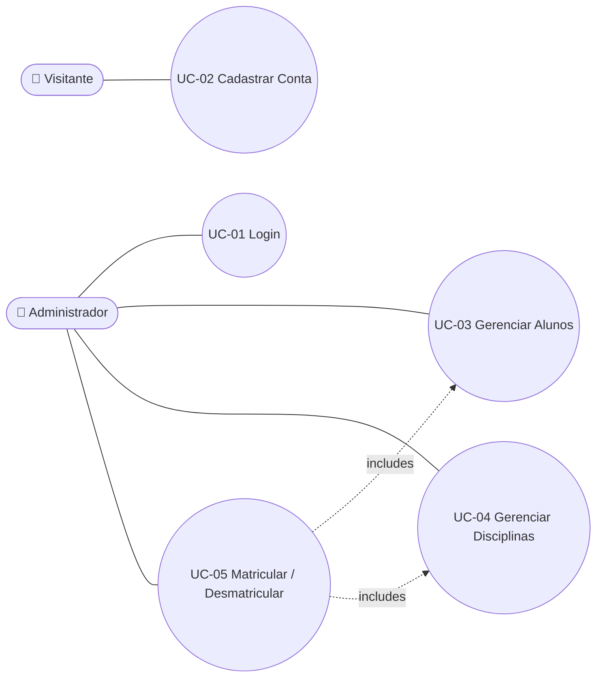
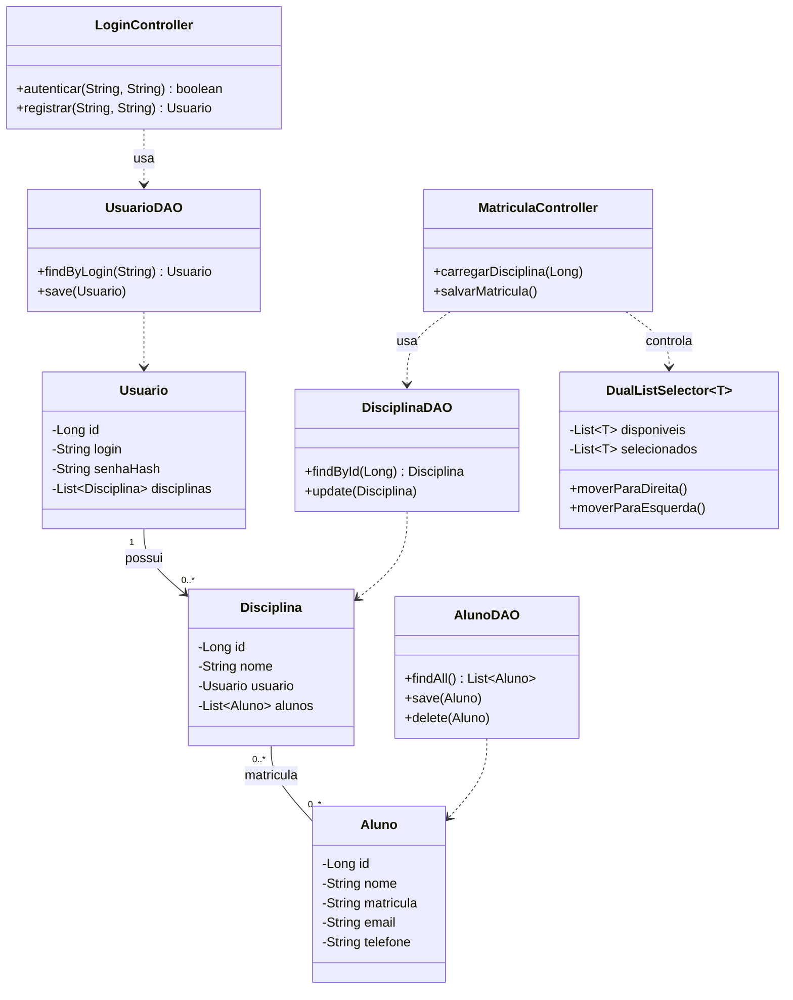
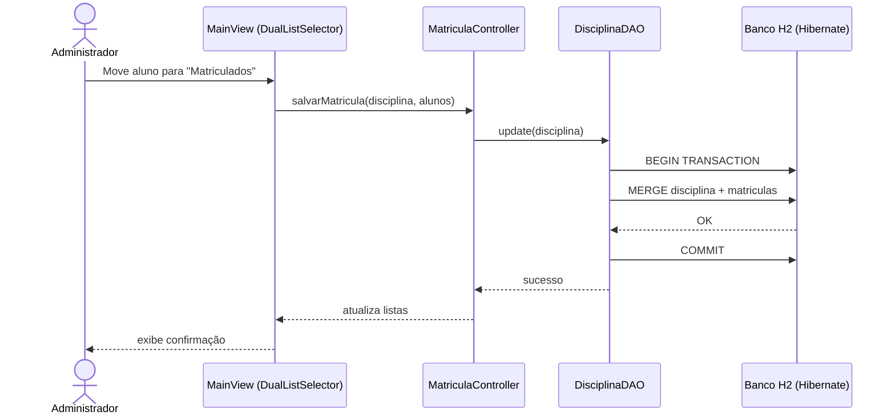
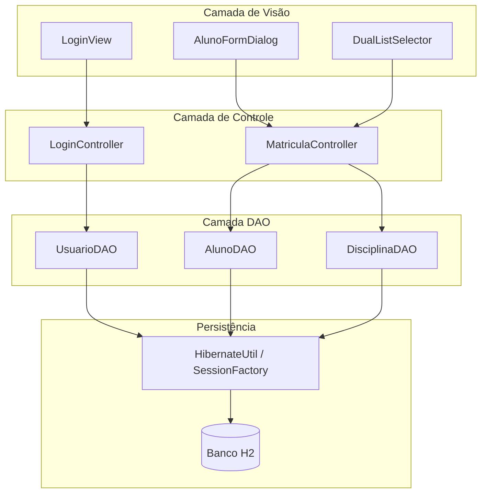
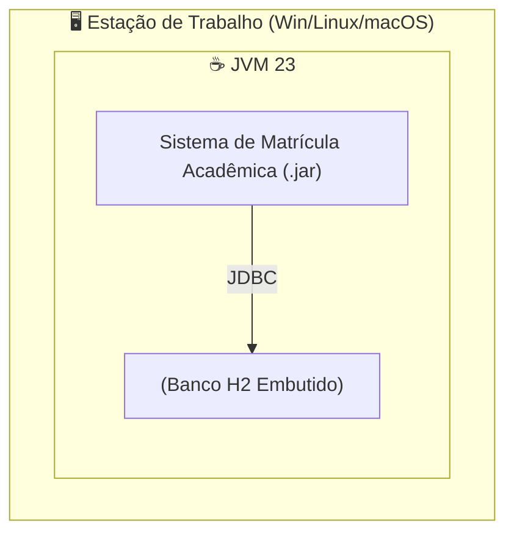
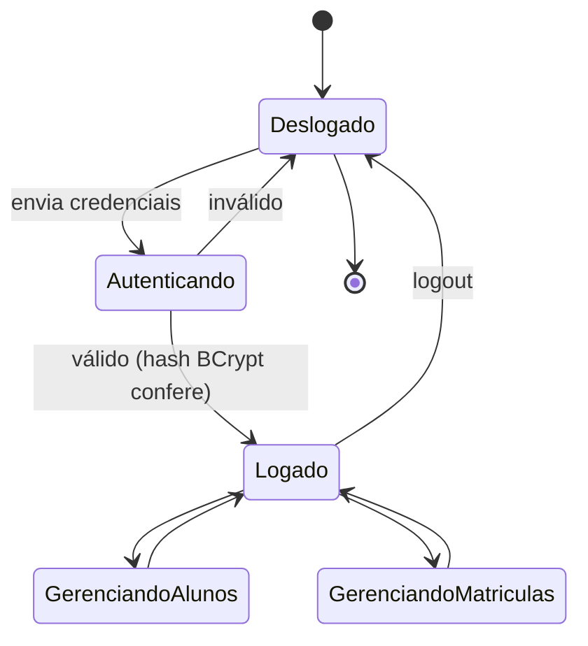
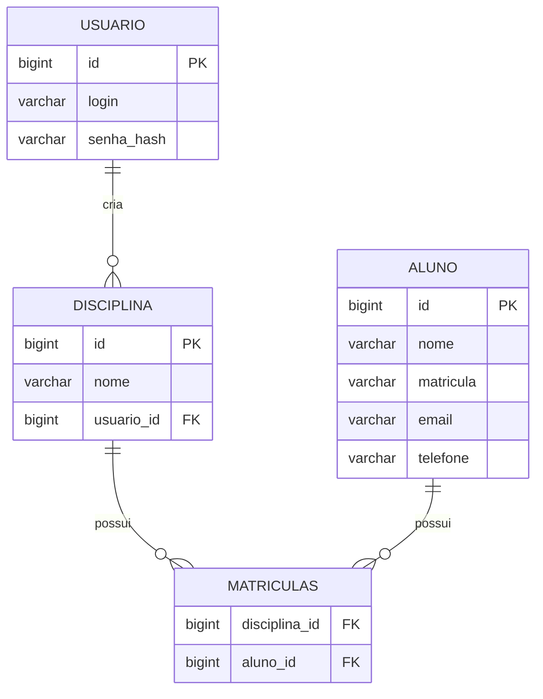
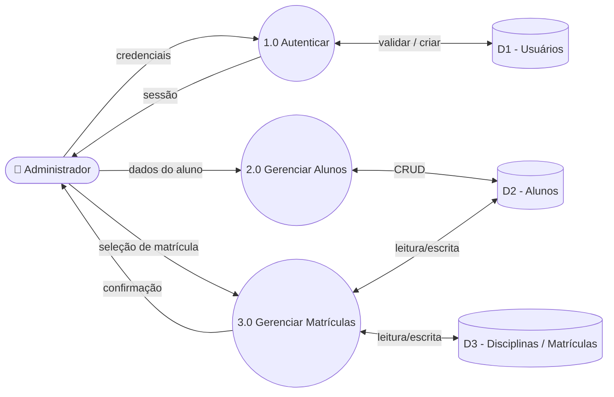
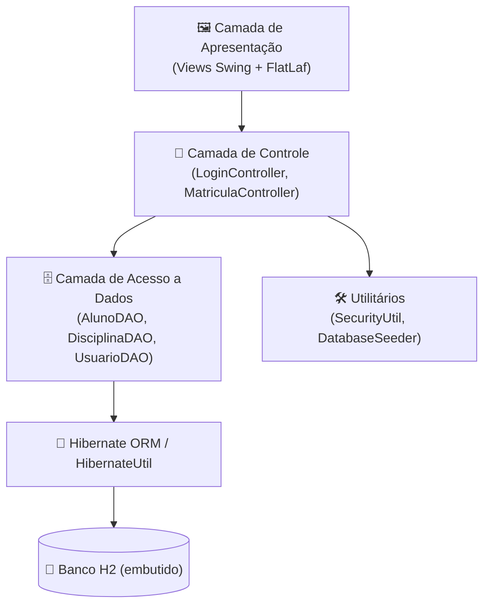
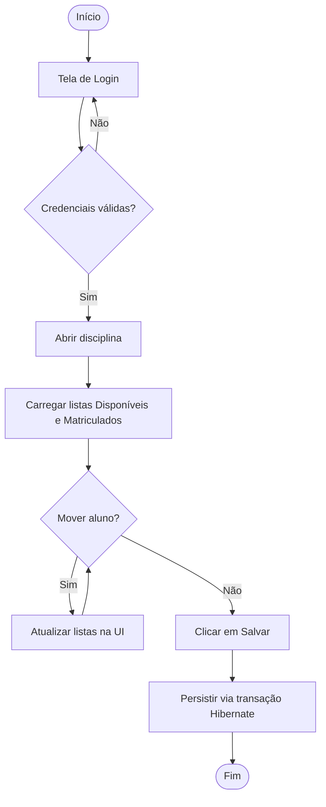

<div align="center">
  <br />
  

  <h1>🎓 Sistema de Matrícula Acadêmica</h1>

  <strong style="font-size: 1.2em;">
    Componente de Seleção em Lista Dupla (Dual List) com Persistência Hibernate
  </strong>

  <br /><br />

  <p style="max-width: 700px;">
    Uma solução desktop robusta desenvolvida em <strong>Java Swing</strong> sob a arquitetura <strong>MVC</strong>. O projeto foca na implementação de um componente visual reutilizável para seleção de itens e na persistência de dados utilizando <strong>Hibernate ORM</strong>.
  </p>

  <p>
    
    
    
    
  </p>

  <p>
    🌐 <strong>Choose Language / Selecione o idioma / Elija el idioma</strong><br/><br/>
    <a href="README.md"></a>
    <a href="README_PT.md"></a>
    <a href="README_ES.md"></a>
  </p>
</div>

---

## 📖 Sobre o Projeto

O **Sistema de Matrícula Acadêmica** é uma aplicação desktop desenvolvida para demonstrar competências avançadas em Programação Orientada a Objetos e arquitetura **MVC**. Sua funcionalidade central é um componente reutilizável "Dual List Selector" usado para matricular alunos em disciplinas, com persistência via **Hibernate** e banco de dados embutido **H2**.

## 📑 Sumário

- 📋 Requisitos (Funcionais, Não Funcionais, Regras de Negócio, Domínio, Dados, Interface)
- 🎭 Casos de Uso
- 🔗 Matriz de Rastreabilidade de Requisitos
- 📄 Documento de Especificação de Requisitos de Software (SRS)
- 📊 Diagramas UML e Estruturais (Casos de Uso, Classes, Sequência, Componentes, Implantação, Máquina de Estados)
- 🗄️ Modelo de Dados e Dicionário de Dados (Conceitual / Lógico / Físico / DER)
- 🔀 Diagrama de Fluxo de Dados (DFD)
- 🏗️ Diagrama de Arquitetura e Fluxograma
- 👤 Persona e Mapa de Jornada do Usuário
- 🖼️ Wireframes e Mockups
- 🚀 Instalação e Execução
- 👨‍💻 Autor

---

<details>
<summary>

## 📋 1. Requisitos

</summary>

### ✅ Requisitos Funcionais (RF)

| ID | Módulo | Descrição | Prioridade |
|---|---|---|---|
| RF-001 | Autenticação | O sistema deve permitir login e cadastro de contas de administrador. | Essencial |
| RF-002 | Gestão de Alunos | O sistema deve permitir criar, editar e excluir alunos (CRUD). | Essencial |
| RF-003 | Matrícula | O usuário deve poder mover alunos entre as listas "Disponíveis" e "Matriculados". | Essencial |
| RF-004 | Matrícula | Ao clicar em "Salvar", a associação entre aluno e disciplina deve ser persistida. | Essencial |
| RF-005 | Interface | A lista deve exibir um ícone (avatar) ao lado do nome do aluno. | Média |
| RF-006 | Gestão de Disciplinas | O sistema deve permitir que o usuário autenticado crie disciplinas de sua propriedade. | Alta |
| RF-007 | Seed de Dados | Na primeira execução, o sistema deve popular o banco com alunos de exemplo e um usuário admin padrão. | Média |

### ⚡ Requisitos Não Funcionais (RNF)

| ID | Atributo | Descrição |
|---|---|---|
| RNF-001 | Usabilidade | A interface deve utilizar o tema FlatLaf para visual moderno e responsivo. |
| RNF-002 | Portabilidade | O banco de dados deve ser H2 embutido, sem necessidade de instalação externa. |
| RNF-003 | Manutenibilidade | O código deve seguir estritamente o padrão MVC e usar Generics no componente visual. |
| RNF-004 | Segurança | Senhas nunca devem ser armazenadas em texto plano (hash BCrypt). |
| RNF-005 | Confiabilidade | Operações de escrita devem ser atômicas, com transações Hibernate e rollback em falhas. |
| RNF-006 | Performance | A lista de alunos deve renderizar com fluidez com mais de 1.000 registros via `ListCellRenderer` customizado. |

### 📜 Regras de Negócio (RN)

| ID | Ator | Regra | Justificativa |
|---|---|---|---|
| RN-001 | Sistema | Uma matrícula associa um aluno a uma disciplina via tabela de relacionamento N:N. | Permite que o aluno esteja em múltiplas disciplinas. |
| RN-002 | Sistema | Na primeira execução, se não houver usuários, cria-se automaticamente `admin` / `1234`. | Garante acesso imediato sem configuração manual. |
| RN-003 | Usuário | O campo "Matrícula" do aluno deve ser único. | Garante a unicidade do registro acadêmico. |
| RN-004 | Sistema | Senhas de novos usuários devem ser criptografadas via BCrypt antes da persistência. | Segurança básica contra vazamento de dados. |
| RN-005 | Usuário | A exclusão de um aluno é permanente e remove suas matrículas. | Hard delete conforme escopo da atividade. |
| RN-006 | Sistema | Uma disciplina sempre pertence ao usuário (Usuario) que a criou. | Define o limite de propriedade em cenários multiusuário. |

### 🌐 Requisitos de Domínio

- O sistema modela um domínio acadêmico simplificado: **Usuários (administradores)**, **Disciplinas**, **Alunos** e **Matrículas**.
- A "Matrícula" não é uma entidade de primeira classe na UI — é representada pela presença de um `Aluno` na coleção de uma `Disciplina`.
- O vocabulário do domínio está em português no código (`Aluno`, `Disciplina`, `Usuario`, `Matricula`), refletindo o idioma nativo da instituição.

### 🗃️ Requisitos de Dados

- O registro de aluno requer: nome completo, matrícula única, e-mail e telefone.
- O registro de usuário requer: login único e senha em hash (nunca em texto plano).
- O registro de disciplina requer: nome e usuário proprietário.
- A relação de matrícula requer apenas o par (ID da disciplina, ID do aluno).

### 🖥️ Requisitos de Interface

- A tela de login deve validar credenciais e exibir feedback visual de erro.
- A tela principal deve apresentar duas listas sincronizadas ("Disponíveis" / "Matriculados") com botões de movimentação.
- Os formulários (Adicionar/Editar Aluno) devem validar campos obrigatórios antes de habilitar "Salvar".
- A interface deve usar um Look & Feel moderno e consistente (FlatLaf) em todas as janelas.

</details>

---

<details>
<summary>

## 🎭 2. Casos de Uso

</summary>

| ID | Caso de Uso | Ator Principal | Descrição |
|---|---|---|---|
| UC-01 | Login | Administrador | Autenticar-se com login e senha para acessar o sistema. |
| UC-02 | Cadastrar Conta | Visitante | Criar uma nova conta de administrador com senha em hash. |
| UC-03 | Gerenciar Alunos (CRUD) | Administrador | Criar, editar, visualizar e excluir registros de alunos. |
| UC-04 | Gerenciar Disciplinas | Administrador | Criar disciplinas de propriedade do usuário logado. |
| UC-05 | Matricular / Desmatricular Alunos | Administrador | Mover alunos entre as listas "Disponíveis" e "Matriculados" e persistir o resultado. |

### Diagrama de Casos de Uso



</details>

---

<details>
<summary>

## 🔗 3. Matriz de Rastreabilidade de Requisitos

</summary>

| Requisito | Caso de Uso | Diagrama(s) | Componente |
|---|---|---|---|
| RF-001 / RN-002 | UC-01 Login | Sequência, Máquina de Estados | `LoginController`, `UsuarioDAO` |
| RF-001 / RN-004 | UC-02 Cadastrar Conta | Classes, Máquina de Estados | `LoginController`, `SecurityUtil` |
| RF-002 / RN-003 / RN-005 | UC-03 Gerenciar Alunos | Classes, DER | `AlunoFormDialog`, `AlunoDAO` |
| RF-006 / RN-006 | UC-04 Gerenciar Disciplinas | Classes, DER | `MatriculaController`, `DisciplinaDAO` |
| RF-003 / RF-004 / RN-001 | UC-05 Matricular / Desmatricular | Sequência, Componentes, Fluxograma | `DualListSelector`, `MatriculaController`, `DisciplinaDAO` |
| RF-005 | UC-03 | Wireframe / Mockup | `DualListSelector` (renderer customizado) |
| RNF-002 / RNF-004 / RNF-005 | UC-01..05 | Implantação, Arquitetura | `HibernateUtil`, `SecurityUtil` |

</details>

---

<details>
<summary>

## 📄 4. Documento de Especificação de Requisitos de Software (SRS)

</summary>

### 4.1 Propósito

Este documento especifica o comportamento funcional e não funcional do Sistema de Matrícula Acadêmica, uma aplicação desktop para gerenciamento de alunos, disciplinas e matrículas.

### 4.2 Escopo

O sistema cobre: autenticação de administradores, CRUD de alunos, criação de disciplinas e gerenciamento de matrículas via interface dual-list. Não cobre notas, frequência ou suporte multi-instituição.

### 4.3 Descrição Geral

- **Perspectiva do produto:** aplicação desktop Java Swing standalone com banco H2 embutido — sem servidor externo.
- **Classes de usuário:** um único papel, *Administrador* (criado via cadastro, ou seedado como `admin` / `1234`).
- **Ambiente operacional:** Windows, Linux ou macOS com Java 23+ instalado.
- **Restrições:** separação MVC estrita; componente de UI genérico e reutilizável (`DualListSelector<T>`).

### 4.4 Requisitos Específicos

Veja [§1 Requisitos](#-1-requisitos) para a lista completa de RF / RNF / RN, e [§2 Casos de Uso](#-2-casos-de-uso) para as especificações comportamentais.

### 4.5 Requisitos de Interface Externa

- **UI:** Swing + FlatLaf, descrita em [§9 Wireframes e Mockups](#-9-wireframes-e-mockups).
- **Dados:** banco H2 embutido via Hibernate, descrito em [§6 Modelo de Dados](#-6-modelo-de-dados-e-dicionário-de-dados).
- **Hardware:** nenhum requisito especial além de um desktop/notebook capaz de executar uma JVM.

</details>

---

<details>
<summary>

## 📊 5. Diagramas UML e Estruturais

</summary>

### Diagrama de Classes



### Diagrama de Sequência — Matricular Aluno



### Diagrama de Componentes



### Diagrama de Implantação



### Máquina de Estados — Sessão do Usuário



> 📦 *Nota: para manter a concisão, os diagramas de Objetos, Comunicação, Atividades, Pacotes, Estrutura Composta, Visão Geral de Interação e Tempo foram consolidados nos diagramas acima — o escopo reduzido do sistema (3 entidades, 2 controllers, 1 componente de UI genérico) é totalmente coberto por estas seis visões.*

</details>

---

<details>
<summary>

## 🗄️ 6. Modelo de Dados e Dicionário de Dados

</summary>

### Modelo Conceitual

Três conceitos centrais: **Usuário** (administrador), **Disciplina** (de propriedade de um Usuário) e **Aluno** (matriculado em zero ou mais Disciplinas). A relação entre Disciplina e Aluno é muitos-para-muitos ("Matrícula").

### Modelo Lógico

- `Usuario (1) ──< (N) Disciplina`
- `Disciplina (N) ──< matriculas >── (N) Aluno`

### Modelo Físico — DER



### Dicionário de Dados

**`alunos`**

| Campo | Tipo | Restrições | Descrição |
|---|---|---|---|
| id | BIGINT | PK, auto-incremento | Identificador único do aluno |
| nome | VARCHAR | NOT NULL | Nome completo |
| matricula | VARCHAR | NOT NULL, UNIQUE | Número de matrícula |
| email | VARCHAR | opcional | E-mail de contato |
| telefone | VARCHAR | opcional | Telefone de contato |

**`usuarios`**

| Campo | Tipo | Restrições | Descrição |
|---|---|---|---|
| id | BIGINT | PK, auto-incremento | Identificador único do usuário |
| login | VARCHAR | NOT NULL, UNIQUE | Nome de usuário |
| senha_hash | VARCHAR | NOT NULL | Hash BCrypt da senha |

**`disciplinas`**

| Campo | Tipo | Restrições | Descrição |
|---|---|---|---|
| id | BIGINT | PK, auto-incremento | Identificador único da disciplina |
| nome | VARCHAR | NOT NULL | Nome da disciplina |
| usuario_id | BIGINT | FK → usuarios.id | Administrador proprietário |

**`matriculas`** (tabela de junção)

| Campo | Tipo | Restrições | Descrição |
|---|---|---|---|
| disciplina_id | BIGINT | FK → disciplinas.id | Disciplina matriculada |
| aluno_id | BIGINT | FK → alunos.id | Aluno matriculado |

</details>

---

<details>
<summary>

## 🔀 7. Diagrama de Fluxo de Dados (DFD)

</summary>



> *Linhagem de dados: os dados de alunos e matrículas se originam de entrada manual do administrador ou do `DatabaseSeeder` (primeira execução), fluem pela camada DAO e são persistidos no armazenamento H2 (arquivo/memória) — nenhum sistema externo está envolvido.*

</details>

---

<details>
<summary>

## 🏗️ 8. Diagrama de Arquitetura e Fluxograma

</summary>

### Arquitetura (MVC em Camadas)



### Fluxograma — Processo de Matrícula



</details>

---

<details>
<summary>

## 👤 9. Persona e Mapa de Jornada do Usuário

</summary>

### Persona

| Atributo | Descrição |
|---|---|
| **Nome** | Carla Mendes |
| **Função** | Coordenadora Acadêmica |
| **Idade** | 41 |
| **Maturidade tecnológica** | Intermediária — confortável com apps desktop, não é desenvolvedora |
| **Objetivos** | Matricular/desmatricular alunos rapidamente a cada semestre, sem erros |
| **Frustrações** | Sistemas legados lentos e poluídos; medo de perder alterações não salvas |
| **Frase** | *"Eu só preciso mover alunos entre as listas e saber que foi salvo."* |

### Mapa de Jornada do Usuário

| Etapa | Ação | Ponto de Contato | Emoção | Ponto de Dor | Oportunidade |
|---|---|---|---|---|---|
| 1. Acesso | Abre o app e faz login | LoginView | Neutra | Esquece a senha | Feedback de erro claro (RF-001) |
| 2. Orientação | Seleciona uma disciplina | MainView | Curiosa | Muitas disciplinas listadas | Busca/filtro (futuro) |
| 3. Ação | Move alunos entre as listas | DualListSelector | Concentrada | Incerteza sobre qual lado é "matriculado" | Rótulos e ícones claros (RF-005) |
| 4. Confirmação | Clica em "Salvar" | MainView | Aliviada | Sem feedback após salvar | Diálogo/toast de confirmação |
| 5. Revisão | Reabre a disciplina para verificar | MainView | Confiante | — | Dados persistidos corretamente (RF-004) |

</details>

---

<details>
<summary>

## 🖼️ 10. Wireframes e Mockups

</summary>

### Tela de Login (Wireframe)

```
┌──────────────────────────────────────┐
│              🎓 LOGIN                 │
│                                        │
│   Usuário   [______________]         │
│   Senha     [______________]         │
│                                        │
│         [  ENTRAR  ]  [ CADASTRAR ]   │
│                                        │
│   ⚠ Credenciais inválidas (em erro)   │
└──────────────────────────────────────┘
```

### Tela Principal — Lista Dupla (Mockup)

```
┌────────────────────────────────────────────────────────────────┐
│  Disciplina: [ Cálculo I       ▼ ]               [ Salvar 💾 ]  │
├─────────────────────────┬───────────┬──────────────────────────┤
│  ALUNOS DISPONÍVEIS      │           │   ALUNOS MATRICULADOS    │
│  ────────────────────    │  ➡ Add    │   ────────────────────   │
│  👤 2024001 - Ana Silva   │           │   👤 2024010 - João Lima  │
│  👤 2024002 - Bruno Costa │  ⬅ Remove │   👤 2024011 - Maria Reis │
│  👤 2024003 - Carla Souza │           │   👤 2024012 - Pedro Alve │
│  ...                      │           │   ...                    │
├─────────────────────────┴───────────┴──────────────────────────┤
│ [ + Novo Aluno ]  [ ✎ Editar ]  [ 🗑 Excluir ]                   │
└────────────────────────────────────────────────────────────────┘
```

</details>

---

## 🚀 Instalação e Execução

### Pré-requisitos

* **Java JDK 23**
* **Maven** 3.8+
* **Git** (opcional)
* IDE recomendada: **IntelliJ IDEA**

### Passo a Passo

1. Clone o repositório:
   ```bash
   git clone https://github.com/VictorHJesusSantiago/DualListHibernate.git
   ```
2. Abra o projeto na IDE e deixe o Maven baixar as dependências do `pom.xml`.
3. Configure o Project SDK para **Java 23**.
4. Execute `src/main/java/br/com/projeto/MainApp.java`.

### 🔑 Acesso Padrão

Na primeira execução, o sistema cria:

* **Usuário:** `admin`
* **Senha:** `1234`

---

## 👨‍💻 Autor

<table>
  <tr>
    <td width="100" align="center">
      
    </td>
    <td>
      <strong>Victor Henrique Jesus Santiago</strong><br>
      Desenvolvedor Full Stack<br><br>
      📧 <a href="mailto:victorhenriquedejesussantiago@gmail.com">victorhenriquedejesussantiago@gmail.com</a><br>
      👔 <a href="https://www.linkedin.com/in/victor-henrique-de-jesus-santiago/">LinkedIn/victorhjsantiago</a><br>
      🐙 <a href="https://github.com/VictorHJesusSantiago">GitHub/VictorHJesusSantiago</a>
    </td>
  </tr>
</table>
