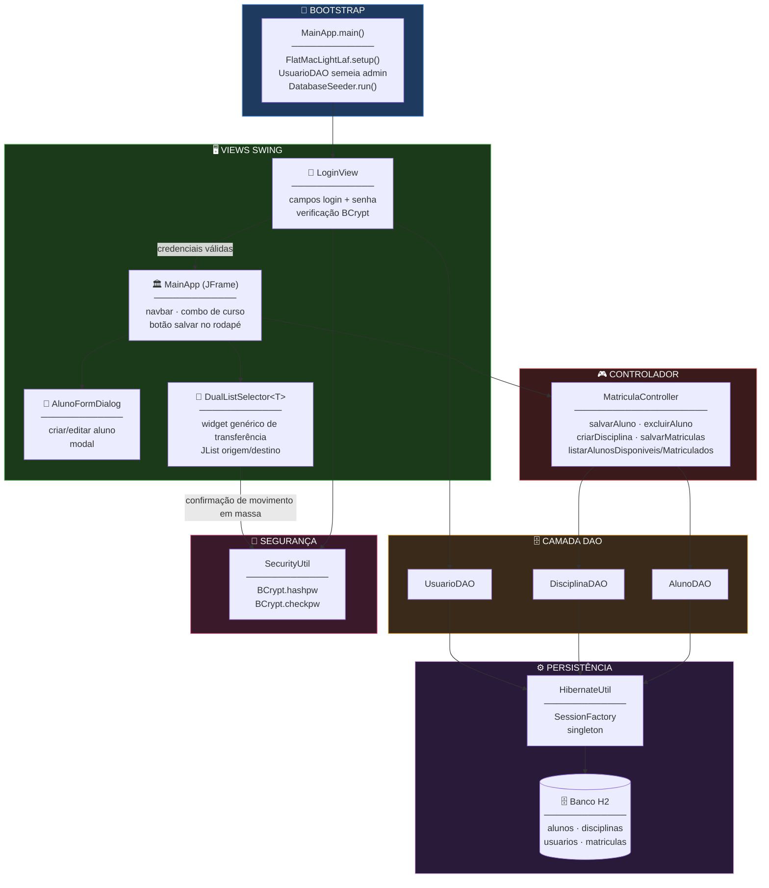
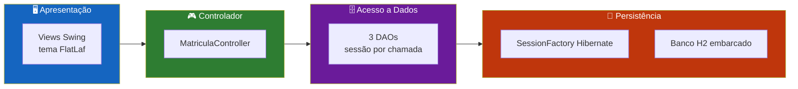
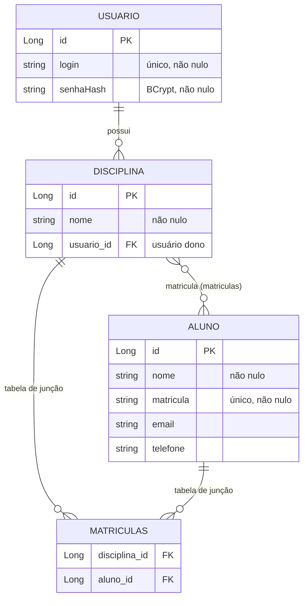
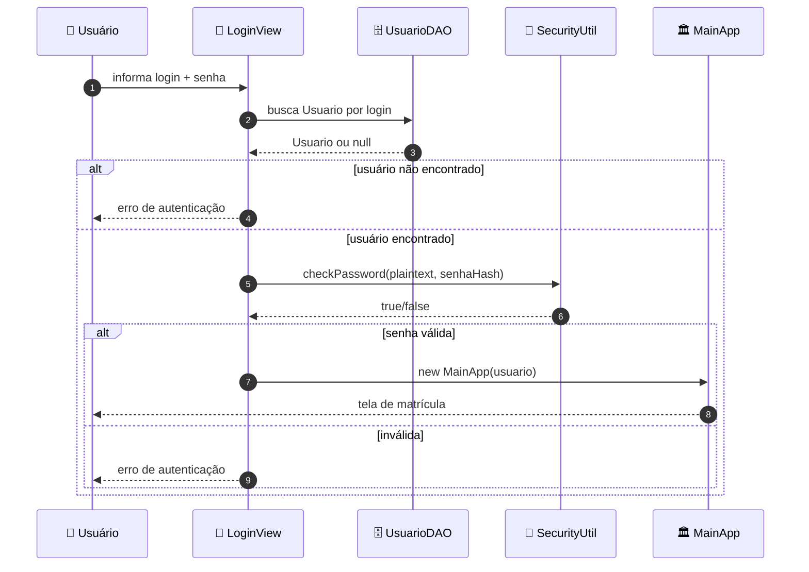
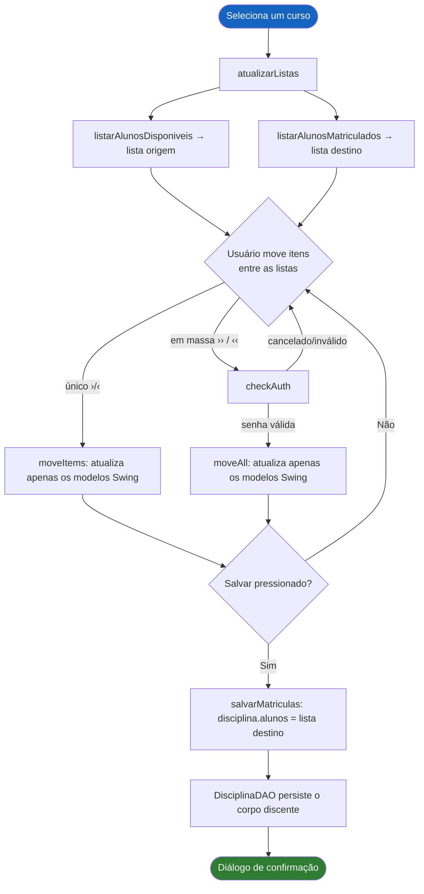
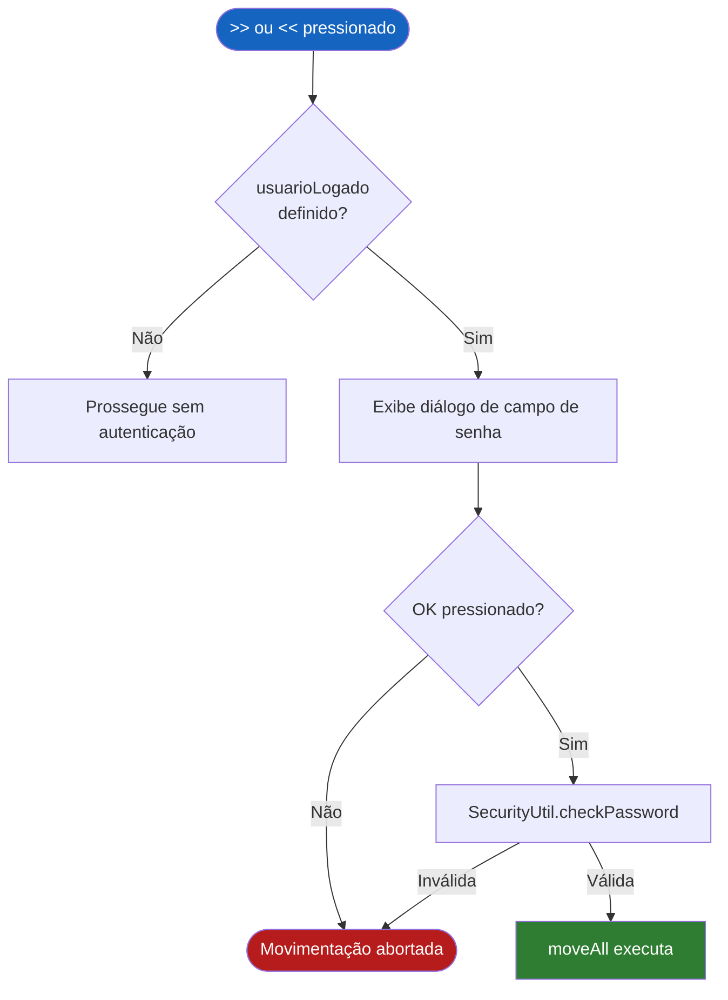

<div align="center">

**🌐 Choose Language / Selecione o Idioma / Elija el Idioma**

[](README.md)&nbsp;&nbsp;&nbsp;[](README_PT.md)&nbsp;&nbsp;&nbsp;[](README_ES.md)

</div>

---

<div align="center">

```
██████╗ ██╗   ██╗ █████╗ ██╗     ██╗     ██╗███████╗████████╗
██╔══██╗██║   ██║██╔══██╗██║     ██║     ██║██╔════╝╚══██╔══╝
██║  ██║██║   ██║███████║██║     ██║     ██║███████╗   ██║
██║  ██║██║   ██║██╔══██║██║     ██║     ██║╚════██║   ██║
██████╔╝╚██████╔╝██║  ██║███████╗███████╗██║███████║   ██║
╚═════╝  ╚═════╝ ╚═╝  ╚═╝╚══════╝╚══════╝╚═╝╚══════╝   ╚═╝
     Gerenciador de Matrículas em Swing + Hibernate com UI de Lista Dupla
```

---

[-ED8B00?style=for-the-badge&logo=openjdk&logoColor=white)](https://openjdk.org/)
[](https://hibernate.org/)
[](https://www.h2database.com/)
[]()
[](https://www.formdev.com/flatlaf/)
[]()
[](https://maven.apache.org/)

<br/>

> **Um gerenciador de matrículas desktop onde mover um aluno entre duas listas**
> *é* o próprio ato de matriculá-lo ou desmatriculá-lo, apoiado em Hibernate ORM sobre um banco H2 embarcado.

<br/>


</div>

---

## 📑 Sumário

<details>
<summary>▶️ <strong>Clique para expandir / recolher esta seção</strong></summary>

<table>
<tr>
<td valign="top" width="50%">

**🏗️ Sistema**
- [Visão Geral](#-visão-geral)
- [Arquitetura do Sistema](#️-arquitetura-do-sistema)
- [Stack Tecnológica](#️-stack-tecnológica)
- [Padrões de Projeto](#-padrões-de-projeto-aplicados)
- [Estrutura do Projeto](#-estrutura-do-projeto)

**📦 Módulos**
- [MainApp — Shell](#️-mainapp--shell-da-aplicação)
- [LoginView — Autenticação](#-loginview--tela-de-autenticação)
- [DualListSelector — UI Genérica](#-duallistselector--widget-genérico-de-lista-dupla)
- [MatriculaController — Orquestração](#-matriculacontroller--orquestração-de-matrículas)
- [Camada DAO](#️-camada-dao--alunodao-disciplinadao-usuariodao)
- [SecurityUtil — Hashing](#-securityutil--hash-de-senha)
- [HibernateUtil / DatabaseSeeder](#️-hibernateutil--databaseseeder)

</td>
<td valign="top" width="50%">

**💼 Negócio**
- [Regras de Negócio](#-regras-de-negócio)
- [Requisitos Funcionais](#-requisitos-funcionais)
- [Requisitos Não Funcionais](#-requisitos-não-funcionais)

**📐 Design**
- [Modelo de Dados](#️-modelo-de-dados)
- [Fluxos do Sistema](#-fluxos-do-sistema)
- [Fluxo de Login](#fluxo-de-login)
- [Fluxo de Matrícula](#fluxo-de-matrícula)
- [Fluxo de Autorização de Movimentação em Massa](#fluxo-de-autorização-de-movimentação-em-massa)

**🔐 Segurança & Operação**
- [Segurança](#-segurança)
- [Instalação & Execução](#-instalação--execução)
- [Testes Automatizados](#-testes-automatizados)
- [Métricas & Monitoramento](#-métricas--monitoramento)
- [Limitações Conhecidas](#️-limitações-conhecidas)

</td>
</tr>
</table>

---

</details>

## 🌟 Visão Geral

<details>
<summary>▶️ <strong>Clique para expandir / recolher esta seção</strong></summary>

**DualListHibernate** é uma aplicação desktop em Java Swing que gerencia a matrícula de alunos em cursos ("disciplinas") através de um **widget de transferência de lista dupla**: os alunos disponíveis ficam em uma lista à esquerda, os matriculados ficam em uma lista à direita, e botões de seta únicos ou em massa movem os itens entre elas. Salvar simplesmente persiste o que ficou do lado direito como o corpo discente matriculado do curso — o estado da UI *é* o estado do domínio até que o botão salvar o confirme.

A persistência roda através do **Hibernate ORM 6** contra um banco **H2** embarcado, com três entidades JPA — `Usuario`, `Disciplina`, `Aluno` — conectadas por um relacionamento um-para-muitos (o usuário é dono dos cursos) e muitos-para-muitos (o curso matricula alunos). Uma camada DAO leve envolve o boilerplate de `Session` do Hibernate, e um `MatriculaController` fica entre as views Swing e os DAOs, mantendo as preocupações de persistência fora do código de UI.

O acesso é protegido por uma tela de login apoiada em hash de senha com **BCrypt**, e operações destrutivas em massa (mover *todos* os alunos de uma vez) exigem que a senha do admin logado seja reinserida antes de prosseguir.

### 🎯 Objetivos do Sistema

| Objetivo | Descrição |
|----------|-----------|
| 🔄 **Matrícula em lista dupla** | Representar "matriculado" vs. "disponível" como duas listas conectadas por setas de transferência |
| 🎓 **Gestão de cursos** | Permitir que um usuário autenticado crie cursos e escope a matrícula a eles |
| 👤 **CRUD de alunos** | Criar, editar e excluir registros de alunos através de um diálogo modal |
| 🔐 **Acesso autenticado** | Exigir login antes que qualquer tela de matrícula seja alcançável |
| 🛡️ **Confirmação de ação em massa** | Exigir reentrada de senha antes de mover uma lista inteira de uma vez |
| 🗄️ **Persistência apoiada em ORM** | Modelar o domínio como entidades JPA mapeadas pelo Hibernate em tabelas H2 |
| 🌱 **Dados iniciais determinísticos** | Semear um usuário admin e dados de demonstração automaticamente na primeira execução |
| 🎨 **Visual desktop moderno** | Renderizar com o tema Mac Light do FlatLaf em vez do visual padrão do Swing |

---

</details>

## 🏗️ Arquitetura do Sistema

<details>
<summary>▶️ <strong>Clique para expandir / recolher esta seção</strong></summary>

### Diagrama de Módulos


```mermaid
flowchart TB
    subgraph BOOT["🚀  BOOTSTRAP"]
        MAIN["MainApp.main()\n─────────────\nFlatMacLightLaf.setup()\nUsuarioDAO semeia admin\nDatabaseSeeder.run()"]
    end

    subgraph UI["🖥️  VIEWS SWING"]
        direction LR
        LOGIN["🔐 LoginView\n─────────────\ncampos login + senha\nverificação BCrypt"]
        APP["🏛️ MainApp (JFrame)\n─────────────\nnavbar · combo de curso\nbotão salvar no rodapé"]
        FORM["📝 AlunoFormDialog\n─────────────\ncriar/editar aluno\nmodal"]
        DLS["🔀 DualListSelector&lt;T&gt;\n─────────────\nwidget genérico de transferência\nJList origem/destino"]
    end

    subgraph CTRL["🎮  CONTROLADOR"]
        MC["MatriculaController\n─────────────────────\nsalvarAluno · excluirAluno\ncriarDisciplina · salvarMatriculas\nlistarAlunosDisponiveis/Matriculados"]
    end

    subgraph DAO["🗄️  CAMADA DAO"]
        direction LR
        ADAO["AlunoDAO"]
        DDAO["DisciplinaDAO"]
        UDAO["UsuarioDAO"]
    end

    subgraph ORM["⚙️  PERSISTÊNCIA"]
        HU["HibernateUtil\n─────────────\nSessionFactory\nsingleton"]
        DB[("🗄️ Banco H2\n─────────────\nalunos · disciplinas\nusuarios · matriculas")]
    end

    subgraph SEC["🔐  SEGURANÇA"]
        SU["SecurityUtil\n─────────────\nBCrypt.hashpw\nBCrypt.checkpw"]
    end

    MAIN --> LOGIN
    LOGIN -->|"credenciais válidas"| APP
    LOGIN --> SU
    APP --> DLS
    APP --> FORM
    APP --> MC
    DLS -->|"confirmação de movimento em massa"| SU
    MC --> ADAO & DDAO
    LOGIN --> UDAO
    ADAO & DDAO & UDAO --> HU --> DB

    style BOOT fill:#1e3a5f,color:#fff,stroke:#4a90d9
    style UI fill:#1a3a1a,color:#fff,stroke:#4caf50
    style CTRL fill:#3a1a1a,color:#fff,stroke:#e57373
    style DAO fill:#3a2a1a,color:#fff,stroke:#ffb74d
    style ORM fill:#2a1a3a,color:#fff,stroke:#ce93d8
    style SEC fill:#3a1a2a,color:#fff,stroke:#f06292
```

### Camadas da Arquitetura


```mermaid
flowchart LR
    subgraph L1["🖥️ Apresentação"]
        A1["Views Swing\ntema FlatLaf"]
    end
    subgraph L2["🎮 Controlador"]
        B1["MatriculaController"]
    end
    subgraph L3["🗄️ Acesso a Dados"]
        C1["3 DAOs\nsessão por chamada"]
    end
    subgraph L4["💾 Persistência"]
        D1["SessionFactory Hibernate"]
        D2["Banco H2 embarcado"]
    end

    L1 --> L2 --> L3 --> L4

    style L1 fill:#1565C0,color:#fff
    style L2 fill:#2E7D32,color:#fff
    style L3 fill:#6A1B9A,color:#fff
    style L4 fill:#BF360C,color:#fff
```

---

</details>

## 🛠️ Stack Tecnológica

<details>
<summary>▶️ <strong>Clique para expandir / recolher esta seção</strong></summary>

<table>
<thead>
<tr>
<th>Camada</th>
<th>Tecnologia</th>
<th>Versão</th>
<th>Finalidade</th>
</tr>
</thead>
<tbody>
<tr>
<td><strong>🧠 Linguagem</strong></td>
<td>Java</td>
<td>23 (recursos preview habilitados)</td>
<td>Aplicação inteira, compilada com <code>--enable-preview</code></td>
</tr>
<tr>
<td rowspan="2"><strong>🗄️ Persistência</strong></td>
<td>Hibernate ORM</td>
<td>6.4.1.Final</td>
<td>Implementação JPA, mapeamento de entidades, gerenciamento de sessão</td>
</tr>
<tr>
<td>Banco H2</td>
<td>2.2.224</td>
<td>Armazenamento relacional embarcado, em arquivo/memória</td>
</tr>
<tr>
<td rowspan="2"><strong>🎨 UI</strong></td>
<td>Java Swing</td>
<td>embutido no JDK</td>
<td>Janelas, diálogos, listas, gerenciadores de layout</td>
</tr>
<tr>
<td>FlatLaf</td>
<td>3.2.5</td>
<td>Look &amp; Feel moderno (Mac Light), componentes arredondados via <code>FlatClientProperties.STYLE</code></td>
</tr>
<tr>
<td><strong>🔐 Segurança</strong></td>
<td>jBCrypt</td>
<td>0.4</td>
<td>Hash de senha (<code>gensalt(12)</code>) e verificação</td>
</tr>
<tr>
<td rowspan="2"><strong>🔧 Build</strong></td>
<td>Maven</td>
<td>—</td>
<td><code>pom.xml</code>, projeto de módulo único</td>
</tr>
<tr>
<td>maven-compiler-plugin</td>
<td>3.11.0</td>
<td>Compila com <code>source</code>/<code>target</code> 23 e flag de preview</td>
</tr>
</tbody>
</table>

---

</details>

## 🎨 Padrões de Projeto Aplicados

<details>
<summary>▶️ <strong>Clique para expandir / recolher esta seção</strong></summary>

| Padrão | Onde | Justificativa |
|--------|------|----------------|
| 🧭 **Camadas estilo MVC** | Views (`MainApp`, `LoginView`, `AlunoFormDialog`) → Controlador (`MatriculaController`) → DAO → Hibernate | A UI nunca toca o Hibernate diretamente; toda chamada de persistência é mediada |
| 🔀 **Widget Genérico** | `DualListSelector<T>` | A mecânica de lista de transferência é escrita uma vez e reutilizada para qualquer lista de `T`, sem fixar em `Aluno` |
| 🏭 **Padrão DAO** | `AlunoDAO`, `DisciplinaDAO`, `UsuarioDAO` | Cada entidade recebe um gateway de persistência pequeno e focado |
| 🔂 **Singleton** | `HibernateUtil` — uma `SessionFactory` para todo o ciclo de vida do processo | Evita o custo de reconstruir o modelo de metadados do Hibernate a cada chamada |
| 🧱 **Renderizador de Célula Customizado** | `ModernStudentRenderer` dentro de `DualListSelector` | Desacopla "como um aluno aparece em uma lista" do próprio widget de lista |
| 🚦 **Confirmação de Guarda** | `checkAuth()` antes de `moveAll()` | Ações em massa de alto impacto exigem uma etapa explícita de reautenticação |
| 🌱 **Semeadura na Inicialização** | `UsuarioDAO.criarUsuarioAdminSeNaoExistir()` + `DatabaseSeeder.run()` | A aplicação é executável a partir de um banco limpo, sem configuração manual |
| 🎨 **Estilização por Client-Property** | Strings `FlatClientProperties.STYLE` por toda a view | Ajustes visuais por componente (arco, borda, hover) sem criar subclasses de componentes Swing |

---

</details>

## 📁 Estrutura do Projeto

<details>
<summary>▶️ <strong>Clique para expandir / recolher esta seção</strong></summary>

```
DualListHibernate/
│
├── 📄 pom.xml                            # Build Maven: Hibernate, H2, FlatLaf, jBCrypt
│
└── 📂 src/main/
    ├── 📂 java/br/com/projeto/
    │   ├── 📄 MainApp.java                       # ★ Shell da aplicação — navbar, combo de curso, salvar
    │   │
    │   ├── 📂 controller/
    │   │   └── 📄 MatriculaController.java        # ★ Orquestração de matrículas — API voltada à UI
    │   │
    │   ├── 📂 dao/
    │   │   ├── 📄 AlunoDAO.java                   # Gateway de persistência do aluno
    │   │   ├── 📄 DisciplinaDAO.java               # Gateway de persistência do curso
    │   │   └── 📄 UsuarioDAO.java                  # Gateway de persistência do usuário + semeadura de admin
    │   │
    │   ├── 📂 model/
    │   │   ├── 📄 Aluno.java                       # @Entity — aluno
    │   │   ├── 📄 Disciplina.java                  # @Entity — curso, dono de @ManyToMany alunos
    │   │   └── 📄 Usuario.java                     # @Entity — usuário, dono de @OneToMany disciplinas
    │   │
    │   ├── 📂 util/
    │   │   ├── 📄 DatabaseSeeder.java              # Bootstrap de dados de demonstração
    │   │   ├── 📄 HibernateUtil.java               # Singleton de SessionFactory
    │   │   └── 📄 SecurityUtil.java                # Hash/verificação BCrypt
    │   │
    │   └── 📂 view/
    │       ├── 📄 LoginView.java                   # Tela de autenticação
    │       ├── 📄 DualListSelector.java            # ★ Widget genérico de transferência de lista dupla
    │       └── 📄 AlunoFormDialog.java             # Modal de criação/edição de aluno
    │
    └── 📂 resources/
        └── 📄 hibernate.cfg.xml                    # Configuração de conexão/dialeto Hibernate/H2
│
├── 📄 README.md                          # 🇺🇸 Inglês (principal)
├── 📄 README_PT.md                       # 🇧🇷 Português (este arquivo)
└── 📄 README_ES.md                       # 🇪🇸 Espanhol
```

---

</details>

## 📦 Módulos do Sistema

<details>
<summary>▶️ <strong>Clique para expandir / recolher esta seção</strong></summary>

### 🏛️ MainApp — Shell da Aplicação

O `JFrame` principal, construído inteiramente em código (sem layout `.form`/XML). Contém uma navbar superior (título, seletor de curso, botão de novo curso, botões de ação de aluno, logout), um `DualListSelector` central, e um botão de salvar no rodapé.

| Região | Conteúdo |
|--------|----------|
| Navbar esquerda | Título, combo box "Disciplina:", botão `+` de novo curso |
| Navbar direita | Novo Aluno, Editar, Excluir, Sair |
| Centro | `DualListSelector<Aluno>` vinculado ao curso selecionado |
| Rodapé | "Salvar Alterações de Matrícula" — confirma a lista de destino como o corpo discente |

`atualizarListas()` reconsulta os alunos disponíveis e matriculados via `MatriculaController` toda vez que o combo de curso muda.

---

### 🔐 LoginView — Tela de Autenticação

O ponto de entrada da aplicação (lançado a partir de `main()` após o bootstrap). Coleta um login e senha, busca o `Usuario` via `UsuarioDAO`, e verifica a senha com `SecurityUtil.checkPassword` contra o hash BCrypt armazenado. Em caso de sucesso, abre `MainApp` com o `Usuario` autenticado; em caso de falha, permanece na tela.

---

### 🔀 DualListSelector — Widget Genérico de Lista Dupla

O componente central de UI, parametrizado como `DualListSelector<T>` para que a mecânica de transferência seja reutilizável além de alunos.

| Elemento | Papel |
|----------|-------|
| `sourceModel` / `targetModel` | Dois `DefaultListModel<T>` que apoiam as `JList`s "disponível" e "matriculado" |
| `>` / `<` | Move a seleção atual um item por vez |
| `>>` / `<<` | Move todos os itens de uma vez — protegido por `checkAuth()` |
| `ModernStudentRenderer` | Renderizador de célula customizado que desenha um avatar de iniciais, nome e subtítulo "matrícula • email" |
| `checkAuth()` | Solicita a senha do admin logado antes que uma movimentação em massa prossiga |

`setSourceItems`/`setTargetItems` e `getSourceItems`/`getTargetItems` são o contrato público do widget — `MainApp` lê e escreve através deles, nunca tocando diretamente nos modelos Swing.

---

### 🎮 MatriculaController — Orquestração de Matrículas

O único ponto de contato entre as views Swing e a camada DAO.

| Método | Responsabilidade |
|--------|-------------------|
| `salvarAluno(Aluno)` | Cria ou atualiza um aluno via `AlunoDAO` |
| `excluirAluno(Aluno)` | Remove o aluno do corpo discente de todos os cursos, depois exclui o registro |
| `criarDisciplina(nome, usuario)` | Cria um novo curso pertencente ao usuário informado |
| `salvarMatriculas(disciplina, alunos)` | Sobrescreve a lista de matriculados de um curso com os alunos informados |
| `listarDisciplinas(usuario)` | Cursos pertencentes ao usuário atual |
| `listarAlunosDisponiveis(disciplina)` | Todos os alunos ainda não presentes no corpo discente do curso |
| `listarAlunosMatriculados(disciplina)` | O corpo discente atual do curso |

---

### 🗄️ Camada DAO — AlunoDAO, DisciplinaDAO, UsuarioDAO

Cada DAO abre uma `Session` do Hibernate a partir da `SessionFactory` compartilhada de `HibernateUtil`, envolve uma transação, e fecha a sessão — uma sessão por chamada, sem sessão de longa duração mantida ao longo do ciclo de vida da UI. `DisciplinaDAO.listarPorUsuario` e `AlunoDAO.listarTodos` apoiam, respectivamente, o combo box e a lista de origem.

---

### 🔐 SecurityUtil — Hash de Senha

Dois métodos estáticos que envolvem o jBCrypt.

| Método | Comportamento |
|--------|---------------|
| `hashPassword(plaintext)` | `BCrypt.hashpw(plaintext, BCrypt.gensalt(12))` — fator de custo 12 |
| `checkPassword(plaintext, hash)` | Rejeita imediatamente se `hash` for nulo ou não começar com `$2a$`, senão usa `BCrypt.checkpw` |

---

### ⚙️ HibernateUtil / DatabaseSeeder

`HibernateUtil` constrói e armazena em cache uma única `SessionFactory` a partir de `hibernate.cfg.xml`. `DatabaseSeeder.run()` e `UsuarioDAO.criarUsuarioAdminSeNaoExistir()` rodam na inicialização para que a aplicação esteja imediatamente utilizável em um arquivo H2 novo, sem entrada manual de dados.

---

</details>

## 💼 Regras de Negócio

<details>
<summary>▶️ <strong>Clique para expandir / recolher esta seção</strong></summary>

### 🎓 Regras de Matrícula

| # | Regra | Aplicação |
|---|-------|-----------|
| RN-01 | Um aluno está "matriculado" em um curso se e somente se aparecer na lista de destino daquele curso no momento de salvar | `salvarMatriculas` sobrescreve `disciplina.alunos` por completo |
| RN-02 | A lista de disponíveis de um curso exclui todo aluno já matriculado | `listarAlunosDisponiveis` filtra pelo conjunto de IDs matriculados |
| RN-03 | Mover um único aluno exige apenas uma seleção, não autenticação | `>` / `<` chamam `moveItems` diretamente |
| RN-04 | Mover uma lista inteira exige a senha do admin logado | `>>` / `<<` chamam `checkAuth()` antes de `moveAll()` |
| RN-05 | Mudanças de matrícula não são persistidas até que "Salvar Alterações de Matrícula" seja pressionado | O estado da lista dupla é puramente do lado do cliente até o botão do rodapé disparar |

### 👤 Regras de Aluno

| # | Regra | Aplicação |
|---|-------|-----------|
| RN-06 | `matricula` (número de matrícula do aluno) deve ser única | `@Column(unique = true)` em `Aluno.matricula` |
| RN-07 | `nome` e `matricula` são obrigatórios | `@Column(nullable = false)` |
| RN-08 | Excluir um aluno o remove primeiro de todos os cursos em que estava matriculado | `excluirAluno` itera todos os cursos antes da exclusão via DAO |

### 🎓 Regras de Curso

| # | Regra | Aplicação |
|---|-------|-----------|
| RN-09 | Todo curso pertence a exatamente um usuário dono | `@ManyToOne` `Disciplina.usuario`, não anulável |
| RN-10 | Um usuário só vê e gerencia seus próprios cursos | `listarDisciplinas(usuario)` escopa a consulta |
| RN-11 | Um novo curso começa com corpo discente vazio | `Disciplina.alunos` tem como padrão um `ArrayList` vazio |

### 🔐 Regras de Autenticação

| # | Regra | Aplicação |
|---|-------|-----------|
| RN-12 | `login` deve ser único | `@Column(unique = true)` em `Usuario.login` |
| RN-13 | Senhas nunca são armazenadas em texto puro | Apenas `senhaHash` é persistido, produzido por `SecurityUtil.hashPassword` |
| RN-14 | Uma conta de admin tem garantia de existir na primeira execução | `criarUsuarioAdminSeNaoExistir()` na inicialização |

---

</details>

## ✅ Requisitos Funcionais

<details>
<summary>▶️ <strong>Clique para expandir / recolher esta seção</strong></summary>

| ID | Requisito | Prioridade | Status |
|----|-----------|------------|--------|
| **RF-01** | O sistema deve exigir login antes de exibir a tela de matrícula | 🔴 Alta | ✅ Implementado |
| **RF-02** | O sistema deve listar alunos ainda não matriculados no curso selecionado | 🔴 Alta | ✅ Implementado |
| **RF-03** | O sistema deve listar alunos já matriculados no curso selecionado | 🔴 Alta | ✅ Implementado |
| **RF-04** | O sistema deve mover um único aluno selecionado entre as duas listas | 🔴 Alta | ✅ Implementado |
| **RF-05** | O sistema deve mover todos os alunos de uma lista de uma só vez | 🟡 Média | ✅ Implementado |
| **RF-06** | O sistema deve exigir reentrada de senha antes de uma movimentação em massa | 🔴 Alta | ✅ Implementado |
| **RF-07** | O sistema deve persistir a matrícula apenas quando o botão salvar for pressionado | 🔴 Alta | ✅ Implementado |
| **RF-08** | O sistema deve permitir criar um novo curso inline | 🟡 Média | ✅ Implementado |
| **RF-09** | O sistema deve permitir criar um novo aluno via formulário modal | 🔴 Alta | ✅ Implementado |
| **RF-10** | O sistema deve permitir editar os dados de um aluno existente | 🔴 Alta | ✅ Implementado |
| **RF-11** | O sistema deve permitir excluir um aluno após confirmação | 🔴 Alta | ✅ Implementado |
| **RF-12** | O sistema deve remover um aluno excluído de todos os corpos discentes | 🔴 Alta | ✅ Implementado |
| **RF-13** | O sistema deve semear um usuário admin automaticamente na primeira execução | 🟡 Média | ✅ Implementado |
| **RF-14** | O sistema deve semear dados de demonstração automaticamente na primeira execução | 🟢 Baixa | ✅ Implementado |
| **RF-15** | O sistema deve avisar quando uma ação exigir uma seleção ausente | 🟡 Média | ✅ Implementado |
| **RF-16** | O sistema deve fazer logout e retornar à tela de login | 🟡 Média | ✅ Implementado |

---

</details>

## ⚡ Requisitos Não Funcionais

<details>
<summary>▶️ <strong>Clique para expandir / recolher esta seção</strong></summary>

| ID | Categoria | Requisito | Meta |
|----|-----------|-----------|------|
| **RNF-01** | ⚡ Desempenho | Troca de curso até atualização das listas | < 300 ms em H2 local |
| **RNF-02** | 🗄️ Persistência | A escrita de matrícula é atômica por curso | Transação única `salvarOuAtualizar` |
| **RNF-03** | 🔐 Segurança | Senhas armazenadas apenas como hash BCrypt | Fator de custo 12 |
| **RNF-04** | 🎨 Usabilidade | A UI segue uma linguagem visual flat moderna | FlatLaf Mac Light + props `STYLE` customizadas |
| **RNF-05** | 🧱 Manutenibilidade | O código de UI nunca chama o Hibernate diretamente | Todo acesso mediado por DAOs |
| **RNF-06** | 🔁 Reusabilidade | A mecânica de lista de transferência não é específica de aluno | `DualListSelector<T>` é genérico |
| **RNF-07** | 🌱 Configuração zero | A aplicação inicia contra um banco vazio sem passos manuais | Semeadura automática de admin + dados de demo |
| **RNF-08** | 🖥️ Portabilidade | Roda em qualquer host com JDK 23, sem servidor de banco externo | H2 embarcado |

---

</details>

## 🗄️ Modelo de Dados

<details>
<summary>▶️ <strong>Clique para expandir / recolher esta seção</strong></summary>

### Diagrama Entidade-Relacionamento


```mermaid
erDiagram
    USUARIO ||--o{ DISCIPLINA : "possui"
    DISCIPLINA }o--o{ ALUNO : "matricula (matriculas)"

    USUARIO {
        Long id PK
        string login "único, não nulo"
        string senhaHash "BCrypt, não nulo"
    }

    DISCIPLINA {
        Long id PK
        string nome "não nulo"
        Long usuario_id FK "usuário dono"
    }

    ALUNO {
        Long id PK
        string nome "não nulo"
        string matricula "único, não nulo"
        string email
        string telefone
    }

    MATRICULAS {
        Long disciplina_id FK
        Long aluno_id FK
    }

    DISCIPLINA ||--o{ MATRICULAS : "tabela de junção"
    ALUNO ||--o{ MATRICULAS : "tabela de junção"
```

### Especificação das Tabelas

| Tabela | Entidade correspondente | Relacionamento-chave |
|--------|--------------------------|------------------------|
| `usuarios` | `Usuario` | `@OneToMany(mappedBy="usuario", cascade=ALL, fetch=EAGER)` → `disciplinas` |
| `disciplinas` | `Disciplina` | `@ManyToOne` → `usuario`; `@ManyToMany(fetch=EAGER)` via `matriculas` → `alunos` |
| `alunos` | `Aluno` | Referenciado por `matriculas`; identidade via `id`, chave de negócio via `matricula` |
| `matriculas` | tabela de junção | `disciplina_id` + `aluno_id`, declarada via `@JoinTable` em `Disciplina.alunos` |

> [!NOTE]
> `Disciplina.alunos` e `Usuario.disciplinas` são ambos `EAGER`-fetched, o que mantém simples a lógica de atualização da lista dupla ao custo de carregar grafos completos em toda consulta de curso/usuário — aceitável na escala desta aplicação.

---

</details>

## 🔄 Fluxos do Sistema

<details>
<summary>▶️ <strong>Clique para expandir / recolher esta seção</strong></summary>

### Fluxo de Login


```mermaid
sequenceDiagram
    autonumber
    participant U as 👤 Usuário
    participant LV as 🔐 LoginView
    participant DAO as 🗄️ UsuarioDAO
    participant SEC as 🔐 SecurityUtil
    participant APP as 🏛️ MainApp

    U->>LV: informa login + senha
    LV->>DAO: busca Usuario por login
    DAO-->>LV: Usuario ou null
    alt usuário não encontrado
        LV-->>U: erro de autenticação
    else usuário encontrado
        LV->>SEC: checkPassword(plaintext, senhaHash)
        SEC-->>LV: true/false
        alt senha válida
            LV->>APP: new MainApp(usuario)
            APP-->>U: tela de matrícula
        else inválida
            LV-->>U: erro de autenticação
        end
    end
```

### Fluxo de Matrícula


```mermaid
flowchart TD
    A([Seleciona um curso]) --> B[atualizarListas]
    B --> C[listarAlunosDisponiveis → lista origem]
    B --> D[listarAlunosMatriculados → lista destino]
    C & D --> E{Usuário move itens<br/>entre as listas}
    E -->|único ›/‹| F[moveItems: atualiza apenas os modelos Swing]
    E -->|em massa ›› / ‹‹| G[checkAuth]
    G -->|senha válida| H[moveAll: atualiza apenas os modelos Swing]
    G -->|cancelado/inválido| E
    F & H --> I{Salvar pressionado?}
    I -- Não --> E
    I -- Sim --> J[salvarMatriculas: disciplina.alunos = lista destino]
    J --> K[DisciplinaDAO persiste o corpo discente]
    K --> L([Diálogo de confirmação])

    style A fill:#1565C0,color:#fff
    style L fill:#2E7D32,color:#fff
```

### Fluxo de Autorização de Movimentação em Massa


```mermaid
flowchart TD
    S([">> ou << pressionado"]) --> N{usuarioLogado<br/>definido?}
    N -- Não --> ALLOW[Prossegue sem autenticação]
    N -- Sim --> PROMPT[Exibe diálogo de campo de senha]
    PROMPT --> OK{OK pressionado?}
    OK -- Não --> DENY([Movimentação abortada])
    OK -- Sim --> CHK[SecurityUtil.checkPassword]
    CHK -- Válida --> MOVE[moveAll executa]
    CHK -- Inválida --> DENY

    style S fill:#1565C0,color:#fff
    style MOVE fill:#2E7D32,color:#fff
    style DENY fill:#B71C1C,color:#fff
```

---

</details>

## 🔐 Segurança

<details>
<summary>▶️ <strong>Clique para expandir / recolher esta seção</strong></summary>

### Controles Implementados

| Controle | Implementação | Efeito |
|----------|---------------|--------|
| 🔐 **Senhas com hash** | `BCrypt.hashpw` com fator de custo 12 | Senhas em texto puro nunca tocam o banco de dados |
| ✅ **Verificação resistente a timing** | `BCrypt.checkpw` | Comparação BCrypt padrão, resistente a atalhos ingênuos de timing |
| 🧪 **Validação de formato de hash** | `checkPassword` rejeita hashes que não começam com `$2a$` antes de comparar | Hashes malformados ou legados falham de forma segura em vez de lançar exceção |
| 🛡️ **Reautenticação para ações em massa** | `checkAuth()` solicita novamente a senha antes de `moveAll()` | Uma sessão momentaneamente desbloqueada não consegue matricular ou desmatricular em massa silenciosamente |
| 🔒 **Sem eco de senha em texto puro** | `JPasswordField` mascara a entrada no prompt de ação em massa | Resistência a "shoulder-surfing" durante o prompt de reautenticação |

### Limitações de Segurança Conhecidas

> [!WARNING]
> Este é um app desktop educacional; os itens abaixo precisariam de atenção antes de qualquer uso em produção.

| Limitação | Risco | Caminho de mitigação |
|-----------|-------|-----------------------|
| 🗄️ **Arquivo H2 embarcado e não criptografado** | Qualquer um com acesso ao sistema de arquivos pode ler o banco diretamente | Habilitar criptografia de arquivo do H2 ou migrar para um banco servidor com controle de acesso adequado |
| 🔓 **Sem bloqueio de sessão/conta** | Tentativas de login ilimitadas contra `LoginView` | Adicionar limitação de tentativas ou bloqueio após falhas repetidas |
| 🧾 **Sem política de complexidade de senha** | `hashPassword` aceita qualquer string | Impor comprimento/complexidade mínimos antes de gerar o hash |
| 🪪 **Modelo de credencial única de admin compartilhada** | O admin semeado é, de fato, a conta raiz | Introduzir papéis/permissões por usuário se o uso multi-tenant for pretendido |
| 🧬 **Recursos preview do Java habilitados** | `--enable-preview` prende os builds a um conjunto específico de recursos do JDK | Fixar a build exata do JDK usada para compilação e distribuição |

---

</details>

## 🚀 Instalação & Execução

<details>
<summary>▶️ <strong>Clique para expandir / recolher esta seção</strong></summary>

### Pré-requisitos

```bash
java -version     # JDK 23 exigido (recursos preview)
mvn -version       # Apache Maven
```

### Build

```bash
mvn clean compile
mvn package          # produz target/DualListHibernate-1.0-SNAPSHOT.jar
```

### Execução

```bash
mvn exec:java -Dexec.mainClass="br.com.projeto.MainApp"

# Ou diretamente, com recursos preview habilitados:
java --enable-preview -cp target/classes:$(mvn dependency:build-classpath -q -Dmdep.outputFile=/dev/stdout) br.com.projeto.MainApp
```

Na primeira execução, a aplicação cria automaticamente o usuário admin e semeia cursos/alunos de demonstração — nenhuma configuração manual de banco é necessária.

---

</details>

## 🧪 Testes Automatizados

<details>
<summary>▶️ <strong>Clique para expandir / recolher esta seção</strong></summary>

> [!IMPORTANT]
> Não existem fontes de teste neste repositório (`src/test` está ausente). A tabela abaixo é uma checklist para verificação manual e ponto de partida para uma futura suíte JUnit.

### Checklist Manual de Aceitação

| # | Cenário | Resultado esperado |
|---|---------|---------------------|
| 1 | Lançar em um banco vazio | Usuário admin e dados de demonstração são semeados automaticamente |
| 2 | Logar com credenciais válidas | `MainApp` abre com os cursos pertencentes àquele usuário |
| 3 | Logar com credenciais inválidas | Acesso negado, permanece em `LoginView` |
| 4 | Mover um aluno com `>` | O aluno aparece apenas na lista de matriculados, ainda não persistido |
| 5 | Mover todos os alunos com `>>` | O prompt de senha aparece antes de a movimentação executar |
| 6 | Cancelar o prompt de senha da ação em massa | Nenhum aluno se move |
| 7 | Salvar a matrícula | `disciplina.alunos` no H2 corresponde exatamente à lista de destino |
| 8 | Excluir um aluno matriculado em 2 cursos | O aluno desaparece do corpo discente de ambos os cursos e do banco de dados |
| 9 | Criar uma `matricula` duplicada | A persistência falha devido à restrição de unicidade |

---

</details>

## 📊 Métricas & Monitoramento

<details>
<summary>▶️ <strong>Clique para expandir / recolher esta seção</strong></summary>

| Métrica | Valor |
|---------|-------|
| Entidades JPA | 3 (`Usuario`, `Disciplina`, `Aluno`) |
| Classes DAO | 3 |
| Views Swing | 3 (`LoginView`, `MainApp`, `AlunoFormDialog`) |
| Widgets genéricos | 1 (`DualListSelector<T>`) |
| Dependências diretas | 4 (Hibernate, H2, FlatLaf, jBCrypt) |
| Fator de custo BCrypt | 12 |
| Nível de preview do Java | 23 |

---

</details>

## ⚠️ Limitações Conhecidas

<details>
<summary>▶️ <strong>Clique para expandir / recolher esta seção</strong></summary>

> [!IMPORTANT]
> Desenvolvido como demonstração educacional de mapeamento ORM com Hibernate e de um widget reutilizável de transferência em lista dupla no Swing.

| Categoria | Problema | Status |
|-----------|----------|--------|
| 🧪 **Sem testes automatizados** | `src/test` está ausente | ⚠️ Aberto — adicionar cobertura JUnit para `MatriculaController` e round-trips de DAO |
| ↩️ **Sem desfazer antes de salvar** | Uma vez pressionado "Salvar", o corpo discente anterior se perde | ⚠️ Aberto — capturar um snapshot do corpo discente anterior para uma opção de rollback |
| 🔓 **Sem bloqueio de conta** | Tentativas de login ilimitadas | ⚠️ Aberto — adicionar limitação |
| 🗄️ **Arquivo H2 não criptografado** | Acesso ao sistema de arquivos equivale a acesso aos dados | ⚠️ Aberto — habilitar criptografia do H2 para qualquer uso além de demonstração local |
| 🧬 **Dependência de recursos preview do Java 23** | Prende a build a um conjunto específico de recursos do JDK | ➕ Intencional para o escopo desta demonstração, mas vale revisitar para longevidade |

</details>

---

<div align="center">

---

### 🎓 DualListHibernate

*Duas listas, um corpo discente: matrícula como um arrastar entre colunas*

[](https://openjdk.org/)
[](https://hibernate.org/)
[]()

<br/>

```
"Matrícula aqui não é uma caixa de seleção — é em qual coluna o nome está."
```

</div>
